```{r setup, include = FALSE}
options(
  formatR.indent = 2,
  width = 55, digits = 4, warnPartialMatchAttr = FALSE,
  warnPartialMatchDollar = FALSE
)

local({
  r = getOption('repos')
  if (!length(r) || identical(unname(r['CRAN']), '@CRAN@'))
    r['CRAN'] = 'https://cran.rstudio.com'
  options(repos = r)
})

lapply(c('DT', 'citr', 'formatR', 'svglite', 'units', 'leafsync', 'lwgeom'), function(pkg) {
  if (system.file(package = pkg) == '') install.packages(pkg)
})

```

#  Bienvenue! {-}


>> LE COURS EST PRÉSENTEMENT EN CONSTRUCTION: REVENEZ PLUS TARD!


```{r include = FALSE}
# automatically create a bib database for R packages
knitr::write_bib(c(
  .packages(), 'bookdown', 'knitr', 'rmarkdown'
), 'packages.bib')
```

<!--chapter:end:index.Rmd-->

\mainmatter


# (PART) À propos du cours {-}
# Présentation {-}

Présentation générale du cours  
Je n'ai jamais utilisé R, puis-je suivre ce cours?  


## Objectifs {-}

Les objectifs du cours sont:  

À la fin du cours vous saurez ...  


## Fonctionnement du cours {-}

Le cours est divisé en X modules et s'échelonne sur 15 semaines.  
La feuille de route explique ...  
Elle se veut un guide, une suggestion, ...  
Guide des études à distance

## Rétroaction {-}
Mode de communication  
Temps de réponse aux questions, temps pour remise des notes  
Accusé de réception  
Réponses rapides  
Commentaires  

## Travaux notés {-}
Il y a X travaux noté  
Les gabarits des travaux notés se trouvent ici X  

## Sources de données {-}
Vous pouvez trouver toutes les sources de données utilisées dans ce cours ici X  

## Utilisation de R {-}
Pourquoi utilisons-nous R dans ce cours?  
Si vous avez des questions, utilisez la rubrique Ressources  

<!--chapter:end:Presentation.Rmd-->

# Feuille de route {-}

```{r FeuilleRoute, fig.align='left', echo=FALSE,out.width = '100%'}
knitr::include_graphics('Images/Calendrier.png')
```

<!--chapter:end:Route.Rmd-->

# Ressources R {-}

## Guide général R {-}

## Les libraries R {-}

## Guide R-Markdown {-}

## Guide shiny app {-}

## Références R  {-}

###Les couleurs dans R {-}

###Les thèmes d'une carte {-}


<!--chapter:end:Ressources.Rmd-->

# Données {-}

Cette rubrique répertorie différentes bases de données spatiales.   
(!!) Vous êtes tombé sur une base de donnée intéressante qui ne figure pas plus bas? Partagez avec moi votre découverte et je l'ajouterai à cette liste.


## Données utilisées dans le cours{-}

## Autres sources de données{-}


<!--chapter:end:Donnees.Rmd-->

# Travaux notés {-}

Le cours comprends 5 travaux notés et 1 examen à réaliser à la maison.  
La feuille de route vous fourni les moments auxquels les travaux doivent être entrepris et remis.

## Travail noté 1 {-}
## Travail noté 2 {-}
## Travail noté 3 {-}
## Travail noté 4 {-}
## Examen {-}

<!--chapter:end:TravauxNotes.Rmd-->

`r if (knitr::is_html_output()) '
# Références {-}
'`

<!--chapter:end:References.Rmd-->

# Crédits {-}

Conceptrice: Élise Filotas

<!--chapter:end:Credits.Rmd-->

# (PART) Apprentissage {-}
# Introduction {#intro}


```{r setup1, include = FALSE}
source("bin/chunk-options.R")
```


L'objectif principal de ce module est

À la fin de ce module vous saurez:

- abc
-
-

Vous utiliserez les librairies suivantes:

-
-

Vous apprendrez à utiliser les fonctions suivantes:

-
-

Dans la section Leçon, vous utiliserez des données XYXYX

Dans la section Exercice, vous utiliserez XXXXX

```{r load-libraries1, include = FALSE}
#library(raster)
# library(rgdal)
# library(ggplot2)
# library(dplyr)
# library(sf)
# library(svglite) ## J'ai pas besoin de ça pour créer les figures, mais pour les inclure dans le markdown, oui.
# library(ggpubr)
```


## Leçon
### Les données spatiales

Les données spatiales d'hier à aujourd'hui

-	La cartographie, la géomatique, la science des données
-	Exemples de données spatiales et d'applications

### Les outils
Les outils et logiciels de visualisation et d'analyse géospatiale

- Logiciels commerciaux
- Logiciels ouverts (open-source)
- Services d'infonuagique

### L'utilisation de R

L'utilisation de R pour l'analyse spatiale...

Les libraries essentielles:

-	dplyr
-	ggplot2
-	raster
-	rgdal
-	rasterVis
-	remotes
-	sf
-	sp
-	GISTools


## Exercice

### Mon premier R-Markdown

<!-- KC -->

<!--chapter:end:Module1/index.Rmd-->

# Modèles de données spatiales {#base}


Ce module s’intéresse à la façon dont nous représentons les phénomènes spatiaux se déroulant à la surface de la Terre par des données spatiales. Les objectifs principaux sont de connaître les propriétés des deux types de modèle de données spatiales, les données vectorielles et les données matricielles. 

À la fin de ce module vous saurez :

-	Définir les propriétés principales des données vectorielles.
-	Reconnaître des formats de fichier de données vectorielles.
-	Définir les propriétés principales des données matricielles.
-	Reconnaître des formats de fichier de données matricielles.
-	Comprendre ce qu’est une structure en couches.

 

La section [exercice](#ex_base) est divisée en deux parties. 
Dans un premier temps, vous réaliserez une auto-évaluation pour vérifier votre acquisition des connaissances enseignées dans ce module. 

Dans un second temps, vous apprendrez à utiliser R Markdown.


## Leçon


Les phénomènes spatiaux sont généralement perçus comme étant soit des entités discrètes avec des frontières bien définies ou encore comme des phénomènes continus qu’on observe de partout mais qui ne possèdent pas de frontières naturelles^[Repris de l'introduction aux données spatiales du site [Spatial Data Science](https://rspatial.org/raster/spatial/2-spatialdata.html).]. Une rivière, une route, un pays, ou une ville sont tous des exemples d’entités spatiales discrètes (\@ref(fig:vectomat)a). D’autre part, l’élévation, la température ou la qualité de l’air sont des exemples de phénomènes continus, appelés aussi des champs spatiaux (\@ref(fig:vectomat)b).

<br>
```{r vectomat, fig.align='left', echo=FALSE, fig.cap="Exemples de données vectorielles et matricielles : a) La carte délimitant les régions administratives du Québec est formée à partir de données vectorielles; b) La carte topographique du Québec (source : [https://mern.gouv.qc.ca/repertoire-geographique/carte-relief-quebec/)](https://mern.gouv.qc.ca/repertoire-geographique/carte-relief-quebec/))", out.width = '100%'}
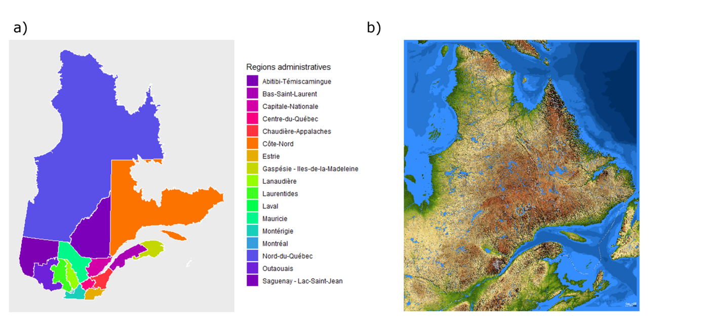
```
<br>

Les entités spatiales (ou objets) sont habituellement représentés par ce qu’on appelle des données vectorielles (« vector data », en anglais), alors que les phénomènes continues sont habituellement représentés par des données matricielles (« raster data », en anglais).  Ces deux modèles sont des façons bien différentes de percevoir et de représenter les phénomènes spatiaux. Nous les décrivons dans les deux sous-sections suivantes.


### Les données vectorielles

##### Définition {-}

Les données vectorielles sont utilisées pour représenter des entités spatiales dont les frontières sont explicites et qui possède une localisation précise et unique. Les données vectorielles sont définies par leur localisation géographique, leur géométrie, et un ou plusieurs attributs.

La **localisation géographique** désigne l’emplacement de l’entité selon un système de coordonnées géographique ou un système de coordonnées projeté. Un système de coordonnées géographique utilise un système en trois dimensions pour donner la position (x,y,z) ou longitude et latitude d’une entité spatiale sur la surface sphérique de la Terre. Un système de coordonnées projeté, donne la position d’une entité spatiale sur une surface plane à deux dimensions. Nous reviendrons sur les systèmes de coordonnées de référence à la section 2.1.3.

La **géométrie** d’une entité spatiale correspond à sa forme (« shape », en anglais). Il existe trois principaux types de géométrie, aussi appelées des classes : les points, les lignes, et les polygones  (Tableau \@ref(fig:geometriesimple)). Ces classes peuvent être combinées pour créer des géométries plus complexes; des multipoints, des multilignes, des multipolygones, etc.

<br>
```{r geometriesimple, fig.align='left', echo=FALSE,fig.cap="Exemple de données vectorielles de géométrie simple. Remarquez que dans le cas d’un polygone, la première et la dernière coordonnées sont les mêmes. Tableau inspiré de Wikipedia (https://en.wikipedia.org/wiki/Well-known_text_representation_of_geometry)", out.width = '80%'}
knitr::include_graphics('Module2/images/2_geometriesimple.png')
```
<br>

Les données vectorielles comprennent également des variables additionnelles appelées des **attributs**. Les attributs sont toutes informations permettant de décrire une entité spatiale autres que sa localisation et sa géométrie.

##### Géométrie et topologie {-}

Les **points** sont les données vectorielles les plus simples. Par exemple, un point pourrait représenter l’emplacement d’un restaurant dans une ville. Les attributs associés à ce point pourraient inclure les heures d’ouverture, sa spécialité culinaire, l’échelle de prix de son menu ou d’autres informations.

<br>
```{r multipoints, fig.align='left', echo=FALSE,fig.cap="L’emplacement des stations de vélo en libre partage, *Bixi*, dans un quartier de Montréal correspond à une géométrie multipoints. Source : https://secure.bixi.com/map/", out.width = '60%'}
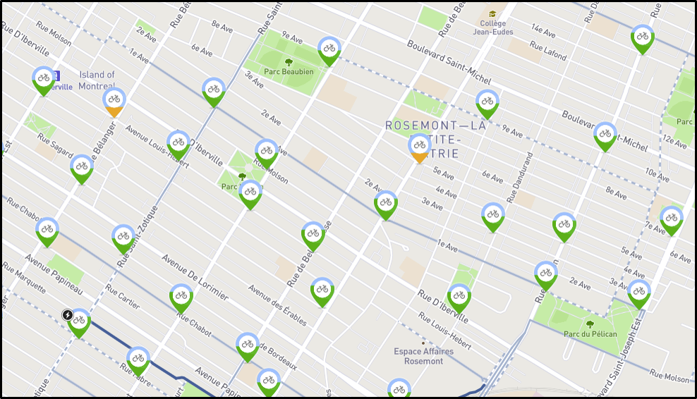
```
<br>

Il est aussi possible de combiner plusieurs points ensemble dans une structure multipoints définie par un attribut unique (Figure \@ref(fig:multipoints)). Par exemple, l’ensemble des restaurants de cuisine vietnamienne dans une ville pourrait être considéré comme une géométrie unique.

La géométrie des **lignes** est plus complexe. Le terme ligne en analyse spatiale n’a pas la même définition que dans le langage usuel. Une ligne désigne un ensemble d’une seule ou de plusieurs polylignes (Figure \@ref(fig:multilignes)). Une polyligne, quant à elle, désigne une séquence de segments de droite reliés entre eux. Ainsi, en analyse spatiale, une seule ligne pourrait représenter le fleuve Saint-Laurent et l’ensemble de ces affluents (rivière des Outaouais, rivière Saint-Maurice, le Fjord du Saguenay, etc.). D’autre part, il serait aussi possible de définir plusieurs lignes – une pour chaque affluent, par exemple.

<br>
```{r multilignes, fig.align='left', echo=FALSE,fig.cap="Le réseau hydrologique du bassin de l’Amazone représente un exemple d’un ensemble de polylignes. Source : Wang et al. 2020.", out.width = '60%'}
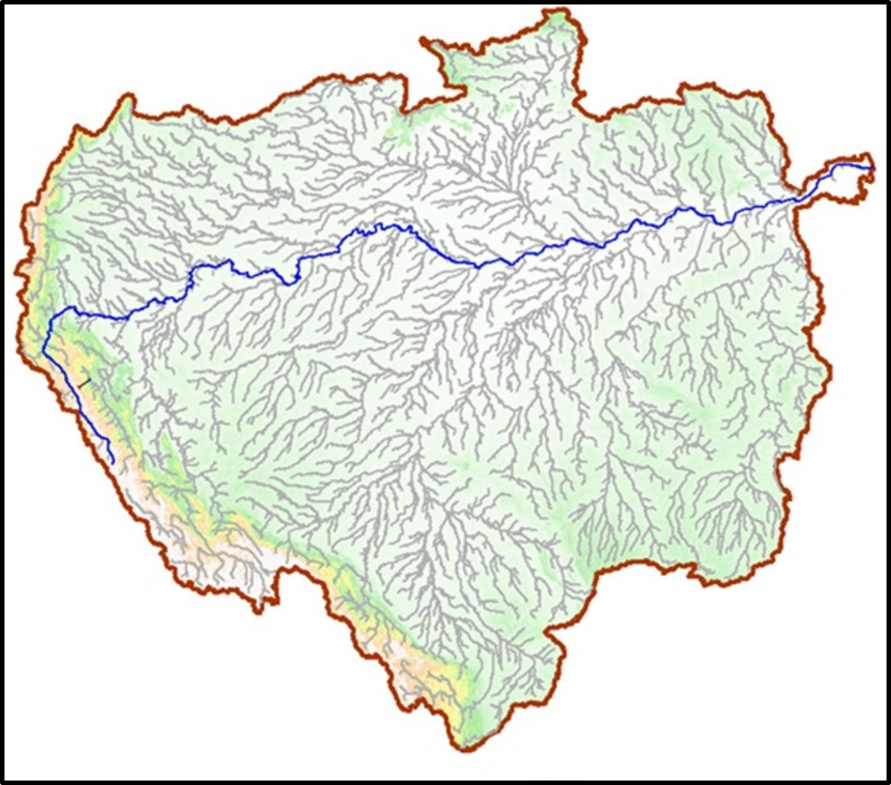
```
<br>

Une ligne est représentée par un ensemble ordonné de coordonnées. Les segments de droite peuvent être calculés ou dessinés sur une carte en connectant ensemble les points. Ainsi, la représentation d’une ligne est semblable à celle d’une structure multipoints. La différence notable est que l’ordre des points est important dans la représentation d’une ligne car il est nécessaire de savoir quels points sont connectés entre eux.

Un réseau – par exemple un réseau routier ou un réseau hydrographique – est une ligne de géométrie particulière comprenant des informations additionnelles comme le débit, la connectivité ou la distance.

Un **polygone** désigne un ensemble de polylignes fermées. La géométrie d’un polygone est très semblable à celle des lignes à l’exception que la dernière paire de coordonnées doit coïncider avec la première paire afin de « fermer » le polygone.

Une particularité des polygones est qu’ils peuvent comprendre des trous. C’est-à-dire qu’un polygone peut être entièrement compris à l’intérieur d’un polygone de plus grande superficie. Ceci est le cas d’une île au sein d’un lac, par exemple. Le polygone formant un îlot permet d’éliminer une partie du polygone qui l’englobe. De plus, alors que l’auto-intersection est permise pour une ligne (c’est-à-dire qu’elle peut se croiser sur elle-même), cette propriété n’est pas valide pour un polygone.

Finalement, plusieurs polygones peuvent être considérés comme formant une géométrie unique ((Figure \@ref(fig:multipolygones))). Par exemple, l’Indonésie est constituée de plusieurs îles. Chaque île peut être représentée par son propre polygone, ou encore l’ensemble des îles peut être représenté par un seul polygone (ou multi-polygones) désignant le pays en entier.

<br>
```{r multipolygones, fig.align='left', echo=FALSE,fig.cap="Les Antilles peuvent être représentées par plusieurs polygones distincts pour chaque île, ou par un seul multipolygone. Source : https://fr.wikipedia.org/wiki/Antilles", out.width = '50%'}
knitr::include_graphics('Module2/images/2_multipolygones.png')
```
<br>

Le modèle vectoriel est très efficace pour représenter la **topologie**. La topologie est une description des relations spatiales qu’ont les entités spatiales entre elles. Par exemple, une analyse de données vectorielles permettra de déterminer précisément si une entité spatiale est adjacente à une autre, si elle y est incluse, ou si elle s’intersecte (Figure \@ref(fig:relationsspatiales)).

<br>
```{r relationsspatiales, fig.align='left', echo=FALSE, fig.cap="Exemples de relations spatiales entre deux entités spatiales : a) adjacence, b) inclusion, et c) intersection.", out.width = '100%'}
knitr::include_graphics('Module2/images/2_relationsspatiales.png')
```
<br>

##### Format de données vectorielles {-}  

Les données vectorielles peuvent être stockées dans une grande variété de formats différents. Ces formats ont évolué et continuent d’évoluer en fonction des besoins et des avancées technologiques. Plusieurs formats ont été développés pour être utilisés avec des logiciels commerciaux mais peuvent être lus et parfois édités par d’autres logiciels.

Peu importe leur format, les données vectorielles sont toujours organisées selon une *base de données relationnelle*. Un identifiant désigne chaque objet spatial et l’associe à une géométrie et à un ou plusieurs attributs (Tableau \@ref(fig:baserelationnelle)).

<br>
```{r baserelationnelle, fig.align='left', echo=FALSE, fig.cap="Exemple d’une base de données relationnelle pour la carte des régions administratives du Québec (Figure \\@ref(fig:vectomat)a). Chaque objet vectoriel dans la carte correspond à une ligne dans la base de données où figurent les attributs qui lui sont associés", out.width = '100%'}
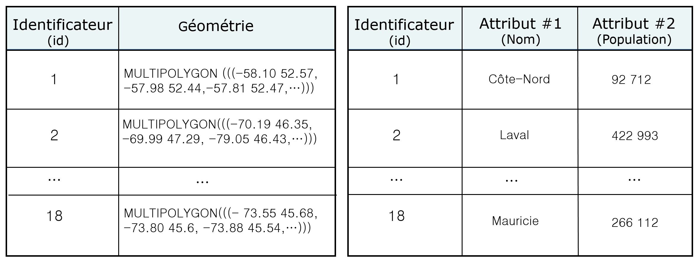
```
<br>

Voici une liste non-exhaustive de formats de données vectorielles.

###### SHAPEFILE (.SHP, .DBF, .PRJ, .SHX) {-}

  Le *shapefile* est un format propriétaire d’ESRI créé pour les logiciels ArcView et ArcGIS. En français, on le nomme aussi un fichier de forme. À ce jour, il est le format le plus couramment utilisé pour les données vectorielles. Il est devenu un standard tant pour les plateformes commerciales qu’opensource.

  Un *shapefile* comprend entre quatre types de fichiers qui contiennent des informations différentes et toutes essentielles à sa représentation.

  -	.shp : contient les données spatiales
  -	.dbf : contient les données d’attributs
  -	.prj : contient l’information sur la projection des données
  -	.shx : fichier d’index

  Le fichier d’index sert à lier entre elles les informations contenues dans les autres fichiers. Il existe parfois d’autres types de fichier d’index (.sbx, .sbn). Pour visualiser un *shapefile*, il est nécessaire d’avoir tous les fichiers associés (et pas seulement le fichier .shp). Le fichier .prj peut être absent. En son absence, le shapefile peut être lu mais les données ne seront pas projetées adéquatement. Nous reviendrons sur le concept de projection plus tard dans ce module.


###### GEODATABASE (.GDB) {-}

 La géodatabase est le nouveau format propriétaire d’ESRI conçu pour ArcGIS. Il est de plus en plus adopté car il présente de nombreux avantages par rapport au *shapefile*. Une géodatabase est une façon de rassembler et d’organiser des données propres à un sujet ou à un projet dans une unique base de données. Elle peut contenir des données géographiques dans une large gamme de fichiers et de formats (Figure \@ref(fig:geodatabase)).

<br>
```{r geodatabase, fig.align='left', echo=FALSE,fig.cap="Illustration d’une géodatabase telle que représentée sur le site web d’ArcGIS. Image récupérée à : https://desktop.arcgis.com/fr/arcmap/10.3/manage-data/geodatabases/a-quick-tour-of-the-geodatabase.htm", out.width = '50%'}
knitr::include_graphics('Module2/images/2_geodatabase.PNG')
```
<br>

 Par exemple, un projet sur le réseau de transport d’électricité au Québec pourrait nécessiter l’utilisation de plusieurs *shapefiles* (position des centrales, position des pylônes, parcours des câbles, etc.) et aussi plusieurs données matricielles (topographie, végétation, etc.). Ainsi, il s’avère beaucoup plus efficace d’avoir l’ensemble de ces données au sein d’une même base.

 De plus, une géodatabase peut être utilisée par de multiples utilisateurs, ce qui est fort utile pour assurer le partage efficace, la mise à jour, et la cohérence des données géographiques au sein de grandes organisations, comme des entreprises ou des ministères.

 Malheureusement, bien que les géodatabases peuvent être lues avec `R`, elles peuvent seulement être modifiées dans ArcGIS.


###### GEOGRAPHIC JAVASCRIPT OBJECT NOTATION (.GEOJSON, .JSON) {-}

 Le format geoJSON est un format standard ouvert très utilisé en cartographie web. geoJSON est une extension du format JSON pour les données géographiques. Un fichier geoJSON contient les coordonnées des données géospatiales ainsi que d’autres informations sur les attributs. Un seul fichier est nécessaire pour stocker l’ensemble de l’information.


###### GOOGLE KEYHOLE MARKUP LANGUAGE (.KML, .KMZ) {-}

 Ce format est basé sur le langage XML et est optimisé pour les navigateurs de cartographie web comme Google Maps et Google Earth. KMZ est une version compressée d’un fichier KML (KML-Zipped).


###### COVERAGE {-}

 COVERAGE est le format propriétaire d’ESRI, développé pour le logiciel ArcInfo, qui a précédé le format *shapefile*. C’est une autre façon de stockée les données vectorielles qui nécessite plusieurs fichiers. Bien que ce format ne soit plus utilisé lorsque de nouvelles données vectorielles sont conçues, vous pourriez être amenés à rencontrer ce format si vous devez travailler avec des données qui précédent 1990.


###### ARCINFO INTERCHANGE FILE (.EOO) {-}

 C'est le format utilisé pour importer ou exporter des données d’ArcInfo. Il fonctionne comme un fichier zip et permet de partager facilement en un seul fichier les multiples fichiers et dossiers associés au format Coverage. Il permet aussi de transférer des données matricielles de format GRID.


###### MAPINFO INTERCHANGE FILE (.MID, .MIF) {-}

 C'est le format propriétaire de MapInfo, le compétiteur d’Esri. Le format *shapefile* a supplanté le format interchange qui est de moins en moins utilisé. Le fichier MIF contient la localisation géographique et la topologie, et le fichier MID contient les attributs.


###### WEB MAP SERVICE (WMS) {-}

 N’est pas un format de données mais plutôt un protocole de communication qui permet de visualiser des données spatiales qui sont logées sur un serveur. Les organisations gouvernementales ont souvent recours à cette méthode de partage de l’information spatiale car elle permet de s’assurer que les données diffusées sont toujours à jour. L’utilisateur peut jouer avec les paramètres de visualisation mais ne peut pas importer et modifier les données. Notez que ce protocole est utilisé à la fois pour les données vectorielles et les données matricielles.


### Les données matricielles

##### Définition {-}

Les données matricielles représentent la surface terrestre par une grille régulière, communément appelé un *raster*, formée de rectangles de même forme et de même dimension appelés cellules ou pixels (Figure \@ref(fig:raster)). À chaque cellule de la matrice correspond une valeur numérique (ou une valeur manquante) associée à un attribut d’intérêt. On appelle couche (« layer » en anglais) l’information recueillie dans la matrice.

La valeur d’une cellule peut être continue (p. ex. l’élévation - voir Figure \@ref(fig:vectomat)b) ou catégorique (p. ex. le zonage attribué à différents secteurs d’une ville tel que résidentiel, commercial ou industriel). Normalement, la valeur d’une cellule représente la valeur moyenne (ou la valeur prédominante) pour la superficie qu’elle couvre. Cependant, les valeurs sont parfois estimées pour le centre de la cellule.

<br>
```{r raster, fig.align='left', echo=FALSE,fig.cap="Exemple de données matricielles associées à des classes de végétation obtenues à partir d’une image satellitaire. Figure inspirée de NEON neonscience.org/resources/series/introduction-working-raster-data-r", out.width = '100%'}
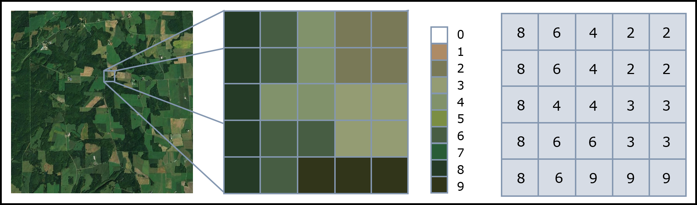
```
<br>

On peut utiliser une base de données relationnelle pour lier la valeur d’un pixel à l’attribut qu’il décrit (Figure  \@ref(fig:rastertable)). Contrairement aux données vectorielles où les polygones peuvent être associés à plusieurs attributs, une couche de données matricielles peut représenter un seul attribut.

<br>
```{r rastertable, fig.align='left', echo=FALSE,fig.cap="Exemple de table relationnelle pour les données vectorielles de la Figure ref(fig:raster). Une valeur numérique est associée à chaque couleur de l’image ainsi qu’à un attribut, ici le type de végétation", out.width = '80%'}
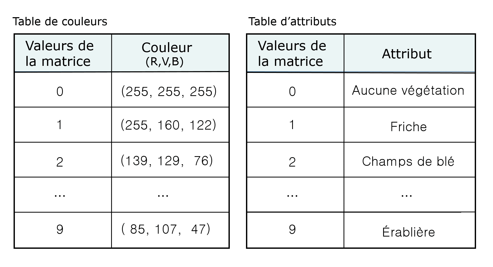
```
<br>

Dans leur format le plus simple, les données matricielles prennent la forme d’une image digitale. Cependant, pour associer les données matricielles à une location particulière sur la surface de la Terre, des informations spatiales doivent être ajoutées. Ainsi, un fichier de données matricielles géospatiales débute toujours par une section, appelée le «header» en anglais, qui procure la localisation.

La localisation pour des données matricielles est définie par **l’étendue spatiale** (« extent » en anglais) couverte par la matrice, la **dimension** des cellules, le **nombre de rangées et de colonnes** qui divisent la superficie (respectivement « rows » et « columns » en anglais), et le **système de coordonnées géographique  ou projeté**.  La dimension des cellules correspond à la résolution spatiale et peut être calculée à partir de l’étendue et du nombre de rangées et de colonnes.

##### Résolution et géométrie {-}

La **résolution** définie la précision avec laquelle nous pouvons discerner les objets dans l’espace. Une grande résolution correspond à une matrice de données dont les cellules ont une petite taille (Figure \@ref(fig:resolution)). En conséquence, une telle matrice est plus lente à visualiser et à manipuler, et requière un fichier plus volumineux. En contrepartie, une couche de données matricielles de faible résolution possède des cellules de plus grande taille, se visualise et se manipule plus rapidement, et est contenue dans un fichier moins volumineux.

<br>
```{r resolution, fig.align='left', echo=FALSE,fig.cap="Exemple du concept de résolution: plus la résolution est grande, plus la taille des cellules est petite. Dans cette figure, la résolution diminue de droite à gauche, et la taille des cellules augmente. Source de données: https://mern.gouv.qc.ca/nos-publications/spatiocarte-quebec/", out.width = '100%'}
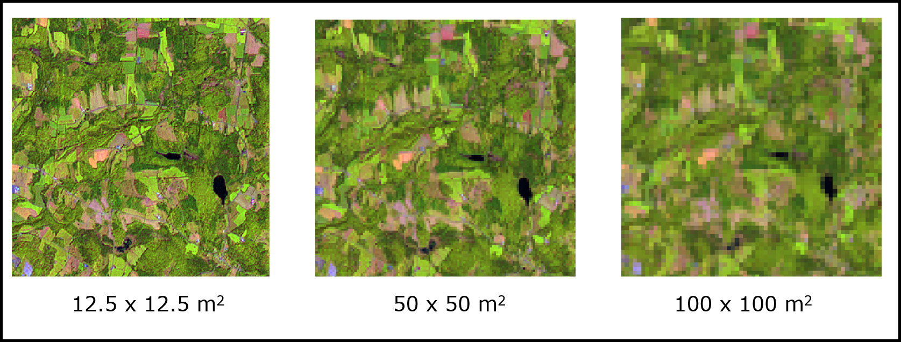
```
<br>

Contrairement aux données vectorielles, la géométrie des données matricielles n’est pas définie explicitement par un ensemble de coordonnées. La géométrie peut être déduite en observant les démarcations se produisant aux limites des ensembles de cellules de même valeur. Cependant ces démarcations ne correspondent pas nécessairement aux frontières des entités sur le terrain (Figure \@ref(fig:boundary)).

<br>
```{r boundary, fig.align='left', echo=FALSE,fig.cap="La géométrie des objets spatiaux matriciels. Les frontières d’une entité spatiale définie avec des données matricielles (droite) ne correspondent pas nécessairement aux frontières réelles (gauche)", out.width = '80%'}
knitr::include_graphics('Module2/images/2_raster_boundary.png')
```
<br>

Ainsi, lorsque nous représentons des objets spatiaux aux frontières bien définies, l’utilisation de données vectorielles plutôt que matricielles s’avère plus précise et plus efficace.

Par ailleurs, la représentation de phénomènes continus avec des données vectorielles, nécessiterait de définir un grand nombre de petit polygones et d’enregistrer les coordonnées de chacun d’eux. Dans la majorité des cas, une telle représentation augmenterait dramatiquement le temps de traitement des données.

##### Données matricielles à bande unique et multi-bandes {-}

Un *raster* peut contenir une couche ou plusieurs couches de données. Par exemple, un fichier de données matricielles d’élévation comprendra une seule couche de données, soit l’élévation à chaque cellule. Par exemple la carte topographique du Québec (Figure \@ref(fig:vectomat)b) est un exemple de raster à une seule couche.

Un raster à une seule couche peut aussi représenter des images en noir et blanc en utilisant un codage binaire pour exprimer différentes teintes de gris. Un codage sur 1 bit exprimera 2<sup>1</sup> (2) teintes de gris [0,1], un codage sur 4 bit exprimera 2<sup>4</sup> (16) teintes de gris [0,1,2,…,15], et un codage sur 16 bits exprimera 2<sup>16</sup> (65536) teintes de gris [0,1,2,…, 65535] (Figure \@ref(fig:binaire)).

<br>
```{r binaire, fig.align='left', echo=FALSE,fig.cap="Exemple de codage binaire pour les *raster* à une couche: Images en blanc et noir utilisant différentes teintes de gris : 2 teintes (gauche), 8 teintes (centre) et 256 teintes (droite).", out.width = '100%'}
knitr::include_graphics('Module2/images/2_binaire.png')
```
<br>

D’autres rasters peuvent contenir plusieurs couches, appelées aussi des bandes (ou canaux). Par exemple, les images de couleurs contiennent souvent trois bandes: une bande de rouge, une bande de vert et une bande de bleu. C’est ce qu’on nomme le format RGB (pour « red », « green », et « blue »). Ces bandes font références à des sections du spectre électromagnétique captées lors de la prise de l’image (Figure \@ref(fig:electro)).

<br>
```{r electro, fig.align='left', echo=FALSE,fig.cap="*Raster* multibande. Les bandes blues, vertes et rouges correspondent à des sections du spectre électromagnétique. Source: Esri. Image récupérée à https://desktop.arcgis.com/en/arcmap/10.3/manage-data/raster-and-images/raster-bands.htm.", out.width = '50%'}
knitr::include_graphics('Module2/images/2_electromagnetic_spectrum.png')
```
<br>


En combinant ces bandes, on peut recréer l’image (Figure \@ref(fig:3bands)). Attention : chaque bande doit posséder les mêmes informations spatiales pour être superposée aux autres.

<br>
```{r 3bands, fig.align='left', echo=FALSE,fig.cap="Image satellitaire de région de l’Estrie. Le raster multi-bande contient une bande de rouge, une bande de vert et une bande de bleu. L’image couleur s’obtient en combinant les trois bandes.  Source de données: https://mern.gouv.qc.ca/nos-publications/spatiocarte-quebec/", out.width = '100%'}
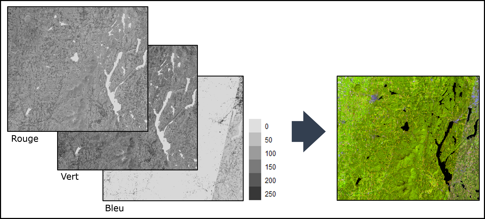
```
<br>

##### Format des données matricielles {-}

Tout comme les données vectorielles, les données matricielles peuvent être stockées dans une grande variété de formats différents. Les images possèdent des structures matricielles, ainsi les formats bien connus pour la transmission d’images sur le Web, .jpg (Joint Photographic Experts Group), .gif (Graphics Interchange Format), et .png (Portable Network Graphics), sont des exemples de format de données matricielles.

Voici une liste non-exhaustive de formats de données matricielles.

###### GRID (.GRD) {-}

  GRID est le format propriétaire d’ESRI pour stocker des données matricielles.


###### TIFF AND GEOTIFF (.TIF) {-}

  Le Tag Image File format (TIFF) est utilisé pour le stockage d’images numériques. Il a la particularité d’être comme un contenant dans lequel plusieurs informations additionnelles sur les données peuvent être stockées (par ex. les attributs, et autres métadonnées).
Le format GeoTIFF est un fichier .tif standard dans lequel on intègre des informations additionnelles sur la localisation spatiale des données (p. ex. la résolution, l’étendue ou le système de coordonnées).


###### COMMA SEPERATED VALUE FORTMAT (.CSV) {-}

  Le format .csv contient du texte séparé par des virgules, et correspond à une façon simple et très répandue de représenter des données matricielles. Par exemple, un fichier .csv pourrait être constitué de trois colonnes : la première pour la coordonnée x de la cellule, la deuxième pour sa coordonnée y, et la troisième pour la valeur de l’attribut.

  Une autre façon d’utiliser le format .csv est d’y stocker la matrice de données sous forme d’un tableau de dimension égale à cette dernière. Chaque entrée du tableau donne la valeur d’attribut pour la cellule correspondante. Les informations sur la localisation spatiale doivent alors être fournies en en-tête du fichier.


###### BITMAP (.BMP) {-}

  BITMAP est le format d’images utilisé dans les applications de Microsoft Windows.


De plus, comme expliqué plus haut, la géodatabase et Web Map Service sont aussi utilisés pour les données matricielles.


Peu importe le type de données spatiales et le format utilisé pour les stocker, les données spatiales sont souvent accompagnées de **métadonnées**. Les métadonnées sont les données sur les données. C’est-à-dire qu’elles viennent donner des informations supplémentaires pour faciliter la compréhension et l’utilisation des données spatiales (p. ex. l’origine des données, l’auteur.e, les détails sur la structure, le lexique, les abréviations, la légende, etc.). Idéalement, tout ensemble de données devrait être accompagné de métadonnées.


### Structure en couches

Lorsque nous travaillons avec des données spatiales, il est fréquent de devoir combiner des données représentant des phénomènes spatiaux distincts. Nous devons alors utiliser une structure en couches. Une **couche** de donnée réfère à un thème spécifique (par ex. topographie, végétation, ou réseau routier) et contient un seul modèle de données (matricielles ou vectorielles) (Figure \@ref(fig:couches)). 

<br>
```{r couches, fig.align='left', echo=FALSE,fig.cap="Représentation de données spatiales par la superposition de couches thématiques. Source: Esri. Image récupérée à https://desktop.arcgis.com/fr/arcmap/10.3/guide-books/map-projections/what-are-map-projections.htm", out.width = '80%'}
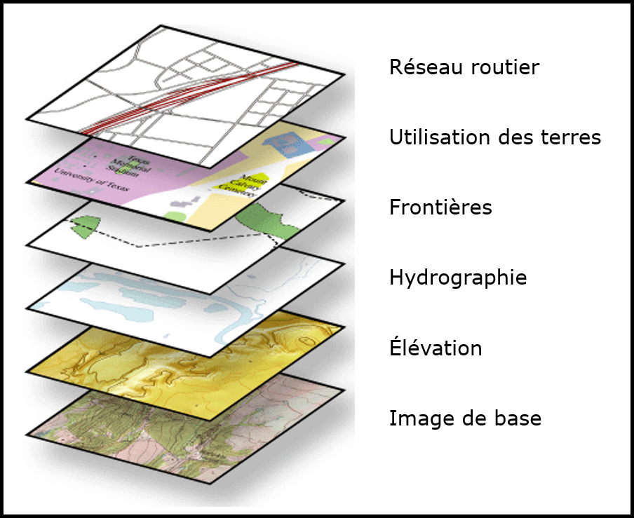
```
<br>

La superposition de couches permet de visualiser les relations spatiales entre les données de différentes thématiques [@Auda2018]. Il est primordial que chaque couche de données utilise le même système de coordonnées de référence lorsqu’elles sont superposées. Le [module 3](#SRC) portera spécifiquement sur cette notion.

## Exercice {#ex_base}

<!--chapter:end:Module2/index.Rmd-->

# Systèmes de coordonnées de référence {#SRC}


Ce module porte sur les systèmes de coordonnées de référence (SRC). Nous avons vu dans le module 2 que l’intégration de couches de données spatiales différentes nécessite qu’elles soient définies selon le même système de référence spatiale. C’est-à-dire que le modèle mathématique utilisé pour représenter la position des données sur la surface de la Terre doit être le même pour les deux jeux de données. Dans ce module, nous définissons plusieurs concepts cartographiques pour bien comprendre l’importance du SRC dans la visualisation, la manipulation et l’analyse de données spatiales. 

À la fin de ce module vous saurez :

-	Expliquer la différence entre un ellipsoïde local et un ellipsoïde global.
-	Définir ce qu’est un datum et nommer des datums courants. 
-	Expliquer la différence entre le système de coordonnées géographique et le système de coordonnées projeté.
-	Définir les propriétés permettant de catégoriser les projections
-	Nommer des projections courantes.

La section [exercice](#ex_SRC) est divisée en deux parties. 
Dans un premier temps, vous réaliserez une auto-évaluation pour vérifier votre acquisition des connaissances enseignées dans ce module. 
Dans un second temps, vous continuerez votre apprentissage de R Markdown.

## Leçon

Un **système de coordonnées de référence** (SCR) est un ensemble d’informations qui accompagne un jeu de données spatiales et qui permet de situer ces données sur la surface de la Terre. Ces informations comprennent le modèle utilisé pour représenter la forme de la Terre, c’est-à-dire sa géodésie, et le système de mesure utilisé pour définir des coordonnées qui est soit géographique (système à trois dimensions où les coordonnées sont mesurées à partir du centre de la Terre) ou planimétrique (système à deux dimensions où les coordonnées terrestres sont projetées sur une carte plane) [@Esri_mapproj].


### Les systèmes géodésiques 

La **géodésie** est l’étude de la forme et des dimensions de la Terre. Au cours de l’histoire, les penseurs et les scientifiques ont adopté divers modèles pour représenter la forme de la Terre (Figure \@ref(fig:evolution)). 

Nous référons couramment à la Terre comme un objet rond et nous la représentons comme telle (le globe terrestre!). En vérité, la Terre n’est pas sphérique mais légèrement aplatie aux pôles. 

<br>
```{r evolution, fig.align='left', echo=FALSE,fig.cap="Évolution des modèles de la forme de la Terre : un corps plat, une sphère, une ellipsoïde et un géoïde.", out.width = '80%'}
knitr::include_graphics('Module3/images/3_evolution.png')
```
<br>


La Terre est un corps plastique qui est façonné par un ensemble de forces internes et externes lui donnant une forme irrégulière qui évolue continuellement dans le temps (Figure \@ref(fig:forces)). En particulier, le champ gravitationnel agit différemment sur les parties solides, semi-rigides et liquides de la Terre car celles-ci ont des densités différentes^[Source: [Le Québec géographique](https://quebecgeographique.gouv.qc.ca/education/positionnement.asp)].

<br>
```{r forces, fig.align='left', echo=FALSE,fig.cap="Les différentes forces internes et externes agissant continuellement sur la Terre. Source : Ressources naturelles Canada.", out.width = '50%'}
knitr::include_graphics('Module3/images/3_forces.jpg')
```
<br>


Le  **géoïde** est un modèle de la Terre qui tient compte de l’effet du champ gravitationnel. C’est une surface équipotentielle^["Une surface où le potentiel est constant et qui est en tous points perpendiculaire à la direction dans laquelle s'exerce la pesanteur. Une surface équipotentielle est de niveau, c.-à-d. que l'eau y reste au repos". Définition de [Ressources Naturelles Canada](https://www.rncan.gc.ca/modernisation-systeme-reference-altimetrique/9055#surface_equipotentielle)] du champ de gravité de la Terre qui coïncide avec le niveau moyen des océans (Figure \@ref(fig:geoide)). 

<br>
```{r geoide, fig.align='left', echo=FALSE,fig.cap="Le géoïde. a) La forme irrégulière du géoïde avec des bosses et de creux créer par le champ gravitationnel agissant de façon inégale sur la Terre (source : Bezdek et Sebera 2013). b) Le géoïde coïncide avec le niveau moyen des océans et se distingue de l’ellipsoïde (figure adaptée de [USGS](earthquake.usgs.gov)).", out.width = '100%'}
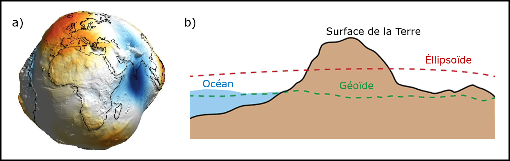
```
<br>


La précision avec laquelle nous pouvons lier un endroit sur Terre à un ensemble de coordonnées dépend du modèle du globe choisi. Le géoïde procure une plus grande précision que l’ellipsoïde, mais l’ellipsoïde peut être décrit plus facilement par des équations mathématiques.

Nous pouvons distinguer deux types d’ellipsoïdes utilisés en cartographie. Les **ellipsoïdes globaux** représentent la Terre à l’échelle du globe (Figure \@ref(fig:ellipsoides)). Les **ellipsoïdes locaux** représentent une petite région du globe (Figure \@ref(fig:ellipsoides)). La précision d’un ellipsoïde local est meilleure que celle d’un ellipsoïde global mais uniquement pour des coordonnées situées dans la région qu’il représente. 

<br>
```{r ellipsoides, fig.align='left', echo=FALSE,fig.cap="Ellipsoïdes global et local. Un ellipsoïde global épouse mieux la forme globale du géoïde, tandis qu’un ellipsoïde local épouse mieux la forme du géoïde localement dans la région indiquée par la flèche noire. Figure adaptée de @Knippers2009.", out.width = '50%'}
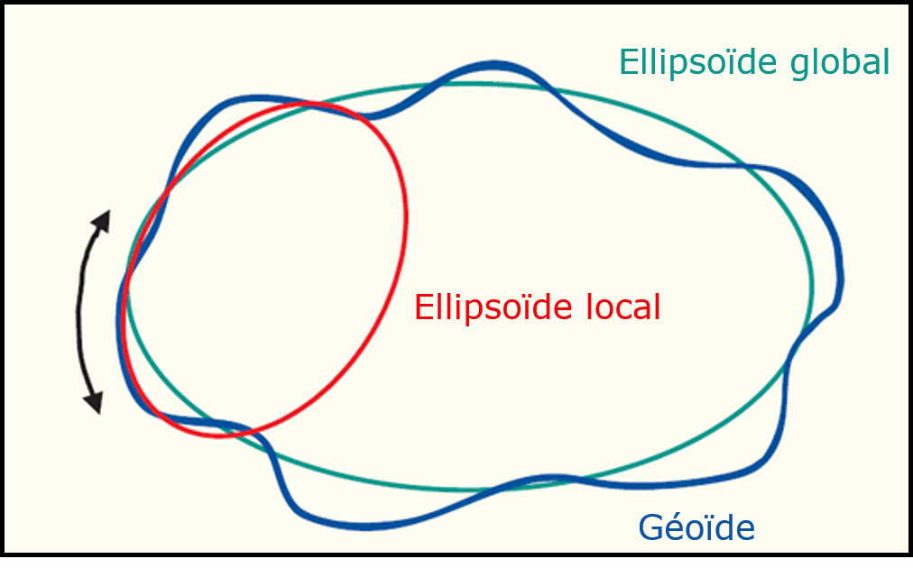
```
<br>


Un **datum** est un système de référence qui détermine la position d’un ellipsoïde sur la Terre : c’est-à-dire son origine par rapport au centre du globe, ainsi que son orientation. 

Les **datums géocentriques** sont associés à des ellipsoïdes globaux. Ce sont des systèmes de référence terrestres globaux dont l’origine correspond au centre de masse de la Terre . Puisque aucun ellipsoïde n’épouse parfaitement la surface de la Terre,  il y a toujours une certaine marge d’erreur à l’utilisation d’un datum géocentrique (Figure \@ref(fig:ellipsoides)). 

La communauté internationale a adopté différent modèles d’ellipsoïdes globaux au fil du temps avec l’amélioration des techniques spatiales de télémétrie et de positionnement [@Theriault2010]. Ces ellipsoïdes diffèrent par les paramètres mathématiques utilisés pour les définir. 

Les principaux systèmes de référence globaux utilisés présentement à travers de monde sont le Geodetic Reference System 1980 (**GRS80**), adopté par [l’Union Géodésique et Géophysique Internationale](http://fr.iugg.org/) et le World Geodetic System 1984 (**WGS84**), défini par le [National Geospatial-Intelligence Agency](https://www.nga.mil/) des États-Unis (Figure \@ref(fig:datum)). Le Global Positioning System (le GPS) utilise le WGS 84. 

<br>
```{r datum, fig.align='left', echo=FALSE,fig.cap="Datums globaux. L’origine de l’ellipsoïde WGS84 se trouve au centre de masse de la Terre. L’origine de l’ellipsoïde GRS80 se trouve à environ 2 m de l’origine de l’ellipsoïde WGS84. L’ellipsoïde Clarke 1866 se trouve à environ 236 m de celle du WGS84. Le datum local NAD27 qui a précédé le NAD83 (voir plus bas) était basé sur l’ellipsoïde Clarke 1866. Figure adaptée du National Oceanic and Atmospheric Administration, source : https://vdatum.noaa.gov/docs/datums.html", out.width = '50%'}
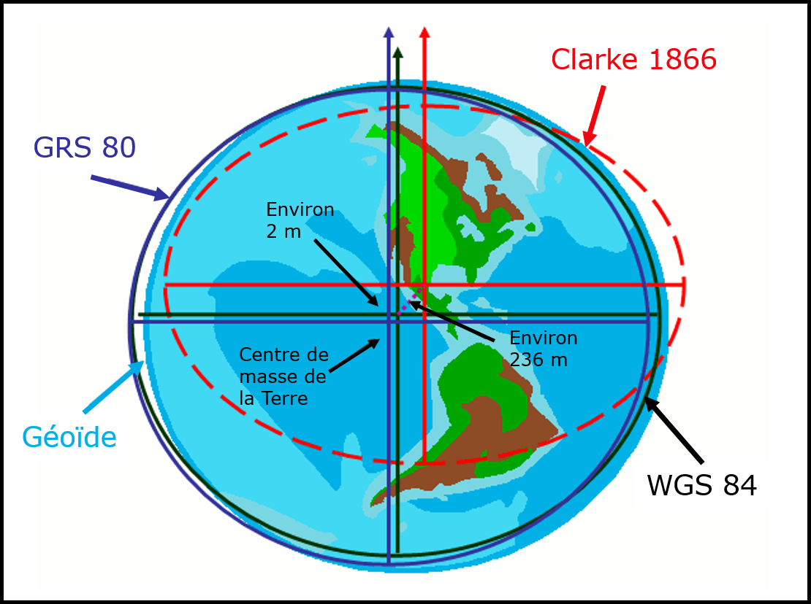
```
<br>


Le **Cadre international de référence terrestre** (ITRF) est un système de référence créé et maintenu par le Service international de la rotation de la Terre et des Systèmes de référence (IERS), un organisme international « qui étudie l’orientation de la Terre et établit un système de coordonnées sur la Terre et par rapport à l’espace. »^[Définition selon [Wikipédia](https://fr.wikipedia.org/wiki/Service_international_de_la_rotation_terrestre_et_des_syst%C3%A8mes_de_r%C3%A9f%C3%A9rence)] L’ITRF n’est pas basé sur un modèle d’ellipsoïde. Il est constitué d’un ensemble de repères terrestres dont les coordonnées $(x,y,z)$ à la surface de la Terre sont établies à partir du centre de la Terre (Figure \@ref(fig:ITRF)). On se sert de ces repères pour déterminer les paramètres des ellipsoïdes globaux et locaux. À cause du mouvement des plaques tectoniques, les coordonnées des repères de l’ITRF doivent être réévaluées périodiquement. 

<br> 
```{r ITRF, fig.align='left', echo=FALSE,fig.cap="Réseau de repères terrestres en vue d’établir le prochain ITRF. Source : NASA Earth Observatory", out.width = '60%'}
knitr::include_graphics('Module3/images/3_ITRF.jpg')
```
<br>


Les **datums locaux** sont associés à des ellipsoïdes locaux. Ce sont des systèmes de référence dont l’origine de l’ellipsoïde est décalée par rapport au centre de la Terre. 

Un datum local fait correspondre un point de la surface de l’ellipsoïde local à un point de la surface de la Terre. Ce point de référence est fixe et il sert « d’ancrage » au datum. C’est le point d’origine du système de référence local, et il est souvent basé sur une plaque tectonique. Il existe des centaines de datum local servant de système de référence à différentes régions du globe. Il est possible d’utiliser le même ellipsoïde pour définir différents datums.


Le système de référence utilisé en Amérique du Nord est le North American Datum of 1983 (**NAD83**). Il est basé sur l’ellipsoïde GRS80 et est fixé à la plaque tectonique nord-américaine. Le European Terrestrial Reference System of 1989 (**ETRS89**) est le système de référence utilisé en Europe. Il est aussi basé sur l’ellipsoïde GRS80 mais est fixé à la plaque tectonique eurasienne. On peut utiliser un datum local seulement pour la région pour laquelle il a été conçu. Ainsi, il serait erroné d’utiliser le ETRS89 pour définir la localisation d’un phénomène spatial au Québec.

<br>
```{r bornes, fig.align='left', echo=FALSE,fig.cap="Réseau de repères terrestres. Gauche : un repère du Réseau de base canadien (RBC) situé en Saskatchewan. Droite : un repère du Réseau géodésique de grande précision (RGP) au Québec. Certains repères du RGP font partie du RBC. (source : www.waymarking.com)", out.width = '60%'}
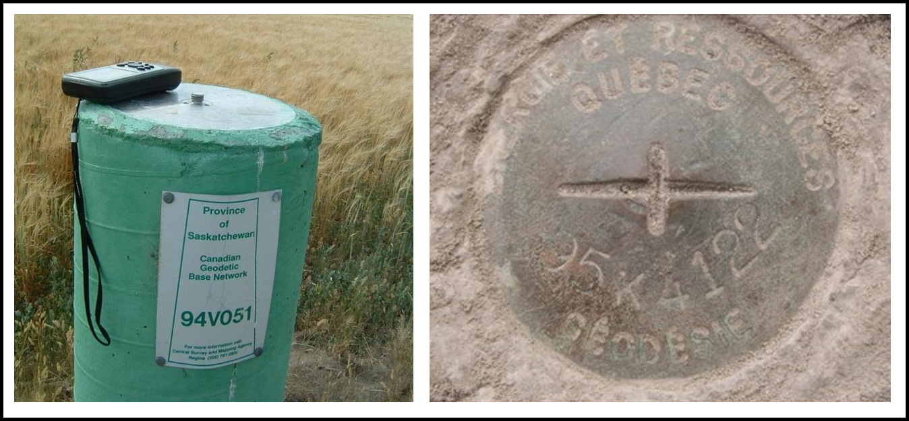
```
<br>

Le Système canadien de référence spatiale (**SCRS**) est un datum local créé par le gouvernement canadien spécifiquement pour ces besoins. La majorité des agences fédérales canadiennes qui ont recours à des données spatiales (Ressources naturelles Canada, Pêches et Océan Canada, Agence spatiale canadienne, etc.) utilise ce système de référence.

Le SCRS est un quadrillage tridimensionnel (latitude, longitude et élévation) adapté du système NAD83 – il est d’ailleurs appelé le **NAD83 (SCRS)**. Il a été développé dans les années 1990 pour corriger des distorsions d’environ 2 m observées entre le NAD 83 et un réseau de points de contrôle (le Réseau de base canadien, RBC, Figure \@ref(fig:bornes) suivi par un système global de navigation par satellite (GNSS) (pour en savoir plus consulter cette description du SCRS donnée par [Ressources naturelles Canada](https://www.rncan.gc.ca/maps-tools-publications/maps/atlas-canada/le-systeme-canadien-reference-spatiale-scrs/9053)) (Figure \@ref(fig:SCRS)). 

<br>
```{r SCRS, fig.align='left', echo=FALSE,fig.cap="Comparaison entre le NAD83 et le SCRS. Les points rouges sont la localisation de repères selon le SCRS et les lignes bleues représentent les erreurs (décalages) produites par le NAD83 sur ces localisations. Figure tirée de @Craymer2006.", out.width = '80%'}
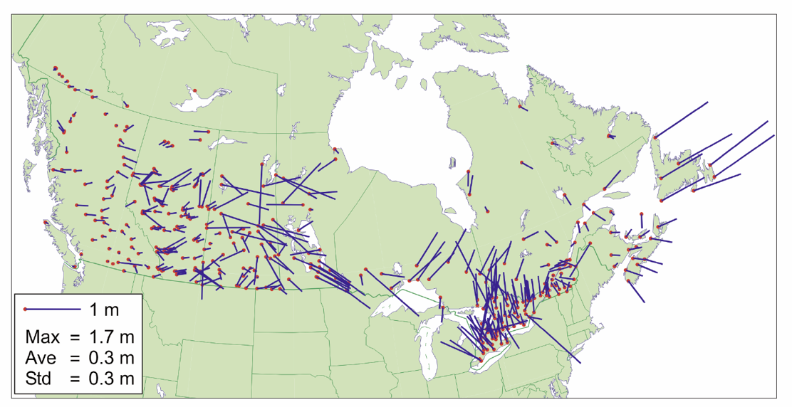
```
<br>

### Les systèmes de coordonnées


La localisation géographique se fait à partir d’un système de coordonnées. Multiples systèmes de coordonnées peuvent être définis, et les coordonnées d’un endroit sur Terre différeront selon le système utilisé. Il existe deux types de système de coordonnées : le système de coordonnées géographiques et le système de coordonnées projetées. 

Le **système de coordonnées géographique** représente la Terre comme une sphère et donne des coordonnées en trois dimensions pour se situer sur sa surface. Le système géographique est défini par le datum choisi (qui peut être local ou global), une unité angulaire de mesure et un méridien principal [@Esri_mapproj] (Figure \@ref(fig:philambda)).

<br>
```{r philambda, fig.align='left', echo=FALSE,fig.cap="Le système de coordonnées géographique. Les points à la surface de la Terre sont définis par les coordonnées sphériques ($\\phi$,$\\lambda$) associées à la longitude (ligne mauve) et à la latitude (ligne bleue foncée) respectivement. Le point rouge possède les coordonnées ($\\phi$,$\\lambda$) = (50$^{\\circ}$ E, 40$^{\\circ}$ N). La ligne jaune représente le méridien principal. Source : Esri, image récupérée à https://desktop.arcgis.com/fr/arcmap/10.3/guide-books/map-projections/geographic-coordinate-system.htm", out.width = '60%'}
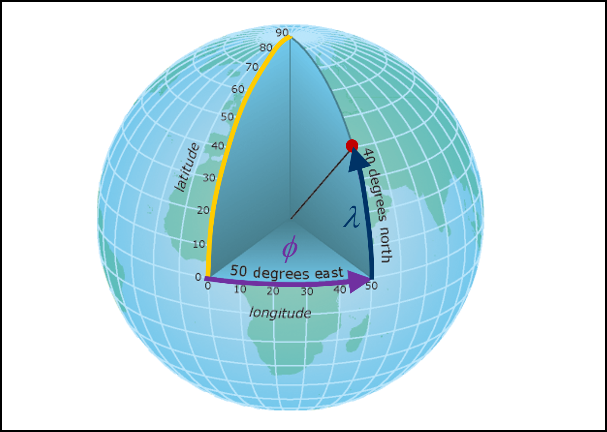
```
<br>


Les coordonnées sphériques ($\phi$, $\lambda$) d’un point sur la surface de la Terre correspondent à sa longitude et à sa latitude respectivement (Figure \@ref(fig:philambda)). On exprime ces coordonnées en degrés (degrés, minutes, secondes (DMS) ou degré décimal (D,D)).

Le système géographique forme ce que l’on appelle un graticule sur la surface de la Terre (Figure \@ref(fig:graticule)). C’est une grille composée de lignes horizontales, appelées les parallèles, et de lignes verticales, appelées les méridiens. Le parallèle de latitude zéro constitue l’équateur, alors que le méridien de longitude zéro constitue le méridien principal. Dans la plupart des systèmes de coordonnées géographiques, le méridien qui traverse l’Observatoire royal de Greenwich en Angleterre correspond au méridien principal. 

<br>
```{r graticule, fig.align='left', echo=FALSE,fig.cap="Graticule. Les parallèles et les méridiens forment un graticule. Source : Esri, image récupérée à https://desktop.arcgis.com/fr/arcmap/10.3/guide-books/map-projections/about-geographic-coordinate-systems.htm", out.width = '90%'}
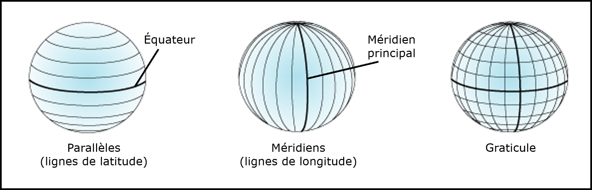
```
<br>

Le **système de coordonnées projeté**, quant à lui, réfère à une transformation mathématique permettant de représenter sous forme de carte plane la réalité tridimensionnelle de la Terre (Figure \@ref(fig:planprojection)).   

<br>
```{r planprojection, fig.align='left', echo=FALSE,fig.cap="Le système de coordonnées projeté. Il permet de représenter sur une surface plane bidimensionnelle la surface tridimensionnelle de la carte à l’aide d’une transformation mathématique $(x,y) = f(\\phi, \\lambda)$", out.width = '90%'}
knitr::include_graphics('Module3/images/3_planprojection.png')
```
<br>


Les systèmes de coordonnées projetés sont nécessaires pour la création de cartes géographiques. Cependant, puisqu’il est impossible de représenter parfaitement la surface d’un objet tridimensionnel sur une carte plane, les systèmes projetés génèrent certaines distorsions (ou déformations) : forme, distance, direction, etc. Par ailleurs, toutes les projections conservent un élément important de la cartographie : la précision de la localisation géographique.

### Les projections

On peut catégoriser les systèmes de coordonnées projetés selon la classe de transformations mathématiques utilisées, le type d’intersections entre le globe et le plan, l’orientation du plan, et le type de distorsions créé sur le plan. 

###### Classes de transformations {-}

On distingue trois classes principales de transformation pour créer un système de coordonnées projeté (Figure \@ref(fig:classes)). 

**Cylindrique** : la surface de la Terre est projetée sur un plan enroulé comme un cylindre. Généralement le cylindre coïncide avec le globe le long d’un parallèle (p.ex. l’équateur).

**Conique** : la surface de la Terre est projetée sur un cône. Le cône et le globe coïncident le long d’un ou de deux parallèles. Pour aplanir le cône, il est découpé le long d’un méridien, généralement le méridien opposé au méridien principal. 

**Azimutale** (ou plane) : la surface de la Terre est projetée directement sur un plan. Celui-ci touche généralement le globe à un seul point (p.ex. le pôle Nord).

<br>
```{r classes, fig.align='left', echo=FALSE,fig.cap="Classes de projection: cylindrique (gauche), conique (centre) et azimutale (droite). Toutes les projections illustrées utilisent un plan de projection qui est tangent à la surface de la Terre. Source : Esri. Image adaptée d’illustrations récupérées à https://desktop.arcgis.com/en/arcmap/10.3/guide-books/map-projections/projection-types.htm", out.width = '90%'}
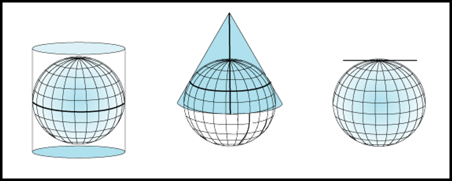
```
<br>


###### Types d'insersection {-}

Il existe deux types d’intersection entre un plan et la surface du globe (Figure \@ref(fig:intersection)).

**Tangente** : le plan touche la surface du globe à un seul point (azimutal) ou le long d’une seule ligne (cylindrique et conique). Les transformations illustrées à la Figure classes sont toutes tangentes.

**Sécante** : le plan traverse la surface du globe le long d’une seule ligne (azimutal) ou le long de deux lignes (cylindrique et conique). Ces lignes sont appelées les parallèles standards. Les transformations illustrées à la Figure intersection sont toutes sécantes.

Notez qu’il n’y a pas de distorsion au point ou à la ligne d’intersection car à cet endroit les systèmes de coordonnées géographiques et projetés coïncident parfaitement.

<br>
```{r intersection, fig.align='left', echo=FALSE,fig.cap="Plans de projection sécants avec le globe. Illustrations pour les classes de projection cylindrique (gauche), conique (centre) et azimutale (droit). Source : Esri. Image adaptée d’illustrations récupérées à https://desktop.arcgis.com/en/arcmap/10.3/guide-books/map-projections/projection-types.htm", out.width = '90%'}
knitr::include_graphics('Module3/images/3_secante.png')
```
<br>


###### Orientation {-}

Le plan de projection peut être positionné selon trois différentes orientations par rapport au globe. 

**Normale** : le plan est parallèle par rapport à l’axe Nord-Sud du globe. Les transformations illustrées aux Figure classes et intersection sont toutes normales.

**Transverse** : le plan est perpendiculaire à l’axe Nord-Sud du globe (Figure \@ref(fig:orientation) gauche).

**Oblique** : le plan est ni parallèle ni perpendiculaire à l’axe Nord-Sud du globe (Figure \@ref(fig:orientation) droite).

<br>
```{r orientation, fig.align='left', echo=FALSE,fig.cap="Orientations du plan de projection. Orientation transversale (gauche), aussi appelée équatoriale pour la projection azimutale, et orientation oblique (droit). Source : Esri. Image adaptée d’illustrations récupérées à https://desktop.arcgis.com/en/arcmap/10.3/guide-books/map-projections/projection-types.htm", out.width ='60%'}
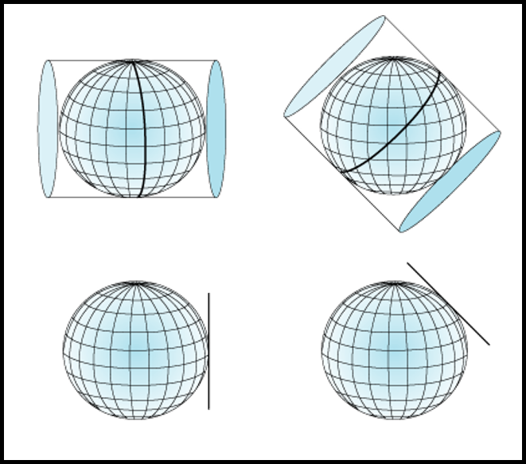
```
<br>

###### Distorsion {-}

Les projections produisent toutes une certaine forme de distorsion. On caractérise un système de coordonnées projeté selon la propriété qu’il conserve, c-à-d la propriété qu’il ne déforme pas. Il y a trois propriétés importantes qui sont ou non conservées (en tenant compte de l’échelle de la carte): la forme, la superficie et la distance.

**Conforme** : la projection conserve localement les angles entre les droites. Les cartes de navigation, notamment, sont produites par des projections conformes pour mesurer adéquatement la direction de trajectoires. La conformité implique également la conservation de la forme des régions de petite superficie. 

**Équivalente** : la projection conserve localement l’aire des régions. Les atlas géographiques emplois souvent des cartes produites par des projections équivalentes pour éviter les biais dans la représentation des superficies de différentes régions du monde.

**Équidistante** : la projection conserve les distances sur certaines lignes du globe, généralement les méridiens.

Aucune projection ne peut être à la fois conforme et équivalente. Plusieurs projections offrent des compromis entre ces deux propriétés.


Il existe plus de deux cent projections distinctes créées au cours de l’Histoire par les scientifiques, notamment des astronomes, des géographes, et des navigateurs. La figure \@ref(fig:projections) illustre un petit sous-ensemble de projections. La projection cylindrique équidistante (coin supérieur gauche de la figure \@ref(fig:projections) a été créée par Marinus de Tyr, un astronome d’origine phénicienne, vers l’an 100. Plusieurs projections sont identifiées par le nom de la personne qui en a fait la découverte. Par exemple, Gérard Mercator est un mathématicien et géographe flamand du 16e siècle, et Jean-Henri Lambert est un mathématicien, cartographe et astronome d’origine alsacienne du 18e siècle. 

<br>
```{r projections, fig.align='left', echo=FALSE,fig.cap="Sélection de 12 projections.  L’ensemble des cartes est tiré du site : https://map-projections.net/", out.width = '90%'}
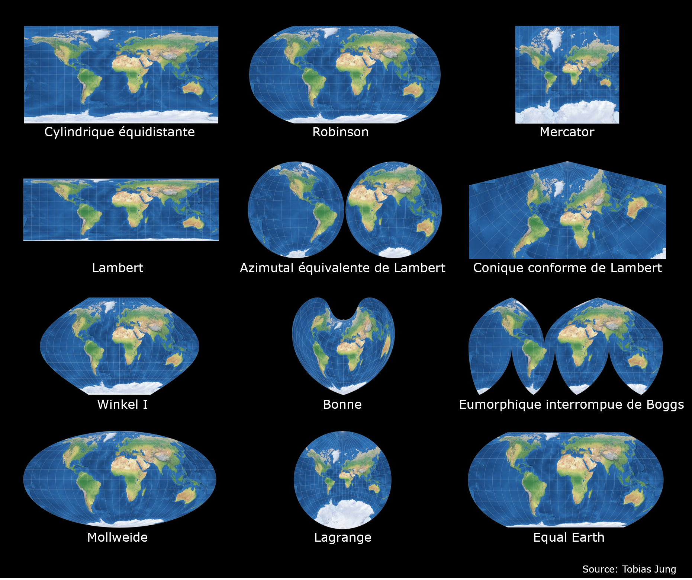
```
<br>

Je vous invite à consulter le site très intéressant de [Tobias Jung](https://map-projections.net/) où un grand nombre de projections est répertorié. Vous pouvez connaître les propriétés des projections et aussi comparer deux projections entre elles. Jetez-y un coup d’œil!

Sur ce site vous pourrez apprendre, par exemple, que les projections de Mollweide, de Bonne, Equal Earth et eumorphique de Boggs sont équivalentes, alors que les projections de Mercator et de Lagrange sont conformes. Les projections de Mercator et cylindrique équidistante, comme son nom l’indique, sont équidistantes.

L’indicatrice de Tissot permet d’illustrer les déformations produites par une projection (Figure \@ref(fig:tissot)). Cette indicatrice porte le nom du cartographe français, Nicolas Auguste Tissot, qui l’a créé au 19e siècle. Le niveau de changement de la taille et de la forme des cercles rouges permet de repérer les endroits sur la carte de plus fortes déformations. 

<br>
```{r tissot, fig.align='left', echo=FALSE,fig.cap="Indicatrice de Tissot pour les 12 projections de la figure \\@ref(fig:projections).  L’ensemble des cartes est tiré du site : https://map-projections.net/", out.width = '90%'}
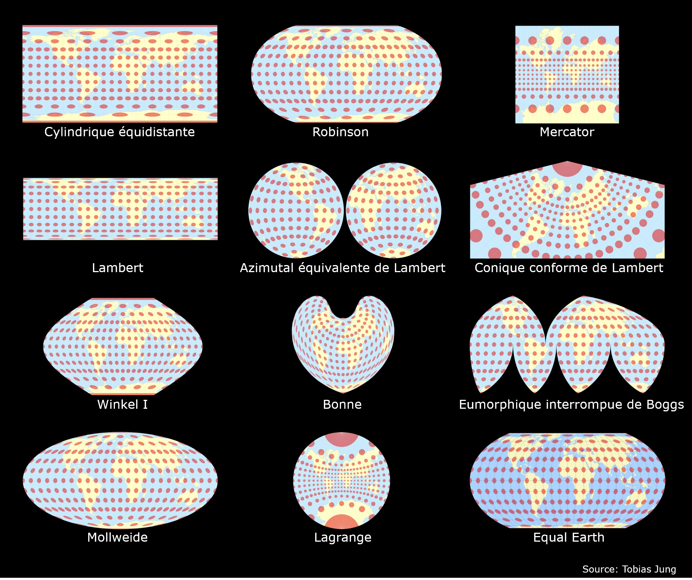
```
<br>

### Projections couramment utilisées 

###### Projection de Mercator {-}

La *projection de Mercator* (Figure Mercator, Figure projections et Figure tissot coin supérieur droit) est une projection cylindrique conforme. Les méridiens y sont parallèles et équidistants. Les parallèles (les lignes de latitude) sont aussi parallèles. Cependant, elles s’écartent les unes des autres au fur et à mesure qu’elles s’éloignent de l’équateur [@Esri_mapproj].

La projection de Mercator fût originalement conçue pour la navigation puisqu’elle préserve les angles. Elle préserve aussi les formes ce qui la rend très populaire pour la cartographie aux échelles régionales. Par ailleurs, la projection de Mercator ne préserve pas les superficies. Elle génère de grandes distorsions aux pôles (Figure \@ref(fig:tissot) coin supérieur droit). Par exemple, la superficie du Groenland apparait être aussi grande que celle de l’Afrique sur une projection de Mercator (Figure \@ref(fig:Mercator), gauche). En vérité, la superficie du Groenland (2 166 086 km$^{2}$, en mauve sur la Figure Mercator, droit) est inférieure à celle de l’Algérie (2 381 741 km$^{2}$, en orange sur la Figure \@ref(fig:Mercator), droit). Ces distorsions rendent la projection de Mercator peu adéquate pour produire des cartes à l’échelle mondiale.

<br>
```{r Mercator, fig.align='left', echo=FALSE,fig.cap="Projection de Mercator. À gauche, on observe que les méridiens sont équidistants tandis que les parallèles s’écartent en se dirigeant vers les pôles (source : Tobias Jung, https://map-projections.net/). À droite, on observe que la superficie réelle du Groenland (en mauve) est similaire à celle de l’Algérie (source : https://thetruesize.com/", out.width = '90%'}
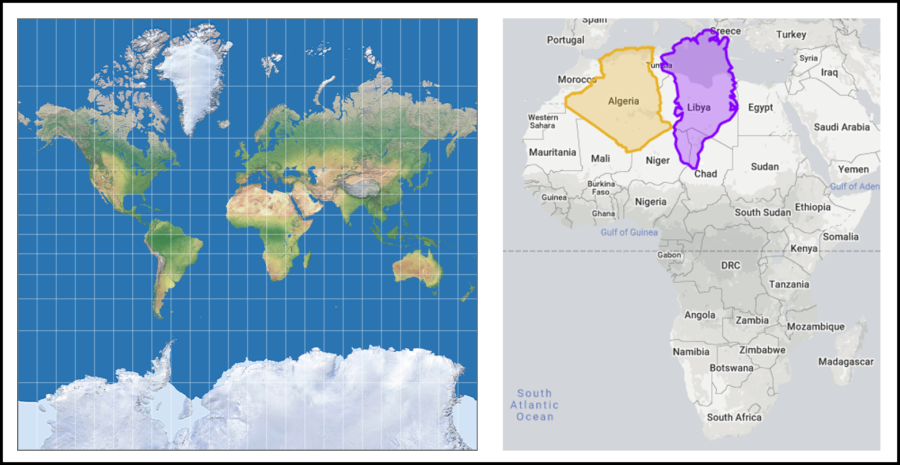
```
<br>

Les services de cartographie en ligne, comme Google Maps, OpenStreetMap, Bing Maps ou Mapquest, utilise la **projection Web de Mercator** (avec le datum WGS84). Cette projection est légèrement différente de la projection usuelle de Mercator (elle utilise la transformation sphérique plutôt que ellipsoïdal) produisant des cartes qui ne sont pas tout à fait conformes [@PROJ].


###### Projection Transverse universelle de Mercator {-}

La **projection Transverse universelle de Mercator** (en anglais Universal Transverse Mercator, UTM) est une projection cylindrique transverse sécante (Figure \@ref(fig:UTM). Le globe est séparé en 60 zones au nord et au sud de l’équateur. Chaque zone couvre 6$^{\circ}$ et est défini en son centre par un méridien central. Les zones sont numérotées de 1 à 60 en suivant la convention selon laquelle la zone 1 couvre la région allant de 180$^{\circ}$ à 174$^{\circ}$ ouest (0$^{\circ}$ correspondant au méridien de Greenwich). Les zones ne couvrent pas les pôles, elles s’arrêtent à la latitude de 84$^{\circ}$ au nord et de 80$^{\circ}$ au sud.

<br>
```{r UTM, fig.align='left', echo=FALSE,fig.cap="Projection transverse universelle de Mercator. Gauche : le globe est découpé en tranches de 6$^{\\circ}$, 3$^{\\circ}$ de part et d’autre d’un méridien central (source : https://www.swisstopo.admin.ch/). Droite : La surface entière de la Terre est représentée par 60 zones (source : https://www.icsm.gov.au/). ", out.width = '90%'}
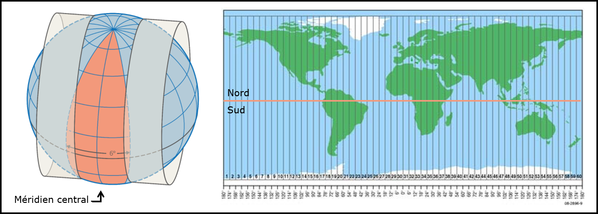
```
<br>

La projection transverse de Mercator est réalisée sur chacune des zones de façon distincte. Nous obtenons donc 60 projections différentes. Chaque zone présente des distorsions, mais puisque les zones sont petites (6$^{\circ}$), les distorsions sont limitées. 

Les coordonnées d’un point dans ce système projeté sont données d’abord par le numéro de la zone dans laquelle il se situe, puis par sa position au sein de la zone, c’est-à-dire par sa longitude et sa latitude mesurées en mètre. On utilise souvent les appellations anglaises pour désigner les longitudes, eastings, et les latitudes, northings. 

Par convention, on associe au méridien central la longitude de 500000 m (500 km). Si le point se situe à l’ouest du méridien central, sa longitude est déterminée en soustrayant la valeur 500000 m de la distance à laquelle il se trouve du méridien. À l’opposé, si le point se trouve à l’est du méridien central, sa longitude sera déterminée en ajoutant 500000 m à la distance qui le sépare du méridien. Les latitudes sont déterminées à partir de l’équateur. Dans l’hémisphère nord, l’équateur correspond à l’origine (0 m) et la latitude d’un point est déterminée par la distance qui le sépare de l’équateur. Dans l’hémisphère sud, l’équateur correspond à la valeur 10 000 000 m, et la latitude d’un point est déterminée en soustrayant à 10 000 000 m la distance qui le sépare de l’équateur (Figure \@ref(fig:fuseau)). Ces conventions sont utilisées de manière à avoir toujours des coordonnées positives dans la zone couverte par la projection.

<br>
```{r fuseau, fig.align='left', echo=FALSE,fig.cap="Longitudes et latitudes à l’intérieur d’une zone de la projection UTM. Source : http://geokov.com/ ", out.width = '50%'}
knitr::include_graphics('Module3/images/3_fuseau.png')
```
<br>

Le Canada s’étend de la zone 7 à la zone 22, alors que le Québec couvre les zones 17 à 21 (Figure \@ref(fig:UTMQuebec)). Notez que les zones sont aussi appelées des fuseaux.

<br>
```{r UTMQuebec, fig.align='left', echo=FALSE,fig.cap="Projection Universelle Transverse de Mercator au Québec. Source: @Lapointe2005", out.width = '50%'}
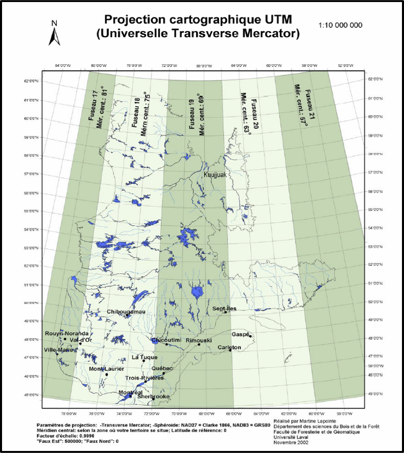
```
<br>

Pour réduire les problèmes liés aux déformations associées au système UTM, le Québec s’est doté de son propre système : la **projection modifiée transverse de Mercator** (MTM). Le système MTM est identique au système UTM à la différence que chaque zone couvre une longitude de 3$^{\circ}$. Les zones étant plus petites, les distorsions sont réduites. Les zones sont numérotées de 1 à 8 débutant aux Iles-de-la-Madeleine et se terminant en Abitibi (Figure \@ref(fig:MTMQuebec)). On associe au méridien central des zones MTM la longitude de 304800 m. 

<br>
```{r MTMQuebec, fig.align='left', echo=FALSE,fig.cap="Projection Mercator Transverse Modifiée au Québec. Source: @Lapointe2005", out.width = '50%'}
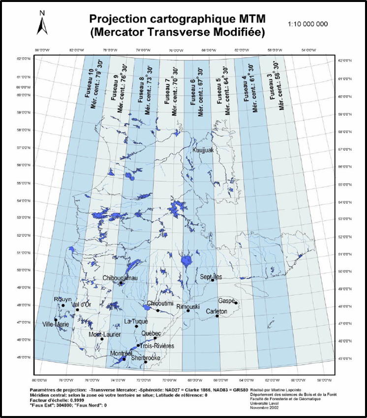
```
<br>

###### Projection conique conforme de Lambert {-}

La **projection conique conforme de Lambert** (LCC) conserve, comme son nom l’indique, la forme des régions ainsi que les angles. Cette projection est également sécante : il n’y a de distorsion le long des deux parallèles standards (Figure \@ref(fig:LCC)). La projection LCC est particulièrement utile pour représenter les régions de latitudes moyennes, comme l’Amérique du Nord, mais elle est également utilisée en Europe.

<br>
```{r LCC, fig.align='left', echo=FALSE,fig.cap="Projection conique conforme de Lambert. Source : United States Geological Survey, récupérée sur Wikipedia", out.width = '60%'}
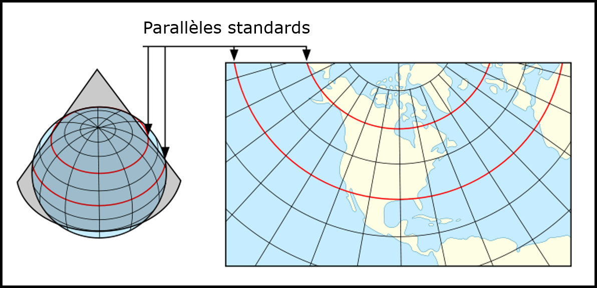
```
<br>

La position des parallèles standards varie selon la région du globe représentée. Au Canada, elles sont généralement situées à 49 N et 77 N. La carte ci-dessous du Canada (Figure \@ref(fig:LCCCanada)) utilise une projection LCC pour présenter les résultats des élections fédérales 2019.

<br>
```{r LCCCanada, fig.align='left', echo=FALSE,fig.cap="Un exemple de projection conique de Lambert. La carte des résultats des élections fédérales canadiennes de 2019. Source : Élections Canada.", out.width = '60%'}
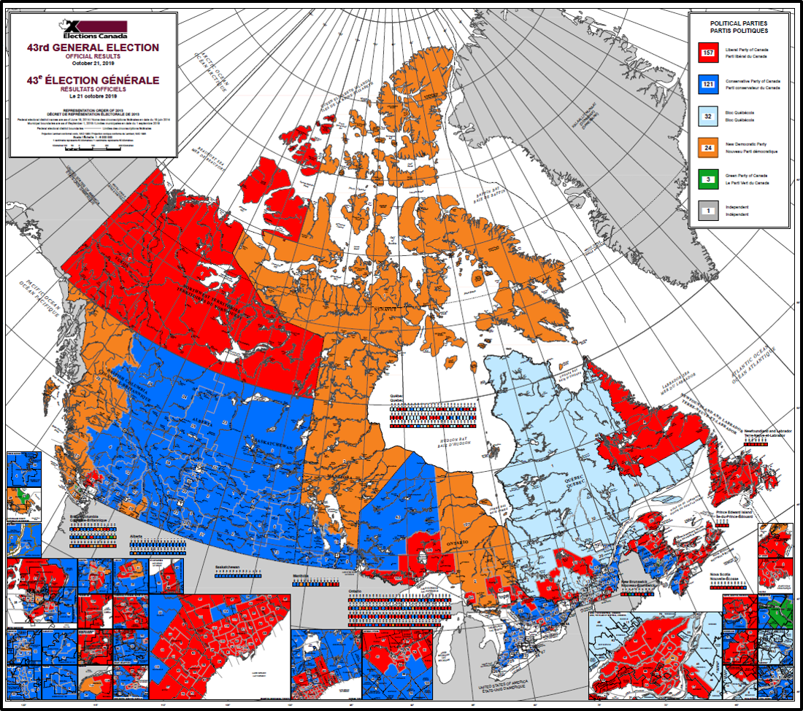
```
<br>


### Les codes EPSG

Le Comité de topographie et de positionnement (Surveying and Positionning Comittee) de l'Association internationale des producteurs de pétrole et de gaz (OGP), autrefois le European Petroleum Survey Group (EPSG), est une organisation scientifique liée à l’industrie pétrolière qui a mis en place une base de données répertoriant tous les systèmes de référence et les systèmes de coordonnées géographiques et projetés existants. Cette base de données, appelée le registre de codes **EPSG**, associe un code numérique à chaque système pour en faciliter l’identification et précise ses paramètres géodésiques et de projection. Vous pouvez consulter cette base de données [ici](https://www.epsg.org/).

Vous pouvez aussi utiliser le site https://epsg.io/ et entrez ‘Quebec’ dans la fenêtre de recherche pour connaître les codes EPGS utilisés au Québec.

Par exemple : 

- NAD83 : 4269 
- NAD83 (SCRS): 4617 
- WGS84: 4326

Ou encore:

- Le fuseau 2 de la projection MTM basé sur le NAD83 : 32182
- La projection Web de Mercator : 3857.


### Résumé

La figure ci-dessous (Figure \@ref(fig:Resume)) résume les étapes du processus utilisé pour définir un système de coordonnées géographique et un système de coordonnées projeté.

<br>
```{r Resume, fig.align='left', echo=FALSE,fig.cap="Résumé. Les étapes du processus pour définir un système de coordonnées géographique et un système de coordonnées projeté. Source : la figure utilise des pictogrammes créés par T. Grajecta (Noun Project)", out.width = '80%'}
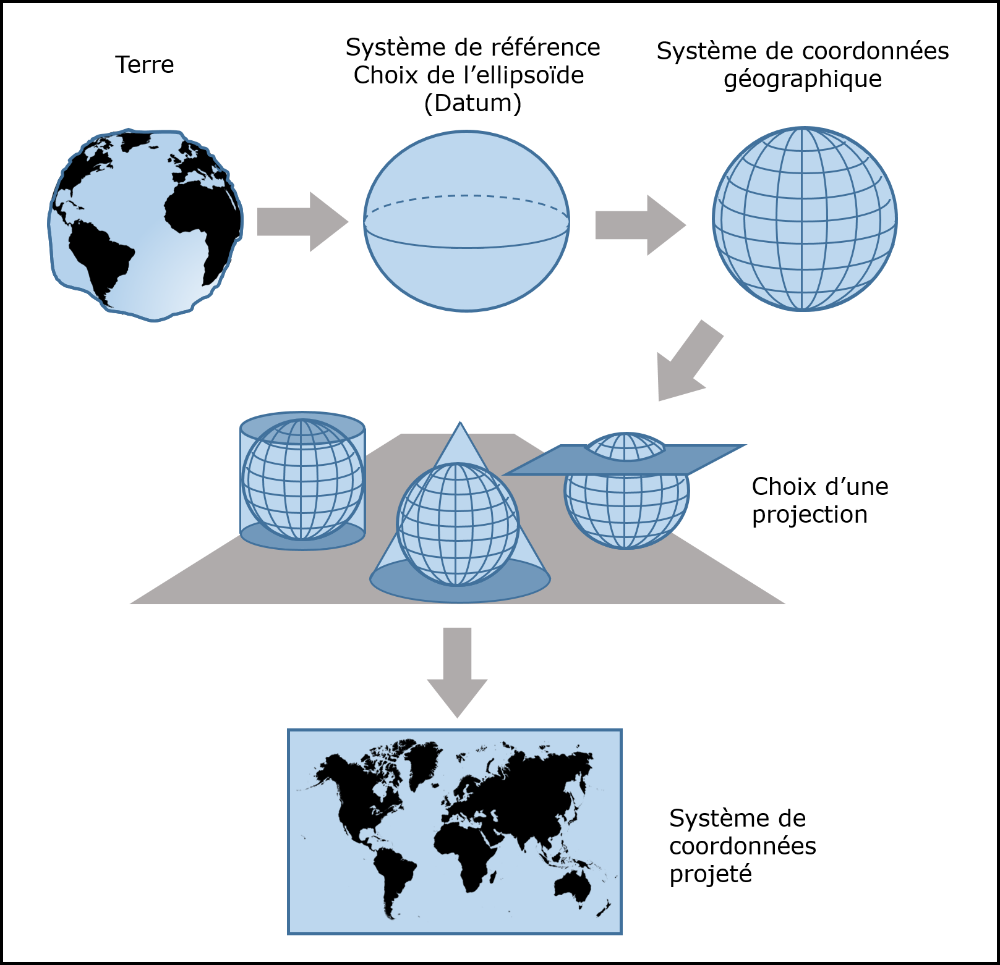
```
<br>

Lorsqu’on représente des données spatiales par un système de coordonnées géographique, il faut **toujours** préciser le datum qui a été adopté. Lorsqu’on représente des données spatiales par un système de coordonnées projeté, il faut **toujours** préciser le datum et la projection.

Lorsqu’on combine des couches de données différentes, on doit s’assurer qu’elles s’appuient sur le même datum et la même projection. Si ce n’est pas le cas, on peut transformer le système de référence et le système de projection. Nous verrons comment procéder à ces transformations dans le [module 7](#manip_vec) et e [module 8](#manip_mat).


## Exercice {#ex_SRC}

<!--chapter:end:Module3/index.Rmd-->


# Données vectorielles {#vec}


L'objectif principal de ce module est d'apprendre à lire, interpréter et visualiser des données vectorielles^[L’ensemble du matériel disponible dans ce module est adapté du cours *Introduction to Geospatial Raster and Vector Data with R* [@Data_Carpentry_IntroGeospatial] de l’organisme [Data Carpentry](https://datacarpentry.org/).  Data Carpentry développe et offre des formations variées et spécialisées sur le traitement et l’analyse de données. Ses formations s’adressent surtout aux chercheuses et chercheurs scientifiques, mais peuvent être consultées par quiconque car leur matériel est libre d’accès. N’hésitez donc pas à y jeter un coup d’œil.]

À la fin de ce module vous saurez:

- Lire un *shapefile*, explorer ses métadonnées et interpréter sa géométrie.
- Lire une *geodatabase*, et explorer ses couches.
- Visualiser des données vectorielles de type point, ligne et polygone.
- Visualiser des données vectorielles par attribut.
- Visualiser plusieurs données vectorielles au sein d'une même figure.
- Transformer le système de coordonnées de référence de données vectorielles.

Vous utiliserez les librairies suivantes:

- `sf`
- `rgdal`
- `mapview`
- `leafsync`


Vous apprendrez à utiliser les fonctions suivantes:

- `st_read()`, `st_write()`
- `st_geometry_type()`
- `st_crs()`
- `st_bbox()`
- `mapview()`
- `st_transform()`
- `latticeView()`

Dans la section [leçon](#lecon_vec), vous utiliserez deux ensembles de données vectorielles. 

Le premier ensemble contient des données *shapefile* relatives au réseau de pistes cyclables de la ville de Montréal et aux accidents routiers impliquant des bicyclettes.

Le second ensemble constitue une *géodatabase* contenant des données du Ministère de l'Éducation et de l'Enseignement Supérieur du Québec relatives aux établissements d'enseignement sur le territoire québécois.

Dans la section [exercice](#ex_vec), vous utiliserez XXXXX

```{r load-libraries4, echo = FALSE, results='hide', warning = FALSE, message = FALSE}
#library(raster)
library(rgdal)
library(sf)
library(mapview)
```


## Leçon {#lecon_vec}


Cette leçon est une introduction aux données spatiales vectorielles sous `R`. 
Les trois premières sections porteront sur des données vectorielles en format *shapefile* puisque celles-ci sont couramment utilisées.
La quatrième section vous familiarisera avec les données vectorielles en format *geodatabase* puisque celles-ci sont de plus en plus utilisées au sein de grandes organisations comme des ministères. 


### Lire un *shapefile* et interpréter sa géométrie


Dans cette section, nous allons explorer des données vectorielles relatives au réseau de pistes cyclables de la ville de Montréal et aux accidents routiers impliquant des bicyclettes.


#### Importer les données {-}

Téléchargez les [données sur le réseau de pistes cyclables](https://github.com/sci1031/sci1031/tree/master/Module4/data/Montreal_Velo.zip). Sauvegardez le dossier compressé (`zip`) dans votre répertoire de travail `Donnees` pour ce module, et dézippez-le. Le dossier Montreal_Velo comprend trois sous-dossiers:

- `accidents`
- `pistes`
- `terre`.


#### Lire les données {#lire-shp}

Pour lire des données vectorielles contenues dans un fichier *shapefile*, nous allons utiliser la librairie `sf`. Notez que la librairie `rgdal` se charge automatiquement lorsque `sf` se charge.

```{r load-sf, eval = FALSE}
library(sf)
```

Nous allons lire les trois *shapefiles* suivants :

- Des données vectorielles de type polygone représentant la frontière de notre zone d’étude, ici, l'île de Montréal.
- Des données vectorielles de type ligne représentant les pistes cyclables sur l'île de Montréal, et
- Des données vectorielles de type point représentant la position d'accidents impliquant des bicyclettes.


Dans un premier temps, nous allons ouvrir les données vectorielles de type polygone qui contiennent les limites terrestres de l'île de Montréal. Pour lire ces données nous utiliserons la fonction `st_read()` de la librarie `sf`. Pour utiliser `st_read()` nous devons spécifier le chemin menant au fichier *shapefile* à lire.

```{r fake-terre, eval = FALSE}
chemin<-"D:/votrechemin/SCI1031/Module4/Donnees/"
nom_du_fichier <- paste(chemin, "Montreal_Velo/terre/terre_shp.shp", sep = "")
limites_terrestres <- st_read(nom_du_fichier)
```

```{r terre, eval = TRUE, echo = FALSE}
limites_terrestres <- st_read("Module4/data/Montreal_Velo/terre/terre_shp.shp")
```

La fonction `st_read()` vous permet d'ores et déjà d'obtenir certaines informations sur la structure des données vectorielles que vous venez de lire: le type de géométrie (`geometry type`), la dimension des données (`dimension`), l’étendue spatiale des données (`bbox`), et les informations relatives au système de coordonnées de référence, le SPSG (`epsg (SRID)`) et la projection (`proj4string`). Nous explorerons ces propriétés en détails plus bas.

Nous allons maintenant lire les données vectorielles de type ligne, en utilisant encore la fonction `st_read()`.

```{r fake-pistes, eval = FALSE}
chemin <-"D:/votrechemin/SCI1031/Module4/Donnees/"
nom_du_fichier<- paste(chemin, "Montreal_Velo/pistes/pistes_cyclables_type.shp", sep = "")
pistes_cyclables <- st_read(nom_du_fichier)
```

```{r pistes, eval = TRUE, echo = FALSE}
pistes_cyclables <- st_read("Module4/data/Montreal_Velo/pistes/pistes_cyclables_type.shp")
#pistes_cyclables$TYPE_VOIE = rep(1:5, length.out = 34)
```

Finalement, nous allons lire les données vectorielles de type point, en utilisant toujours la fonction `st_read()`.

```{r fake-accidents, eval = FALSE}
chemin<-"D:/votrechemin/SCI1031/Module4/Donnees/"
nom_du_fichier<- paste(chemin, "Montreal_Velo/accidents/accidents2018_Mtl_velo.shp", sep = "")
pistes_cyclables <- st_read(nom_du_fichier)
```

```{r accidents}
accidents_velo <- st_read("Module4/data/Montreal_Velo/accidents/accidents2018_Mtl_velo.shp")
```

Remarquez que le type de géométrie (`geometry type`) diffère pour les trois classes de données lues comme nous nous y attendions.
<br>

#### Explorer les métadonnées d’un *shapefile* {-}

Les informations contenues dans un *shapefile* sont appelées des métadonnées. Nous sommes particulièrement intéressées aux métadonnées géospatiales.

Les métadonnées fondamentales d’un *shapefile* sont :

1.	Le type de géométrie : le type de classes des données vectorielles téléchargées.
2.	La projection : le système de coordonnées de référence utilisé pour représenter les données.
3.	L’étendue spatiale : la superficie géographique couvrant les données vectorielles.

##### Le type de géométrie {-}

Nous pouvons explorer chacune de ces métadonnées en utilisant des fonctions de la librairie `sf`. Le type de géométrie est obtenu par la fonction `st_geometry_type()`. Par exemple, pour les limites terrestres de la ville de Montréal, cette fonction nous donne:

```{r type-terre, echo = TRUE,  warning = FALSE, message = FALSE, eval = TRUE}
st_geometry_type(limites_terrestres)
```
Nous avons ainsi la confirmation que ces données vectorielles correspondent à des polygones (plus exactement, 72 polygones). Les 18 niveaux donnés en dessous constituent une liste des classes possibles de géométrie.

En comparaison, pour les données de type ligne et de type point nous obtenons plutôt :

```{r type-pistes, echo = TRUE,  warning = FALSE, message = FALSE, eval = TRUE, output.lines = 2}
st_geometry_type(pistes_cyclables)
```

```{r type-accidents, echo = TRUE,  warning = FALSE, message = FALSE, eval = TRUE, output.lines = 2}
st_geometry_type(accidents_velo)
```

Vous remarquez alors que les pistes cyclables sont composées de nombreuses multilignes. Une multiligne étant elle-même un ensemble de lignes.
Quant aux accidents de vélo, ce sont des points qui désignent la position précise des accidents. On en compte 796 en 2018.


##### La projection {-}


Vérifions maintenant la projection des *shapefiles* en utilisant la fonction `st_crs()` de la librarie `sf`. Pour le *shapefile* `limites_terrestres` nous obtenons:

```{r proj-terre, echo = TRUE,  warning = FALSE, message = FALSE, eval = TRUE}
st_crs(limites_terrestres)
```

La fonction `st_crs()` donne beaucoup d'informations. Pour connaitre la projection utilisée, le datum, ou le code ESPG, nous pouvons préciser la sortie désirée de la fonction, de la manière suivante:
```{r proj-terre-details, echo = TRUE,  warning = FALSE, message = FALSE, eval = TRUE}
st_crs(limites_terrestres)$Name
st_crs(limites_terrestres)$proj4string
st_crs(limites_terrestres)$epsg
```

Ainsi, la projection du *shapefile* `pistes_cyclables` est:
```{r proj-pistes, echo = TRUE,  warning = FALSE, message = FALSE, eval = TRUE}
st_crs(pistes_cyclables)$proj4string
```

Et la projection du *shapefile* `accidents_velo` est:
```{r proj-accidents, echo = TRUE,  warning = FALSE, message = FALSE, eval = TRUE}
st_crs(accidents_velo)$proj4string
```

Les données de tous les *shapefiles* sont dans la projection de Mercator transverse (`+proj=tmerc`) et utilisent le Système de référence géodésique nord-américain de 1983 (`+datum=NAD83`). Connaître le SCR est essentiel pour interpréter l’étendue spatiale des objets spatiaux puisque celui-ci précise, en quelque sorte, les unités de mesure.

##### L'étendue spatiale {-}

Pour connaître l’étendue spatiale des *shapefiles*, nous utilisons la fonction `st_bbox()` de la librairie `sf` :
```{r bbox-terre, echo = TRUE,  warning = FALSE, message = FALSE, eval = TRUE}
st_bbox(limites_terrestres)
```

```{r bbox-pistes, echo = TRUE,  warning = FALSE, message = FALSE, eval = TRUE}
st_bbox(pistes_cyclables)
```

```{r bbox-accidents, echo = TRUE,  warning = FALSE, message = FALSE, eval = TRUE}
st_bbox(accidents_velo)
```

L’étendue spatiale d’un *shapefile* ou d’un objet spatial dans `R` représente les limites géographiques des données, ou la localisation des données les plus au sud, nord, est et ouest.

##### Les attributs {-}


Finalement, nous pouvons visualiser toutes les métadonnées et les attributs d'un *shapefile* simplement en écrivant son nom dans la console `R`:
```{r tout-terre, echo = TRUE,  warning = FALSE, message = FALSE, eval = TRUE}
limites_terrestres
```

```{r tout-pistes, echo = TRUE,  warning = FALSE, message = FALSE, eval = TRUE}
pistes_cyclables
```

```{r tout-accidents, echo = TRUE,  warning = FALSE, message = FALSE, eval = TRUE}
accidents_velo
```

<br>

### Visualisation de *shapefiles* sous R

#### Visualisation avec la librairie Mapview {-}

Vous allez maintenant apprendre à visualiser des données *shapefile* en utilisant la fonction `mapview()` de la librairie `mapview`. Cette librarie est une des plus simples à utiliser pour visualiser rapidement des données spatiales. Commençons par charger cette librarie dans la console `R`:

```{r load-mapview}
library(mapview)
```

Dans un premier temps, visualisons les limites terrestres de la ville de Montréal (Fig \@ref(fig:plot-terre)).

```{r plot-terre, echo = TRUE,  warning = FALSE, message = FALSE, eval = TRUE, fig.cap="Limites terrestres de l'île de Montréal"}
mapview(limites_terrestres, col.regions = "white")
```
<br>

Remarquez que nous avons choisi la couleur blanche pour représenter l'intérieur des polygones délimitant la ville de Montréal. La couleur par défaut (c-à-d si on ne précise pas de couleur) est bleue.

Passez votre curseur sur la carte ainsi créée et remarquez que vous pouvez cliquer sur chacun des polygones contenus dans cette couche de données.

Remarquez aussi la légende dans le coin supérieur gauche de la carte créée et approchez-y votre curseur. Vous pouvez alors sélectionner une ou l'autre des arrières-plans disponibles. L'option "OpenStreetMap" affichera la carte produite par ce gratuitiel de cartographie pour la région entourant le polygone illustré. L'option "ESRI.WorldImagery", quant à elle, affichera une image satellitaire de la région.


Dans un deuxième temps, visualisons les pistes cyclables (Fig \@ref(fig:plot-velo)). Utilisons toujours la fonction `mapview()` et demandons que la couleur du trait des lignes soit verte foncée. Pour définir la couleur des lignes, nous utilisons l'argument `color` et non l'argument `col.regions`.

```{r plot-velo, warning = FALSE, message = TRUE, eval = FALSE, fig.cap = "Pistes cyclables sur l'île de Montréal"}
mapview(pistes_cyclables, color = "darkgreen")
```

<br>

Il existe 657 couleurs prédéfinies dans `R`. Taper la commande `colors()` dans votre console `R` pour voir afficher le nom des couleurs. Celles-sont sont listées par ordre alphabétique sauf pour la première couleur, qui est le blanc (`white`). Ainsi, vous pouvez utiliser une couleur en assignant son nom ou son numéro. Pour produire la figure précédente, `color = "darkgreen"` aurait pu être remplacé par
`color = colors()[81]`. Essayez pour voir.

Les couleurs peuvent aussi être définies selon leur composition en rouge, vert et bleu sur un intervalle allant de 0 à 255 - ce qu'on nomme le vecteur RGB (red, green, blue). Par exemple, la couleur jaune est représentée par le vecteur RGB (255, 255, 0). La couleur verte foncée, utilisée précédemment, est, quant à elle, représentée par le vecteur RGB (0, 100, 0). Les couleurs peuvent aussi être exprimées selon le système de notation [hexadécimal](https://fr.wikipedia.org/wiki/Syst%C3%A8me_hexad%C3%A9cimal). La fonction `rgb` permet de traduire un vecteur de couleur RGB en notation hexadécimal. Ainsi, pour produire la figure précédente, nous aurions pu définir le vecteur  `vert_fonce = rgb(0, 100, 0, maxColorValue=255)`, et remplacer `color = "darkgreen"` par `color = vert_fonce`. Essayez pour voir.

Pour en apprendre davantage sur les couleurs dans `R`, vous êtes invité à consulter le site [Earl Glynn](https://github.com/EarlGlynn/colorchart/wiki/Color-Chart-in-R) et à conserver dans vos notes son [tableau synthèse des couleurs](Module4/4_TableauCouleurs.pdf) dans `R`.

Dans la carte des pistes cyclables, remarquez la légende apparue dans le coin supérieur droit. Celle-ci identifie les différentes catégories de pistes cyclables. Cette information correspond aux différentes valeurs que peut prendre l'attribut "TYPE_VOIE" du *shapefile* `pistes_cyclables`. Nous y reviendrons plus bas.


Finalement, visualisons les accidents de la route impliquant des bicyclettes (Fig \@ref(fig:plot-accidents)).
```{r plot-accidents, warning = FALSE, message = FALSE, eval = TRUE, fig.cap="Accidents de la route avec cyclistes sur l'île de Montréal"}
mapview(accidents_velo, color = "red", col.regions = "red", cex = 1, legend = NULL)
```

<br>

La position des accidents est représentée par des points dont le contour et l'intérieur, dénotés par les arguments `color` et `col.regions` respectivement, sont de couleur rouge. 

L'argument `cex`, quant à lui, indique la taille des cercles, la taille par défaut utilisée dans `mapview` est 2. Ici, nous avons demandé une taille plus petite afin de mieux différencier chacun des points.


<br>

#### Visualiser des données vectorielles par attribut {-}

Lorsque nous avons affiché les métadonnées du *shapefile* `pistes_cyclables`, vous avez peut-être observé que ce dernier comprenait l'attribut `TYPE_VOIE` qui caractérise le type de pistes cyclables de chaque multiligne. Affichons les métadonnées à nouveau:
```{r plot-voie0, echo = TRUE,  warning = FALSE, message = FALSE, eval = TRUE}
pistes_cyclables
```
Utilisons la fonction `levels` pour connaître ces types de voie cyclables. La fonction `levels` donne les différentes valeurs que peuvent prendre un attribut.

```{r plot-voie1, echo = TRUE,  warning = FALSE, message = FALSE, eval = TRUE}
levels(pistes_cyclables$TYPE_VOIE)
```
Si vous ne connaissez pas la distinction entre ces types d'aménagement cyclable, consulter ce [document sommaire](Module4/4_Amenagement3Cyclable3Mtl.pdf) de la *Ville de Montréal*^[Ville de Montréal. Aménagements cyclables. Repéré le 19 mars 2020]

Dans la figure \@ref(fig:plot-velo) réalisée plus haut, toutes les pistes cyclables étaient illustrées en vert. Nous voulons maintenant représenter les six types de voie cyclable par six couleurs différentes. L'avantage de la fonction `mapview()` est qu'elle est capable d'emblée de distinguer les différentes valeurs que peuvent prendre un attribut. Ainsi, nous pouvons simplement demander (Fig \@ref(fig:plot-voie2)):

```{r plot-voie2, warning = FALSE, message = FALSE, eval = TRUE, fig.cap="Bandes cyclables sur l'île de Montréal"}
mapview(pistes_cyclables)
```

<br>

Le *shapefile* `pistes_cyclables` contient un seul attribut, "TYPE_VOIE". Si un *shapefile* contient plus d'un attribut, il faut spécifier celui qu'on veut représenter en argument à la fonction `mapview()`. Dans le cas présent, nous aurions plutôt demandé: `mapview(pistes_cyclables, z = "TYPE_VOIE").

Par défaut, la fonction `mapview()` pour les données vectorielles utilise la palette de couleur *viridis*. Une palette de couleur est un ensemble de plusieurs couleurs prédéfinies et stocké dans un vecteur. Il existe plusieurs palettes de couleur prédéfinies et nous y reviendrons au [Module 6](#carto) portant sur la cartographie. La palette *viridis* forme un gradient allant du mauve au jaune en passant pas le bleu et le vert (Fig \@ref(fig:plot-viridis)):

```{r plot-viridis, echo = FALSE,  warning = FALSE, message = FALSE, eval = TRUE, fig.cap="Palette viridis contenant 200 couleurs différentes"}
library(viridis)
n = 200
image(1:n, 1, as.matrix(1:n), col=viridis(n), axes= FALSE, xlab = "", ylab = "", ylim = c(0.1,0.15), asp  = 1)
```

<br>

Un utilisateur de `R` peut utiliser des palettes prédéfinies, ou encore définir les siennes. Par exemple, si nous trouvons que les couleurs de la palette *viridis* ne permettent pas de bien différencier les différents types de piste cyclable, nous pouvons nous-même créer une palette contenant six couleurs (car il y a six valeurs possibles pour cet attribut).

```{r plot-voie3, echo = TRUE,  warning = FALSE, message = FALSE, eval = TRUE}
couleurs_voie <- c("royalblue", "purple", "turquoise", "darkgreen", "limegreen", "pink")
```

Nous pouvons ajouter cet argument à la fonction `mapview()`(Fig \@ref(fig:plot-voie4)):

```{r plot-voie4, echo = TRUE, warning = FALSE, message = FALSE, eval = FALSE, fig.cap="Types de voie cyclable sur l'île de Montréal"}
mapview(pistes_cyclables, color=couleurs_voie, layer.name = "Types de pistes cyclables")
```

<br>

Remarquez que nous avons changé le titre de la légende en utilisant l'argument `layer.name`.

<br>

#### Visualiser plusieurs *shapefiles* {-}

Nous allons maintenant représenter les données vectorielles `limites terrestres`, `pistes_cyclables` et `accidents_velo` au sein d'une même figure (Fig \@ref(fig:plot-all1)). Il s'agit de définir individuellement chacune des cartes comme un objet `mapview` et de les additionner en utilisant l'opérateur `+`.

```{r plot-all1, echo = TRUE,  warning = FALSE, message = FALSE, eval = TRUE, fig.cap="Pistes cyclables et position des accidents routiers impliquant des bicyclettes sur l'île de Montréal"}
map_limites_terrestres <- mapview(limites_terrestres, col.regions = "white", legend = NULL)
map_pistes_cyclables <-mapview(pistes_cyclables, color=couleurs_voie, layer.name = "Types de pistes cyclables")
map_accidents <- mapview(accidents_velo, color = "red", col.regions = "red", cex = 1, legend = NULL)

map_limites_terrestres + map_pistes_cyclables + map_accidents
```

<br>
<br>

### Reprojection de données vectorielles sous R

Dans cette section vous apprendrez à manipuler le système de coordonnées de référence de données vectorielles. Nous avons vu en début de leçon que les données utilisées sont dans la projection de Mercator transverse (`tmerc`) et utilisent le Système de référence géodésique nord-américan de 1983 (`NAD83`). Par exemple, pour connaître la projection des données `limites_terrestres`, nous avions fait:

```{r proj-terre2, echo = TRUE,  warning = FALSE, message = FALSE, eval = TRUE}
st_crs(limites_terrestres)$proj4string
```

Nous allons maintenant transformer le SCR vers la projection de Robinson (`robin`) et le Système géodésique mondial de 1984 (`WGS84`). Pour se faire nous utilisons la fonction `st_transform` de la librarie `st`.
```{r reproj-terre, echo = TRUE,  warning = FALSE, message = FALSE, eval = TRUE}
limites_terrestres_rob <- st_transform(limites_terrestres,
    CRS("+proj=robin +datum=WGS84"))
```

Comparons les données transformées avec les données initiales. Pour se faire, nous voulons représenter les deux cartes une à côté de l'autre. La librarie `leafsync` associée à la librarie `leaflet` permet de créer facilement des figures avec des panneaux multiples. Nous discuterons plus en détails de ces libraries dans le [Module 6](#carto) portant sur la cartographie. Installez la librarie `leafsync` si ce n'est pas déjà fait, et chargez-là dans votre session de travail.
```{r load-leaflet, results='hide', eval = FALSE, message = FALSE,  warning = FALSE}
library(leafsync)
```

Représentons mainteant les deux projections différentes en utilisant la fonction `latticeView()` de la librarie `leafsync` (Fig \@ref(fig:plot-terre2)). Puisque cette fonction existe à la fois dans la librarie `leafsync` et dans la librarie `mapview` mais qu'elle est obsolète dans cette dernière, nous devons préciser que nous voulons la fonction latticeView()` de la librarie `leafsync` en utilisant la notation suivante: `leafsync::latticeView`
```{r plot-terre2, echo = TRUE,  warning = FALSE, message = FALSE, eval = TRUE, fig.cap="Limites terrestres de l'île de Montréal selon les projections Mercartor (gauche) et Robinson (droit)"}
map_mercator <- mapview(limites_terrestres, col.regions = "white")
map_robinson <- mapview(limites_terrestres_rob)
leafsync::latticeView(map_mercator,map_robinson, ncol = 2)
```

<br>

Nous remarquons que les deux cartes sont identiques (outre la couleur)! Comment cela est-ce possible sachant que nous venons de transformer la projection ? Ceci s'explique par le fait que la fonction `mapview()` représente par défaut toutes données spatiales dans la projection Pseudo-Mercator (ou Mercator Web), qui est la projection utilisée par l'application *OpenStreetMap*. Ainsi, la fonction `mapview` calcule elle-même le changement de projection avant de représenter des données spatiales. Pour conserver la projection originale il faut utiliser l'argument `native.crs=TRUE`.

Représentons à nouveau les cartes des limites terrestres de la région de Montréal, cette fois en précisant que nous voulons conserver le CRS d'orgine.
```{r plot-terre3, echo = TRUE,  warning = FALSE, message = FALSE, eval = TRUE, fig.cap="Limites terrestres de l'île de Montréal selon les projections Web Mercartor (gauche), Mercator (centre) et Robinson (droit)"}
map_web <- mapview(limites_terrestres, col.regions = "white")
map_mercator <- mapview(limites_terrestres, col.regions = "yellow", native.crs=TRUE)
map_robinson <- mapview(limites_terrestres_rob, native.crs=TRUE)

leafsync::latticeView(map_web,map_mercator,map_robinson, ncol = 3)
```

<br>

Remarquez que nous avons utilisé l'argument `ncol` dans la fonction `latticeview` pour spécifier le nombre de colonnes - c-à-d le nombre de panneaux verticaux qu'aura cette image. 

Finalement, pour sauvegarder des données vectorielles, nous utilisons la fonction `st_write()` de la librarie `st`, de la même façon que nous avons utilisé la fonction `st_read()` en début de leçon. Par exemple, sauvons les données `limites_terrestres_rob` que nous venons de créer.

```{r save-terre2, echo = FALSE,  warning = FALSE, message = FALSE, eval = FALSE}
nom_du_fichier<- paste(module, "/Montreal_Velo/terre/terre_rob_shp.shp", sep = "")
st_write(limites_terrestres_rob,nom_du_fichier)
```

```{r fake-terre2, echo = TRUE,  warning = FALSE, message = FALSE, eval = FALSE}
chemin<-"D:/votrechemin/SCI1031/Module4/Donnees/"
nom_du_fichier<- paste(chemin, "Montreal_Velo/terre/terre_rob_shp.shp", sep = "")
st_write(limites_terrestres_rob,nom_du_fichier)
```

<br>

### Lire une géodatabase et explorer ses couches

Dans cette section, nous allons explorer les données vectorielles d'une géodatabase du Ministère de l'Éducation et de l'Enseignement supérieur du Québec (MEES).

<br>

#### Importer les données {-}

Téléchargez les [données du MEES](https://github.com/sci1031/sci1031/tree/master/Module4/data/Donnees_Ouvertes_MEES.gbd.zip). Sauvegardez le dossier compressé (`zip`) dans votre répertoire de travail `Donnees` pour ce module, et dézippez-le. Le dossier Donnees_Ouvertes_MEES.gdb est la geodatabase contenant de multiples fichiers de formats différents.

<br>

#### Lire les données {-}

Dans la section portant sur le [format des données vectorielles](##### Format de données vectorielles) du [Module 2](#base), nous avons expliqué qu'une géodatabase est une façon de rassembler et d’organiser des données propres à un sujet dans une unique base de données.

La géodatabase Donnees_Ouvertes_MEES.gdb que vous venez de télécharger contient plusieurs couches de données vectorielles (*layers*) sur les établissements d'enseignement au Québec.

Pour lire et explorer une géodatabase, on continue à utiliser la libraries `sf`. Chaque couche peut être lue individuellement en utilisant la fonction `st_read()`: `st_read("nom_de_la_geodatabase.gdb", layer = "nom_de_la_couche")`. Il est donc nécessaire de connaître d'abord les noms donnés aux couches composants la géodatabase - information qui nous est, pour l'instant, inconnue.

Pour connaître les couches d'une géodatabase, nous utilisons la fonction `st_layers()`

```{r fake-mees-layers, eval = FALSE}
chemin<-"D:/votrechemin/SCI1031/Module4/Donnees/"
nom_du_fichier <- paste(chemin, "Donnees_Ouvertes_MEES.gdb", sep = "")
couches_mees <- st_layers(nom_du_fichier)
couches_mees
```

```{r mees-layers, eval = TRUE, echo = FALSE}
couches_mees <- st_layers("Module4/data/Donnees_Ouvertes_MEES.gdb")
couches_mees
```

Nous observons que la géodatabase contient 18 couches différentes. Nous pouvons connaître le nom donné à chaque couche (`layer_name`), leur géométrie (`geometry_type`), le nombre d'objets vectoriels qu'elles contiennent (`features`), et le nombre d'attributs qu'elles décrivent (`fields`).

Les couches dont le nom commence par `CS_` contiennent des données vectorielles relatives aux centres de services scolaires^[Les centres de services scolaires (qui remplacent les commissions scolaires depuis 2020) ont pour rôle d'épauler les établissements d'enseignement situés sur leur territoire. Pour plus d'informations, consultez le site web du MEES^[https://www.quebec.ca/education/prescolaire-primaire-et-secondaire/gouvernance-scolaire/#c42437]]. Puisque chacun de ces centres couvre un territoire qui leur est propre, ces données sont des multi-polygones.

Les couches dont le nom commence par `PPS_` et `ES_` contiennent des données vectorielles relatives aux établissements d'enseignement primaire, secondaire et supérieure. Puisque chacun de ces établissements est identifié par une paire de coordonnées, ces données sont des points. 

Lisons les données vectorielles de la couche `PPS_Public_Ecole` en utilisant la fonction `st_read()`. 
```{r fake_ecoles_pub, eval = FALSE}
chemin<-"D:/votrechemin/SCI1031/Module4/Donnees/"
nom_du_fichier <- paste(chemin, "Donnees_Ouvertes_MEES.gdb", sep = "")
ecoles_pub <- st_read(nom_du_fichier, layer = "PPS_Public_Ecole")
```

```{r ecoles_pub, eval = TRUE, echo = FALSE}
ecoles_pub <- st_read("Module4/data/Donnees_Ouvertes_MEES.gdb", layer = "PPS_Public_Ecole")
```
Cette couche donne la localisation des 5202 écoles primaires et secondaires publiques de la province ainsi que 28 autres attributs associés à ces établissements. 

Notez le système de coordonnées de référence: le datum WGS84 et la projection Pseudo-Mercator (ou Mercator Web) sont utilisés.

Notez aussi que cette couche de la géodatabase possède la même structure que celle d'un *shapefile*.

Nous pouvons visualiser la position des écoles publiques du Québec en utilisant la fonction `mapview()` de la librarie `mapview`.
```{r plot-ecoles-pub, echo = TRUE,  warning = FALSE, message = FALSE, eval = TRUE, fig.cap="Les écoles publiques du Québec"}
mapview(ecoles_pub)
```
<br>
Nous remarquons qu'il est difficile de visualiser la position des écoles dans la région Sud du Québec car il y a énormément de points.
<br>

#### Explorer les attributs d'une couche {-}

Pour explorer les attributs associés à la couche `ecoles_pub`, commençons d'abord par utiliser la fonction `names()` qui retourne le nom associé à chaque attribut de la couche.


```{r names-ecoles-pub, eval = TRUE, echo = TRUE}
names(ecoles_pub)
```

Notre première réaction à la lecture de ces noms est qu'ils ne sont pas tous intuitifs!
Examinons les quatre attributs suivants: "NOM_OFFCL_ORGNS", "NOM_MUNCP_GDUNO_IMM", "TYPE_CS", et "SHAPE".

L'attribut "NOM_OFFCL_ORGNS" correspond au nom de chaque école publique. On peut lire les premières entrées de cette liste de noms en utilisant la fonction `head()`:
```{r head-noms-ecoles-pub, eval = TRUE, echo = TRUE}
head(ecoles_pub$NOM_OFFCL_ORGNS)
```
La fonction `head()` indique aussi le nombre de "levels", c'est-à-dire le nombre de valeurs différentes que peut prendre l'attribut. Dans le cas présent, chaque école possède un nom unique. Il y a donc autant de valeurs d'attribut qu'il y a d'écoles.

L'attribut "NOM_MUNCP_GDUNO_IMM" correspond au nom de la municipalité dans laquelle se trouve une école publique. Pour avoir un aperçu des valeurs données, on utilise encore la fonction `head`:
```{r head-villes-ecoles-pub, eval = TRUE, echo = TRUE}
head(ecoles_pub$NOM_MUNCP_GDUNO_IMM)
```

L'attribut "TYPE_CS" identifie les écoles selon leur appartenance à une commision scolaire francophone, anglophone ou à statut linguistique particulier. 

```{r head-type-ecoles-pub, eval = TRUE, echo = TRUE}
head(ecoles_pub$TYPE_CS)
```

Dans ce cas, on remarque qu'il y a trois niveaux ("levels") possibles: Anglo, Franco, et Statut. Il est aussi possible d'obtenir cette information en utilisant la fonction `levels()`:
```{r levels-type-ecoles-pub, eval = TRUE, echo = TRUE}
levels(ecoles_pub$TYPE_CS)
```

Finalement, l'attribut "SHAPE" donne la position géographique de chaque école publique et les métadonnées spatiales associées à cette couche:
```{r head-shape-ecoles-pub, eval = TRUE, echo = TRUE}
head(ecoles_pub$SHAPE)
```
<br>

#### Sélection d'un sous-ensemble de données {-}

Pour simplifier la visualisation de cette couche, nous allons nous concentrer sur les écoles de la municipalité de Montréal.
Pour ce faire, nous créons un nouveau *shapefile* en sélectionnant les données propres à la municipalité de Montréal:
```{r ecoles-pub-Mtl, eval = TRUE, echo = TRUE}
ecoles_pub_Mtl<- ecoles_pub[ecoles_pub$NOM_MUNCP_GDUNO_IMM == "Montréal",]
```
Interprétons cette ligne de commande: elle utilise l'opérateur logique `==` pour sélectionner les écoles publiques de la municipalité de Montréal, ainsi que tous les autres attributs au sein de la couche `ecoles_pub`.

Visualisons maintenant ce nouveau *shapefile* en utilisant la fonction `mapview()`.
```{r plot-ecoles-pub-mtl, echo = TRUE,  warning = FALSE, message = FALSE, eval = TRUE, fig.cap="Les écoles publiques de la ville de Montréal"}
map_pub_mtl<-mapview(ecoles_pub_Mtl, cex = 2)
map_pub_mtl
```

<br>
Ici, nous avons utilisé l'argument `cex` pour diminuer la taille des points sur la carte (la taille par défaut est 6).
En cliquant sur l'un ou l'autre des points vous obtiendrez l'ensemble des attributs propres à l'école sélectionnée.

<br>

#### Visualisation de plusieurs couches d'une géodatabse {-}

Nous voulons visualiser d'autres types d'établissement d'enseignement donnés dans la géodatabase du Ministère de l'Éducation et de l'Enseignement supérieur du Québec. Choisissons les écoles privées, les établissements de niveau collégial (e.g. CÉGEP) et les universités. Pour se faire nous utilisons encore la fonction `st_read` en spécifiant le nom de la couche (`layer`) désirée.

```{r fake_autres_institutions, eval = FALSE}
chemin<-"D:/votrechemin/SCI1031/Module4/Donnees/"
nom_du_fichier <- paste(chemin, "Donnees_Ouvertes_MEES.gdb", sep = "")
ecoles_priv <- st_read(nom_du_fichier, layer = "PPS_Prive_Etablissement")
college<- st_read(nom_du_fichier, layer = "ES_Collegial")
univ <- st_read(nom_du_fichier, layer = "ES_Universitaire")
```

```{r autres-institutions, eval = TRUE, echo = FALSE, message = FALSE,}
ecoles_priv <- st_read("Module4/data/Donnees_Ouvertes_MEES.gdb", layer = "PPS_Prive_Etablissement")
college<- st_read("Module4/data/Donnees_Ouvertes_MEES.gdb", layer = "ES_Collegial")
univ <- st_read("Module4/data/Donnees_Ouvertes_MEES.gdb", layer = "ES_Universitaire")
```


Toujours dans le but de simplifier la visualisation, sélectionnons au sein des couches `ecoles_priv`, `college` et `univ` les établissements situés à Montréal. Attention, pour ces couches le nom de l'attribut associé à la municipalié où se situe les établissements listés est "NOM_MUNCP" et non "NOM_MUNCP_GDUNO_IMM".

```{r autres-institutions-Mtl, eval = TRUE, echo = TRUE}
ecoles_priv_Mtl <- ecoles_priv[ecoles_priv$NOM_MUNCP == "Montréal",] 
college_Mtl<-college[college$NOM_MUNCP == "Montréal",]
univ_Mtl<-univ[univ$NOM_MUNCP == "Montréal",]
```

Nous pouvons visualiser chacun de ces nouveaux *shapefile* individuellement en utilisant la fonction `mapview`, mais plus intéressant encore est de les visualiser ensemble au sein d'une même carte. Pour se faire nous créons d'abord des cartes individuelles.

```{r plot-ecoles-each-mtl, echo = TRUE,  warning = FALSE, message = FALSE, eval = TRUE}
map_priv_mtl<-mapview(ecoles_priv_Mtl, color = "red", col.regions = "red", cex = 2)
map_college_mtl<-mapview(college_Mtl, color = "green", col.regions = "green", cex = 4)
map_univ_mtl<-mapview(univ_Mtl, color = "orange", col.regions = "orange", cex = 6)
```

Remarquez que nous utilisons différentes tailles de points et différentes couleurs pour bien différencier le type d'institution dans la carte qui les combinera. La couleur du contour du point est donnée par l'argument `color` et celle de l'intérieur du point par l'argument `col.regions`. Nous combinons toutes les couches par une simple addition des cartes individuelles
```{r plot-ecoles-all-mtl, echo = TRUE,  warning = FALSE, message = FALSE, eval = TRUE, fig.cap="Institutions d'enseignement à Montréal"}
map_pub_mtl+map_priv_mtl+map_college_mtl+map_univ_mtl
```
Dans le menu dans le coin supérieur gauche de la carte, remarquez que vous pouvez sélectionner/désélectionner chaque couche selon l'information que vous désirez explorer.

Il serait intéressant de créer une nouvelle géodatabase pour sauvegarder les quatre nouveaux *shapefiles* des institutions d'enseignement à Montréal au sein d'une même structure. Malheureusement `R` peut seulement lire des géodatabases mais ne peut pas sauvegarder ce format qui est propriétaire de ESRI. Ainsi, il faudrait utiliser la fonction `st_write()` pour sauvegarder chacun des *shapefiles* individuellement. 


## Exercice {#ex_vec}


<!--chapter:end:Module4/index.Rmd-->

# Données matricielles {#mat}


Cette leçon est une introduction aux données spatiales matricielles sous `R`. Son objectif principal est d'apprendre à lire, interpréter et visualiser des données matricielles^[ Un bon accompagnement à ce module est la section [2.3 Raster data](https://bookdown.org/robinlovelace/geocompr/spatial-class.html#raster-data) du livre *Geocomputation with R* des auteurs Robin Lovelace, Jakub Nowosad, et Jannes Muenchow [@lovelace_geocomputation_2019].].


À la fin de ce module vous saurez:

- Créer et lire un *raster*.
- Interpréter la géométrie d'un *raster*.
- Comprendre la structure d'un *raster*.
- Obtenir des statistiques simples sur les données contenues dans un *raster*.
- Visualiser un *raster*.
- Transformer le système de coordonnées de référence d'un *raster*.
- Transformer la résolution d'un *raster*
- Lire et visualiser un *raster* multi-bande.

Vous utiliserez les librairies suivantes:

- `raster`
- `mapview`
- `leafsync`

Vous apprendrez à utiliser les fonctions suivantes:

- `raster()`
- `getValues()`
- `maxValue()`
- `cellStats()`
- `ncell()`
- `res()`
- `extent()`
- `crs()`
- `aggregate()`
- `projectRaster()`
- `writeRaster()`
- `brick()`
- `stack()`
- `viewRGB()`
- `mapview()` et `latticeView()`, que vous connaissez déjà


Vous utiliserez aussi les fonctions suivantes, qui ne sont pas spécifiques aux données spatiales:

- `dim()`
- `class()` 
- `levels()`
- `factor()`
- `plot()`, `hist()`, `boxplot()`
- `as.data.frame()`
- `head()`
- `max()`, `min()`, `median()`, `median()`
- `summary()`
- `names()`

Dans la section [leçon](#lecon_mat), vous utiliserez deux ensembles de données matricielles. 

Le premier ensemble contient des données spatiales relatives aux ilôts de chaleur urbain dans la région de la ville de Québec.

Le second ensemble contient des données spatiales satellites captées par Landsat près de la ville de La Tuque en Mauricie.


Dans la section [exercice](#ex_mat), vous utiliserez XXXXX


## Leçon {#lecon_mat}

Les données matricielles représentent la surface terrestre par une grille régulière, communément appelé un *raster*. Dans cette leçon, nous utiliserons les expressions «*raster*» et «données matricielles» de façon interchangeable.

Commençons cette leçon en chargeant la librairie `raster` dans notre session de travail `R`.
```{r}
# Installez la librairie si ce n'est pas déjà fait
# install.packages("raster")
# Chargez la librairie
library(raster)
```


### Créer un *raster* et comprendre sa structure

Au [module 2](#base), nous avons expliqué qu'un *raster* est formé de rectangles de même forme et de même dimension appelés cellules ou pixels. À chaque cellule de cette matrice correspond une valeur numérique (ou une valeur manquante) associée à un attribut d’intérêt. On appelle couche (« layer » en anglais) l’information recueillie dans la matrice.

#### Créer un *raster* simple et le visualiser {-}

La fonction `raster()` de la librairie `raster` permet de créer un *raster*. Par exemple:
```{r}
M <- raster(nrows=8, ncols=8, xmn = 0, xmx = 4, ymn = 0, ymx = 4, vals = 1:64)
```

Où `nrows` et `ncols` correspondent respectivement au nombre de lignes et au nombre de colonnes du *raster* `M`, `xmn` et `xmx` correspondent respectivement aux coordonnées-x minimale et maximale du *raster*, `ymn` et `ymx` aux coordonnées-y minimale et maximale, et `vals` est un vecteur comprenant la valeur de chaque pixel du *raster*. Dans le cas présent, le *raster* `M` contient 64 pixels. Le premier pixel a la valeur 1, le deuxième pixel a la valeur 2 et ainsi de suite.

Voyons les informations données, lorsque nous appelons le *raster* `M` que nous venons de créer:
```{r}
M
```
Nous remarquons que des informations additionnelles apparaissent: `ncell` correspond au nombre de cellules (ou de pixels) dans le *raster*, `resolution` correspond à la résolution des pixels, `extent` correspond à l'étendue du *raster* définie par ses coordonnées maximimales et minimales, et `crs` correspond aux paramètres du système de coordonnées de référence utilisé.

Si le SCR d'un *raster* n'est pas défini au moment de sa création, comme dans le cas présent, alors le SCR WGS84 sera attribué par défaut.

Remarquez que la classe (`class`) de l'objet `M` est défini comme étant un `RasterLayer`. Nous verrons dans la dernière section de cette leçon qu'il existe d'autres classes de *raster*, soit les `RasterBrick` et les `RasterStack`.

Remarquez aussi que la résolution d'un pixel est de `0.5 x 0.5`, car les 64 pixels du raster occupent le carré d'aire 16 délimité par les quatres points (0,0), (0,4), (4,0) et (4,4).

Ainsi, une façon équivalente de créer le *raster* `M` est:
```{r}
M <- raster(res = 0.5, xmn = 0, xmx = 4, ymn = 0, ymx = 4, vals = 1:64)
M
```
Dans cette notation, nous avons spécifié la résolution et non la dimension du *raster*.

Nous pouvons également connaître les paramètres d'un *raster* en utilisant les fonctions correspondantes.
```{r, collapse=TRUE}
dim(M)

ncell(M)

nrow(M)

ncol(M)

res(M)

extent(M)

crs(M)

```
<br>

Il existe plusieurs fonctions permettant de visualiser les *rasters*.
Nous pouvons simplement utiliser la fonction `plot()`.
```{r, fig.dim = c(5, 5), fig.cap="Visualisation du raster `M` avec la fonction `plot()`" }
plot(M)
```
<br>

Nous pouvons aussi utiliser la fonction `mapview()` de la librarie `mapview`:
```{r,  echo = TRUE, eval = FALSE}
library(mapview)
library(leaflet)
mapview(M)
```


```{r}
#library(tmap)
#tm_shape(M)+tm_raster(n=ncell(M),legend.show = FALSE)
```


```{r,  echo = FALSE, eval = TRUE, warning = FALSE, fig.dim = c(5, 5), fig.cap="Visualisation du raster `M` avec la fonction `mapview()`"}
library(mapview)
m = mapview(M)
m@map
```
<br>

Nous avons une certaine preference pour l'esthétique qu'offre `mapview()`, n'est-ce pas?
Peu importe la fonction choisie, celle-ci transforme la valeur de chaque cellule en couleur. Différentes pallettes de couleur peuvent etre utilisées, mais pour l'instant, limitons-nous à la palette de couleur par défaut, qui est `inferno` de la librarie `viridis`, inclue automatiquement dans la librarie `mapview`.

Remarquez que le premier pixel, qui porte la valeur 1 dans le cas présent, se trouve en haut à gauche. Le dernier pixel, quant à lui, se trouve dans le coin inférieur droit. L'identité des pixels suit donc les lignes d'un *raster*.


#### *Raster* de différents types de données {-}

Les *rasters* peuvent prendre des valeurs de type discrètes (`integer`) et des nombres réelles (`numeric`).
Ils peuvent également prendre des valeurs logiques (`logical`). Par exemple, remplaçons les valeurs discrètes du *raster* `M` défini plus haut par des valeurs logiques.


```{r, warning = FALSE, message = FALSE}
z <- 1:64
class(z) #la fonction class() renvoie le type de données de l'objet z

# Créons un nombre logique qui est vrai lorsque z est un multiple de trois, et faux autrement
z_mult3 <- z %% 3 == 0

# La fonction modulo, s'exprime par le symbole %%,
# L'expression x %% y vaut 0 si y est un multiple de x,
# L'expression x %% y vaut r si y n'est pas un multiple de x.
# r correspond alors au reste de la division x/y
z_mult3

class(z_mult3) #vérifions que les valeurs sont bien de type logique

# utilisons le vecteur logique z_mult3 pour créer un raster logique
M_logique <- raster(nrows = 8, ncols = 8, xmn = 0, xmx = 4, ymn = 0, ymx = 4,
    vals = z_mult3)

M_logique
```


Visualisons maintenant ce *raster* de type logique:


```{r, echo = FALSE, eval = TRUE, warning = FALSE, fig.dim = c(5, 5), fig.cap="Raster dont les valeurs sont de type logique"}
#mp_ml <- mapview(M_logique)
#mp_ml@map
M_logique_numeric<-raster(nrows = 8, ncols = 8, xmn = 1, xmx = 5, ymn = 1, ymx = 5,
    vals = as.numeric(z_mult3))
mapview(M_logique_numeric, homebutton=false)

```

<br>


Les *rasters* ne peuvent pas prendre des valeurs de type caractères (`character`) mais ils peuvent tout de même prendre des valeurs catégoriques.

Petit rappel, en `R`, les données catégoriques sont représentées par des données de type facteurs (`factor`). Plus précisément, les données catégoriques sont emmagasinées comme étant des nombres entiers auxquels sont associés des étiquettes - des identifiants uniques. Nous référons à ces identifiants comme étant des niveaux (`levels`). Par exemple:

```{r}
# Définissons un vecteur de caractères
mois_hiver <- c("décembre", "janvier", "février", "mars")

# Ce vecteur est bel et bien de type caractère
class(mois_hiver)

# Maintenant transformons ce vecteur en vecteur de type facteur
mois_hiver_facteur <- factor(mois_hiver)

# Ce vecteur transformé est bien de type facteur
class(mois_hiver_facteur)

# Ce nouveau vecteur possède 4 niveaux différents
mois_hiver_facteur

# ou encore
levels(mois_hiver_facteur)

```

Revenons maintenant aux *rasters*. Reprenons l'exemple du *raster* des multiples de 3. Nous allons le transformer en *raster* de type facteur.

```{r, warning = FALSE, message = FALSE}
# Nous transformons d'abord le vecteur z de nombres entiers de 1 à 64,
# en vecteur de type caractère
z_char <- z
z_char[z%%3 == 0] <- "Multiple de 3"
z_char[z%%3 != 0] <- "Autre"

class(z_char)

# Transformons le vecteur z_char en vecteur de type facteur
z_fact <- factor(z_char)

class(z_fact)

# Obtenons maintenant un raster de type facteur
M_factor <- raster(nrows = 8, ncols = 8, xmn = 0, xmx = 4, ymn = 0, ymx = 4,
    vals = z_fact)

M_factor

```

Visualisons maintenant ce *raster* de type facteur:
```{r, echo = TRUE, eval = FALSE}
mapview(M_factor)
```

Visualisons maintenant ce *raster* de type facteur:
```{r, warning = FALSE, echo = FALSE, eval = TRUE, fig.dim = c(5, 5), fig.cap="Raster dont les valeurs sont de type facteur"}
m = mapview(M_factor)
m@map

#M_factor_numeric<-raster(nrows = 8, ncols = 8, xmn = 0, xmx = 4, ymn = 0, ymx = 4,
#    vals = as.numeric(z_fact))
#mapview(M_factor_numeric)

```

<br>


#### Comprendre la structure d'un *raster* {-}

Les objets de type *raster* disposent d'une structure d'objet particulière. Si l'on veut accéder aux valeurs stockées, on doit procéder d'une certaine manière.

La valeur d'une cellule peut être obtenue en référant à l'identifiant (indice) de son pixel; c'est-à-dire un numéro entre 1 et le nombre total de cellules, `ncell`, dans le *raster*.
La valeur d'une cellule peut aussi être obtenue en référant à sa position (ligne, colonne) dans sa structure matricielle.


Par exemple, considérons le *raster* `G` suivant, de dimensions 5 par 5, former de nombres aléatoires entre 0 et 1.
```{r, eval = TRUE, echo = FALSE}
g = c(0.2, 0.3, 0, 0, 0.4, 0.3, 0.6, 0.4, 0.6, 0.4, 1, 0, 1, 0.1, 0.3, 0.4, 0.6, 0.4, 0, 0.2, 0.1, 1, 0.1, 0.3, 0.5)
g[3] = NA
g[4] = NA
g[12] =NA
g[19] = NA
G <- raster(nrows=5, ncols=5, res = 0.5, xmn = 0, xmx = 2.5, ymn = 0, ymx = 2.5, vals = g)
G
```

La figure suivante illustre comment les cellules sont indexées et positionnées dans un raster. La cellule supérieure gauche, de position `[1,1]` est toujours celle portant l'indice `1`.

<br>
```{r, echo=FALSE,fig.cap="Structure d'un raster: indice, position et valeur des pixels", out.width = '100%'}
knitr::include_graphics('Module5/images/ValeurRaster.png')
```
<br>

Ainsi, pour accéder à des valeurs spécifiques du *raster*, on procède de la façon suivante:

```{r, collapse=TRUE}
# Accéder à la première valeur
G[1]
# Accéder à la valeur de la cellule à la position (3,2)
G[3,2]
# Accéder aux valeurs de 5 à 10
G[5:10]
# Accéder à des valeurs spécifiques
G[c(7, 13, 17:20)]
```

Il est souvent plus simple d'utiliser l'indice lorsque nous voulons accéder aux valeurs de plusieurs cellules. Par ailleurs, l'utilisation de la position, est souvent plus intuitive.


Notons toutefois qu'il peut être  dangereux d'extraire des valeurs en utilisant les indices des cellules. En effet, nous perdons une information précieuse: la localisation de la cellule dans l'espace; c'est-à-dire ses coordonnées X et Y. C'est pourquoi, il est souvent privilégié de convertir le *raster* en `data.frame`. La fonction `as.data.frame(..., xy = TRUE)`, appliquée à un objet de classe `raster`, présente l'avantage de retourner les coordonnées associées à l'indice.

```{r}
G_df <- as.data.frame(G, xy = TRUE)
head(G_df)
```

Ainsi, en référant à l'indice d'une cellule, nous pouvons connaître non seulement sa valeur mais aussi sa localisation dans l'espace.
```{r}
G_df[13,]
```


### Statistiques de base sur un *raster*

Voyons maintenant comment calculer des statistiques de base sur les valeurs contenues dans un *raster*.
Tout d'abord, pour connaître l'ensemble des valeurs d'un *raster*, nous pouvons utiliser la fonction `getValues()`.
```{r}
getValues(G)
```
Cette fonction est équivalente à
```{r}
G[]
```

Nous pouvons alors calculer des statistiques élémentaires sur ces valeurs. Par exemple, quelle est la valeur maximale du *raster* `G`?
```{r}
max(getValues(G),na.rm = TRUE)
```
Noter que nous devons préciser que les valeurs `NA` ne soient pas prises en considération lors du calcul de statistiques. En effet, `na.rm = TRUE` signifie que les valeurs `NA` sont retirées (*remove* en anglais, abrégé par *rm*).

Plus simplement, nous pouvons utiliser la fonction équivalente `maxValue` exclusive aux données de classe `raster`.
```{r}
maxValue(G)
```


De la même façon, nous pouvons obtenir d'autres statistiques élémentaires:
```{r, collapse = TRUE}
minValue(G)

min(getValues(G), na.rm = TRUE)

mean(getValues(G), na.rm = TRUE)

median(getValues(G), na.rm = TRUE)

```

La fonction `summary()` permet d'obtenir plusieurs statistiques:
```{r}
summary(G)
```
En plus du minimum, du maximum, et de la médiane, la fonction `summary()` retourne le premier et le troisième quantile, ainsi que le nombre de cellules de valeur `NA` contenu dans le *raster*.

La fonction `cellStats` permet également d'obtenir des statistiques sur les *rasters*. La statistique désirée doit être précisée dans les options de la fonction `cellStats`. Par exemple:
```{r, collapse=TRUE}
# cellStats(G, mean, na.rm = T)
#
# cellStats(G, sd, na.rm = T)   #la déviation standard
#
# cellStats(G, max, na.rm = T)
#
# cellStats(G, min, na.rm = T)
#
# cellStats(G, median, na.rm = T)
#
# cellStats(G, quantile, na.rm = T)
#
# cellStats(G, range, na.rm = T) #le minimum et le maximum
#
# cellStats(G, sum, na.rm=T)

```

Nous pouvons également visualiser la distribution des valeurs contenues dans un *raster* en utilisant les fonctions `R` usuelles telles que `hist()` ou `boxplot`. Par exemple,
```{r, fig.dim = c(5, 5), fig.cap="Histogramme de la distribution des valeurs dans le raster G"}
hist(G,
     main = "",
     xlab = "Valeurs",
     ylab = "Fréquence",
     col = "darkorange")
```
<br>

Ou encore,
```{r,  fig.dim = c(4, 4), fig.cap="Valeur moyenne et intervalle de confiance du raster G"}
boxplot(G,
        main = "",
        ylab = "Valeurs",
        col = "darkorange")
```
<br>

### Lire un *raster* et explorer son contenu

Dans la section précédente, nous avons créé et manipulé des *rasters* très simples et peu volumineux. Dans cette section, nous manipulerons un *raster* plus substantiel constitué de données réelles sur les îlots de chaleur urbains.

Les îlots de chaleur urbains (ICU) sont des "zones urbaines où les températures sont plus chaudes que dans la région rurale voisine." [@SanteCanada2020] Les ICU amplifient les effets négatifs sur la santé humaine pendant les vagues de chaleur. Les ICU se produisent surtout dans les zones où les humains ont fortement altéré le couvert du sol, par exemple pour y aménager des infrastructures en béton (bâtiments, stationnement, route, etc.). L'absence de végétation, la présence de surfaces imperméables et non-réfléchissantes contribuent à la formation d'ICU [@SanteCanada2020].


La température de surface mesurée sur les territoires urbains permet d'identifier la présence d'ilôts de chaleur. Les étudiants.es intéressés à comprendre la méthodologie utilisée pour déterminer la température de surface à partir d'images satellitaires sont invités à consulter cette [note technique](Module5/Module5_ICU_NoteTechnique.pdf) produite par le Centre d'enseignement et de recherche en foresterie de Sainte-Foy inc.

Les donnees sur les ICU pour l'ensemble du territoire québécois sont disponibles sur le site gouvernemental [Données Québec](https://www.donneesquebec.ca/recherche/fr/dataset/ilots-de-chaleur-fraicheur-urbains-et-temperature-de-surface) en format `GeoTIFF`. Puisque cette base de données spatiales est particulièrement volumineuse, nous allons travailler seulement avec les données matricielles relatives à la région de la ville de Québec.


#### Importer les données {-}

Dans un premier temps, téléchargez [les données d'ICU pour la région de la ville de Québec](https://github.com/sci1031/sci1031/tree/master/Module5/data/Temp_vdq.tif). Sauvegardez l'image `tif` dans votre répertoire de travail `Donnees` pour ce module.

#### Lire les donnéées {-}

Nous allons maintenant lire les données matricielles en utilisant la fonction `raster()` de la librarie `raster`.
```{r fake-icu, eval = FALSE}
chemin <- "D:/votrechemin/SCI1031/Module5/Donnees/"
nom_du_fichier <- paste(chemin, "Temp_vdq.tif", sep = "")
T_vdq <- raster(nom_du_fichier)

T_vdq
```


```{r icu, eval=TRUE, echo = FALSE, warning = FALSE, message = FALSE}

#filename_rcrop = "Module5/data/Temp_vdq.tif"
filename_rcrop =  "E:/ELF/Dropbox/TELUQ/ENSEIGNEMENT/Cours/SCI1031/Developpement/Structure_test/sci1031/Module5/data/Temp_vdq.tif"
T_vdq <- raster(filename_rcrop)

T_vdq
```
Nous pouvons d'emblée reconnaitre les informations relatives à la dimension, la résolution, l'étendue, le CRS, et aux valeurs minimale et maximale du *raster* `T_vdq`.

Nous pouvons également utiliser les fonctions `dim()`, `ncell()`, `res()`, `extent()`, `crs()`, et `cellStats(, range)` pour retrouver ces informations:

```{r, collapse=TRUE}
dim(T_vdq)

ncell(T_vdq)

res(T_vdq)

extent(T_vdq)

crs(T_vdq)

cellStats(T_vdq, range)

```


Le nom de la couche de données matricielles contenue dans ce raster, c'est-à-dire son attribut, est obtenu en utilisant la fonction `names()`.
```{r}
names(T_vdq)
```

Nous pouvons changer ce nom pour un nouveau:
```{r}
names(T_vdq) <- "ICU"

T_vdq
```

#### Explorer les statistiques de base {-}

Utilisons la fonction `summary()` pour déterminer les statistiques de base du *raster* `T_vdq`:
```{r}
summary(T_vdq)
```

Remarquez le message retourné par `R`: "`summary is an estimate based on a sample of 1e+05 cells (3.39% of all cells)`". Ce message nous prévient que, par défaut, la fonction `summary()` est calculée sur un échantillon de 100 000 cellules choisies aléatoirement. Dans le cas présent, puisque le *raster* `T_vdq` contient `ncells(T_vdq) = 2946366` cellules, un échantillon de 100 000 cellules correspond donc seulement à 3.39% de toutes les cellules.

La limite par défaut du nombre de cellules sélectionnées pour calculer les statistiques dans la fonction `summary()` est très utile pour obtenir des résultats rapides, surtout lorsque *raster* est volumineux. Cependant, dans certains cas, cet échantillonnage limité pourrait mener à un estimé trompeur. Ainsi, il est toujours possible de spécifier la taille désirée de l'échantillon en utisant l'option `maxsamp`. Par exemple,

```{r}
summary(T_vdq, maxsamp = ncell(T_vdq))
```
Vous remarquerez que l'éxécution de la fonction `summary()` peut prendre plus de temps lorsque le nombre de cellules échantillonnées est plus grand. Dans le cas présent du *raster* `T_vdq`, les statistiques demeurent inchangées mais le nombre de valeurs `NA` a été corrigées.

Nous pouvons également visualiser l'histogramme des valeurs de température de surface.
```{r, fig.dim = c(6, 5), fig.cap="Distribution des températures de surface dans la ville de Québec"}
hist( getValues(T_vdq),
     breaks = 10,
     main = "",
     xlab = "Valeurs",
     ylab = "Fréquence",
     col = "darkorange")
```
<br>

Remarquez que nous avons spécifié que la distribution soit calculée sur l'ensemble des valeurs contenues dans le *raster* `T_vdq` en utilisant la fonction `getValues()`. Autrement, la fonction `hist()` appliquée à un *raster* utilise un échantillonnage aléatoire de 100 000 cellules, similairement à la fonction `summary()`.

### Visualiser les données matricielles avec mapview()

Nous allons visualiser la carte des températures de surface de la région de la ville de Québec en utilisant la fonction `mapview()`.
Afin de situer plus facilement la région illustrée sur le territoire du Québec, nous allons demander d'ajouter la carte d'*OpenStreetMap*^[[OpenStreetMap](https://www.openstreetmap.org/) est un outil collaboratif et libre d'accès de cartographie en ligne.] comme carte de fonds.


```{r, eval = FALSE, echo = TRUE}
mapview(T_vdq,
        map.types = "OpenStreetMap",
        legend = TRUE,
        layer.name = 'ICU')
```

```{r, eval = TRUE, echo = FALSE, warning = FALSE, message = FALSE, fig.dim = c(7, 7), fig.cap="Carte de la température de surface dans la ville de Québec" }
m = mapview(T_vdq,
        map.types = "OpenStreetMap",
        legend = TRUE,
        layer.name = 'ICU')

m@map

```
<br>

L'échelle de la légende indique des niveaux de température. Le niveau 1 correspond aux températures les plus fraîches, et le niveau 9 aux température les plus chaudes.

Vous remarquerez que la résolution de cette carte n'est pas parfaite. En effet, par défaut, la fonction `mapview()` appliquée à un raster utilise 500 000 pixels. Pour que l'ensemble des pixels soient pris en compte, nous devons le préciser en définissant l'option `maxpixels`.

```{r, eval = FALSE, echo = TRUE}
mapview(T_vdq, maxpixels = ncell(T_vdq),
        map.types = "OpenStreetMap",
        legend = TRUE,
        layer.name = 'ICU')
```


```{r, eval = TRUE, echo = FALSE, warning = FALSE, fig.dim = c(7, 7), fig.cap="Carte de la température de surface dans la ville de Québec (visualisation de tous les pixels)"  }
m = mapview(T_vdq, maxpixels = ncell(T_vdq),
        map.types = "OpenStreetMap",
        legend = TRUE,
        layer.name = 'ICU')
m@map
```

<br>

Naturellement, le temps nécessaire pour générer la carte est alors plus long.


#### Visualiser une section d'un *raster* {-}

Nous voulons maintenant nous concentrer sur une petite section de la carte de la région de la ville de Québec. Nous pouvons le faire en spécifiant les lignes et les colonnes qui nous intéressent dans le *raster*. Par exemple, choisissons une région carrée de 100 x 100 cellules dans le quartier Sainte-Foy.

```{r, eval = FALSE, echo = TRUE}
T <- T_vdq[1051:1150, 851:950, drop=FALSE]

mapview(T,  map.types = "OpenStreetMap")
```


```{r, eval = TRUE, echo = FALSE, warnings = FALSE, fig.cap="Carte de la température de surface dans le secteur de Sainte-Foy"}
T <- T_vdq[1051:1150, 851:950, drop=FALSE]

m = mapview(T,  map.types = "OpenStreetMap")
m@map

```
<br>

Notez que l'option `drop = FALSE` est importante car elle permet au nouvel objet `T` de demeurer un *raster* comme `T_vdq`. Autrement, `T` deviendrait un simple vecteur.

Nous observons sur la carte que les températures les plus chaudes (pixels de couleur jaune) sont situées sur les grandes infrastructures bétonnées comme les axes routiers ainsi que les bâtiments et les stationnements (par exemple ceux de la Place Laurier et Sainte-Foy). D'autre part, les températures les plus fraîches (pixels de couleur mauve foncé) sont situés sur des zones boisées comme celles sur le campus de l'Université Laval.


### Changer la résolution d'un *raster*

Il est possible d'augmenter la résolution d'un *raster*. Cela peut s'avérér utile lorsque la résolution de ce dernier est trop petite (c'est-à-dire que la résolution est fine) pour exécuter rapidement des calculs sur celui-ci.
Aussi, cela peut s'avérer utile lorsque nous devons travailler avec des *rasters* de résolution différente, il peut alors être nécessaire que tous les *rasters* aient la même résolution.

Pour augmenter la résolution d'un *raster* nous utilisons la fonction `aggregate()`. Nous devons alors spécifier le facteur, `fact` par lequel nous voulons augmenter la résolution. Par exemple, `fact = 4` augmentera la résolution par un facteur de 4. C'est-à-dire qu'une cellule dans le nouveau *raster* aura une taille quatre fois plus grande que dans le *raster* initial.

Quelle valeur prendra alors une cellule de plus grande résolution? Par défaut, la cellule aura comme valeur la moyenne des valeurs des cellules groupées par l'agrégation. Par ailleurs, il est aussi possible de specifier d'autres fonctions pour calculer la valeur des cellules de plus grande résolution en utilisant l'option `fun`. Par exemple, nous pourrions choisir que la valeur agrégée corresponde à la valeur maximum des valeurs des cellules groupées.

```{r, fig.dim = c(8, 8), fig.cap = "Cartes de différentes résolutions"}
T_fact4_moy <- aggregate(T, fact=4)
T_fact4_max <- aggregate(T, fact=4, fun = 'max')
T_fact8_moy <- aggregate(T, fact=8)
T_fact8_max <- aggregate(T, fact=8, fun = 'max')

mapviewOptions(basemaps = "OpenStreetMap")
map_fact4_moy <- mapview(T_fact4_moy, legend = FALSE)
map_fact4_max <- mapview(T_fact4_max, legend = FALSE)
map_fact8_moy <- mapview(T_fact8_moy, legend = FALSE)
map_fact8_max <- mapview(T_fact8_max, legend = FALSE)

leafsync::latticeView(map_fact4_moy, map_fact4_max, map_fact8_moy, map_fact8_max, ncol = 2)

```

<br><br>


Remarquez que nous avons utilisé la fonction `latticeView()` pour visualiser ces quatre cartes sur deux colonnes.


### Changer la projection d'un *raster*

Comme pour les données vectorielles, il est possible de manipuler le système de coordonnées de référence de données matricielles. Rappelons que pour connaître le SCR d'un *raster* il s'agit d'utiliser la fonction `crs()` de la librairie `raster`.

```{r}
crs(T_vdq)
```
Les arguments retournés par la fonction `crs()` ont la signification suivante:

* `+proj` : le nom de la projection
* `+lat_1` : la latitude du premier parallèle standard^[Souvenez-vous que pour une projection cylindrique ou conique, le plan intersecte le globe le long d'un ou de deux parallèles. Voir la [leçon 2]{#SRC}]
* `+lat_2` : la latitude du deuxième parallèle standard
* `+lat_0` : la latitude de l'origine
* `+lon_0` : la longitude du méridien central
* `+x_0` : le faux est (false easting; dans le cas de projection transverse comme UTM)
* `+y_0` : le faux nord (false northing)
* `+ellps` : le nom de l'ellipsoïde
* `+units` : les unités (mètres, pieds, etc.)


D'autres arguments auraient pu aussi apparaître, comme:

* `+datum` : le nom du datum
* `+zone` : le numéro de la zone pour une projection UTM
* `+k_0`: facteur d'échelle


Nous remarquons que les données matricielles sur les îlots de chaleur de la ville de Québec sont dans la projection conique conforme de Lambert (`+proj=lcc`). De plus, elles utilisent l'ellipsoïde du Système de référence géodésique 1980 (`+ellps=GRS80`).

Le terme `+towgs84=0,0,0,0,0,0,0` signifie que le datum du *raster* est transformé vers le datum WGS84. Les paramètres de cette transformation mathématique sont donnés par les sept chiffres suivants l'égalité. Ils déterminent la translation, la rotation et le facteur d'échelle de cette transformation. Or, puisque les paramètres sont nuls dans le cas présent, aucune transformation n'est appliquée. Ceci signifie que le datum des données peut être approximé par le datum WGS84.

En fait, ces données utilisent la projection Québec Lambert, qui est appropriée pour représenter des données à l'échelle de la province. Celle-ci est basée sur le datum NAD83 qui être très proche du datum WGS84. Retournez voir le [Module 2](#SRC) pour un rappel des systèmes de coordonnées de référence!

Nous voulons maintenant transformer le système de coordonnées de référence du *raster* `T_vdq` vers le système MTM, c'est-à-dire la projection Mercator transverse modifiée. Celle-ci est basée aussi sur le datum NAD83. Dans le système MTM, la ville de Québec ce situe dans le fuseau 7.

Pour savoir comment définir cette projection, c'est-à-dire quels paramètres utilisés, vous pouvez vous rendre sur le site web [spatialreference.org](https://spatialreference.org/). Dans la fenêtre de recherche *Search* tapez "MTM zone 7". Une liste de de code EPSG apparaitra. Sélectionnez le code "EPSG:2949: NAD83(CSRS) / MTM zone 7". Le carré gris qui apparait propose différents formats possibles pour définir une projection. Choisissez "Proj4". La liste des paramètres qui définissent la projection MTM pour le fuseau 7 est alors donnée. Vous pouvez donc copier cette définition, et l'utiliser pour définir la nouvelle projection.

```{r}
proj_mtm7 <- "+proj=tmerc +lat_0=0 +lon_0=-70.5 +k=0.9999 +x_0=304800 +y_0=0 +ellps=GRS80 +units=m +no_defs"
```

Pour transformer la projection d'un *raster*, nous devons utiliser la fonction `projectRaster()` de la librairie `Raster`.
```{r}
T_mtm7 <- projectRaster(T_vdq, crs = proj_mtm7)
```


Comparons les deux cartes utilisant des projections différentes:
```{r, fig.cap="Rasters de projections Québec Lambert et MTM"}
par(mfrow = c(1,2))
plot(T_vdq, main = "Québec Lambert", legend = FALSE)
plot(T_mtm7, main = "MTM fuseau 7")
```
<br>

Il est difficile de percevoir une différence, car celle-ci est légère. Pour s'en convaincre, visualisons une plus petite section de la carte de la ville de Québec:

```{r, echo = FALSE, fig.cap = "Section des rasters de projections Québec Lambert et MTM"}
T_crop <- crop(T_vdq,extent(T_vdq,951,1150, 751,950))
T_crop_mtm7 <- projectRaster(T_crop, crs = proj_mtm7)
par(mfrow = c(1,2))
plot(T_crop, main = "Québec Lambert", legend = FALSE)
plot(T_crop_mtm7, main = "MTM fuseau 7")
```
<br>

Remarquez que la carte de droite, utilisant la projection MTM, est, en effet, inclinée par rapport à la carte utilisant la projection Québec Lambert. Remarquez aussi que les coordonnées des axes x et y sont différentes.

De plus, vous aurez sans doute remarqué que nous avons utilisé la fonction `plot()` et non `mapview()` pour afficher ces cartes. En effet, au moment d'écrire ces lignes, la fonction `mapview()` ne permet pas d'afficher des données matricielles dans leur CRS d'origine. Les données matricielles sont automatiquement transformées selon la projection Web de Mercator au moment de la visualisation, si bien qu'il est impossible de percevoir les différences provenant de projections différentes. Ce problème n'existe pas pour les données vectorielles pour lesquelles nous pouvons utiliser l'option `crs.native = TRUE`.

Pour sélectionner une région précise dans un *raster*, nous avons utilisé la fonction `crop()`. Nous reviendrons en détails sur cette fonction dans le [module 8](#manip_mat) qui traite de la manipulation de données matricielles.


Finalement, pour sauvegarder des données matricielles, nous utilisons la fonction `writeRaster()` de la librairie `raster`. Par exemple, sauvons les données matricielles `T_vdq` que nous avons transformées dans le système de projection MTM.


```{r echo = FALSE,eval = FALSE}
chemin = "E:/ELF/Dropbox/TELUQ/ENSEIGNEMENT/Cours/SCI1031/Developpement/Module5/"
nom_du_fichier <- paste(chemin, "ICU_vdq_MTM7.tif", sep = "")
writeRaster(T_mtm7,nom_du_fichier)
```

```{r echo = TRUE, eval = FALSE}
chemin<-"D:/votrechemin/SCI1031/Module5/Donnees/"
nom_du_fichier<- paste(chemin, "ICU_vdq_MTM7.tif", sep = "")
writeRaster(T_mtm7,nom_du_fichier)
```

<br>

### Lire et visualiser des données matricielles multi-bande.

Les données matricielles peuvent contenir plusieurs couches, appelées aussi des bandes ou des canaux. C'est le cas des images de couleurs qui contiennent souvent trois bandes: une bande de rouge, une bande de vert et une bande de bleu. Dans cette section, nous apprendrons à lire et visualiser ce type de *raster* en utilisant des données satellitaires.

Le gouvernement québécois abrite sur son site [Données Québec](https://www.donneesquebec.ca/recherche/fr/dataset/mosaique-landsat) les données satellites, captées par Sentinel-2 et Landsat, couvrant l'ensemble de la province. Nous parlons alors d'une mosaïque d'images.
Sentinel-2 est une mission d'observation de la Terre de l'Agence spatiale européenne, tandis que Landsat est une mission développée par l'Agence spatiale américaine. Pour en apprendre davantage sur ces programmes d'observation et sur les satellites utilisés, consultez les sites de [Sentinel-2](https://eos.com/sentinel-2/) et de [Landsat](https://landsat.gsfc.nasa.gov/) ou encore les sites respectifs de wikipédia ([Sentinel-2](https://fr.wikipedia.org/wiki/Sentinel-2) et [Landsat](https://fr.wikipedia.org/wiki/Programme_Landsat)).


La résolution des images captées par Sentinel-2 est de 10 m par 10 m, et celle de Landsat est de 30 m par 30 m. Ces images permettent ainsi d'identifier la couverture du sol avec beaucoup de précisions. On les utilise alors pour décrire comment les milieux forestiers, agricoles, humides et anthropisés sont distribués sur le territoire et comment ils évoluent dans le temps. Ces images sont utilisées lors de la planification et l'aménagement du territoire et de ses ressources.


#### Importer les données {-}

Nous allons maintenant visualiser des données satellitaires captées par Landsat sur une section du territoire de la Haute Mauricie, près de la ville de La Tuque. Dans un premier temps, téléchargez les [données](https://github.com/sci1031/sci1031/tree/master/Module5/data/Landsat_LaTuque.tif). Sauvegardez l'image `tif` dans votre répertoire de travail `Donnees` pour ce module.

#### Lire les donnéées {-}

Nous allons maintenant lire les données matricielles en utilisant la fonction `raster()` de la librarie `raster'

```{r  eval = FALSE}
chemin <- "D:/votrechemin/SCI1031/Module5/Donnees/"
nom_du_fichier <- paste(chemin, "Landsat_LaTuque.tif", sep = "")
S <- raster(nom_du_fichier)
S
```

```{r eval = TRUE, echo=FALSE, warning = FALSE, message = FALSE}
filename <- "Module5/data/Landsat_LaTuque.tif"
S <-raster(filename)
S
```

Nous remarquons qu'une information supplémentaire est apparue dans le description du *raster*. Il s'agit de `band : 1 (of 3 bands)`.
Cette information nous précise que nous venons de lire une seule bande alors que ces données matricielles en contiennent trois. Lorsque nous rencontrons un *raster* de plusieurs bandes, il faut plutôt utiliser la fonction `brick()` ou la fonction `stack()` de la librairie `raster` pour lire l'ensemble des bandes.

```{r, warning = FALSE, message = FALSE}
S_mult <- brick(filename)
S_mult
```

Remarquez que la classe de l'objet `S_mult` est `RasterBrick` et non pas simplement `Raster` comme l'objet `S` précédent. De plus, `dimensions` spécifie maintenant que `S_mult` contient trois couches (`nlayers`). Le nom de chaque couche est également donné: `Landsat_LaTuque.1`, `Landsat_LaTuque.2` et `Landsat_LaTuque.3`. Finalement, les valeurs minimum (0) et maximum (255) sont données pour chacune des trois couches.


Nous pouvons sélectionner chacune des bandes à partir du *raster* multi-bande de la façon suivante:
```{r, warning = FALSE, message = FALSE}
SR <- S_mult$Landsat_LaTuque.1
SG <- S_mult$Landsat_LaTuque.2
SB <- S_mult$Landsat_LaTuque.3
```


Par ailleurs, nous pouvons également lire chacune des bandes individuellement avec la fonction `raster()`:
```{r, collapse=TRUE, warning = FALSE, message = FALSE}
SR <- raster(filename, band = 1) #lecture de la bande rouge
SG <- raster(filename, band = 2) #lecture de la bande verte (green)
SB <- raster(filename, band = 3) #lecture de la bande bleu

SR
SG
SB
```

Ainsi, `SR` correspond à la première bande (la rouge), `SG` à la deuxième bande (la verte), et `SB` à la troisième bande (la bleu). Chaque *raster* comprend des valeurs entre 0 et 255. Ces valeurs correspondent au format RGB, et ensemble ces trois couches permettent de visualiser des images couleurs.

#### RasterBrick et RasterStack {-}

Un `RasterBrick` correspond généralement a différentes bandes spectrales stockées dans un seul objet ou un seul fichier dans la mémoire de votre ordinateur.

D'autre part, un `RasterStack` qu'on obtient par l'utilisation de la fonction `stack()` permet de combiner des couches provenant de fichiers différents ou d'objets logés à différents endroits de la mémoire de votre ordinateur. Une condition essentielle pour combiner des couches dans un `RasterStack` est que celles-ci possèdent la même étendue, la même résolution, et le même SCR.

Démontrons en quoi consiste un`RasterStack` par un exemple. Définissons deux couches provenant d'objets différents que nous combinerons par l'utilisation de la fonction `stack()`.

D'abord, utilisons la fonction `raster()` pour créer un *raster* qui possède la même géométrie que les couches du *raster* `S_mult`.

```{r}
raster_1 <- raster(res = res(SR), ext = extent(SR), crs=crs(SR))
```

Attribuons des values aux pixels de `raster_1`. Par exemple,
```{r}
values(raster_1) = 1:ncell(SR)
```
Ici, chaque pixel a comme valeur le numéro de son indice dans la matrice.

Ensuite, définissons un deuxième couche correspondant à une bande du *raster* `S_mult`:

```{r}
raster_2 <- SR
```

Remarquez que la `source` de chaque couche ainsi créée diffère:
```{r}
raster_1
raster_2
```

Maintenant, combinons ces deux couches pour former un `RasterStack` en utilisant la fonction `stack()`:
```{r}
R_stack <- stack(raster_1, raster_2)

R_stack
```

Nous avons ainsi créé un *raster* de classe `RasterStack`.


#### Visualiser un *raster* multi-bande {-}

Visualisons individuellement les bandes d'un *raster* multi-bande en utilisant la fonction `mapview()` de la librarie `mapview`.

```{r, collapse=TRUE, warning = FALSE, fig.cap="Carte pour chacune des bandes rouge, verte et bleue"}
# Définissons une palette de gris de 256 tons différents
mapviewOptions(raster.palette = gray.colors(256))

# Créons une carte pour chaque bande
Map_SR <- mapview(SR)
Map_SG <- mapview(SG)
Map_SB <- mapview(SB)

# Visualisons les trois cartes côte à côte
leafsync::latticeView(Map_SR,Map_SG,Map_SB, ncol = 3)
```
<br>

Nous pouvons également visualiser les trois bandes ensemble en utilisant la fonction `viewRGB()` de la librarie `mapview`. Cette fonction s'applique au *raster* multibande, et demande qu'on spécifie quelle couche du raster est associée à chacune des couleurs rouge, vert et bleu.

```{r, fig.cap="Carte combinant les trois bandes de couleurs"}
viewRGB(S_mult, warning = FALSE, message = FALSE, r=1, g=2, b=3)
```
<br>

Les diverses teintes observées sur l'image Landsat peuvent être interprétées pour déduire le type de végétation ou d'utilisation du sol présents. Par exemple, les teintes de vert varient selon l'âge d'un peuplement forestier, sa densité, et s'il est composé de feuillus ou de conifères. Les teintes roses, brunes ou bourgognes sont associées à des perturbations, comme des épidémies d'insecte ou des feux de forêt. Ici, les pixels roses signalent la présence de coupes forestières.

Pour plus d'informations sur l'interprétation des images Landsat, consultez ce [guide](https://github.com/sci1031/sci1031/tree/master/Module5/Module5_guide-mosaiques-Landsat.pdf) produit par le Ministère des Forêts, de la Faune et des Parcs du Québec [@GuideLandsat2015].


Finalement, pour sauvegarder un *raster* multi-bandes, nous pouvons encore utiliser la fonction `writeRaster()` de la librairie `raster`.


```{r  eval = FALSE, warning = FALSE, message = FALSE}
chemin <- "D:/votrechemin/SCI1031/Module5/Donnees/"
nom_du_fichier <- paste(chemin, "LaTuque-copie.tif", sep = "")
writeRaster(S_mult, nom_du_fichier)
```

```{r echo = FALSE, eval = FALSE}
root = "Module5/data"
filename<- paste(root, "/LaTuque-copie.tif", sep = "")
writeRaster(S_mult, filename, overwrite=TRUE)
```


## Exercice {#ex_mat}


<!--chapter:end:Module5/index.Rmd-->

# Cartographie {#carto}


L'objectif principal de ce module est

À la fin de ce module vous saurez:

-
-
-

Vous utiliserez les librairies suivantes:

-
-

Vous apprendrez à utiliser les fonctions suivantes:

-
-

Dans la section Leçon, vous utiliserez des données XYXYX

Dans la section Exercice, vous utiliserez XXXXX

```{r load-libraries6, echo = FALSE, results='hide', warning = FALSE, message = FALSE}
#library(raster)
# library(rgdal)
# library(ggplot2)
# library(dplyr)
# library(sf)
# library(svglite) ## J'ai pas besoin de ça pour créer les figures, mais pour les inclure dans le markdown, oui.
# library(ggpubr)
```

## Leçon

```{r}
library(sf)
library(tmap)
```

### tmap
Blabla

#### Données
La taille des populations des régions administratives provient de la Banque de données des statistiques officielles sur le Québec (https://bdso.gouv.qc.ca/), et les limites géographiques des régions proviennent du site Données Québec (https://www.donneesquebec.ca/recherche/dataset/decoupages-administratifs)

```{r}
#filename_rcrop = "Module5/data/Temp_vdq.tif"
filename =  "E:/ELF/Dropbox/TELUQ/ENSEIGNEMENT/Cours/SCI1031/Developpement/Structure_test/sci1031/Module6/data/Quebec_RegAdm_Pop.shp"
Q <- st_read(filename_rcrop)

```
Expliquer chaque colonne

#### tm_fill

```{r}
tm_shape(Q)+ 
  tm_fill()
```
####tm_borders
Frontiere des regions admin
```{r}
tm_shape(Q)+
  tm_borders()
```
#### Québec+frontière
```{r}
# Quebec + frontiere
tm_shape(Q)+
  tm_fill()+
  tm_borders()
```
#### tm_polygons

```{r}
# tm_polygons = tm_fill + tm_borders (condense into one signe function)
tm_shape(Q)+
tm_polygons()

```

```{r}
# tmap object
map_Q<-tm_shape(Q)+ tm_polygons()
class(map_Q)
```
#### raster
```{r}
# Prendre raster de l'elevation au QC
library(raster)
filename =  "E:/ELF/Dropbox/TELUQ/ENSEIGNEMENT/Cours/SCI1031/Developpement/Structure_test/sci1031/Module6/data/qc3d.tif"
E<-raster(filename)
```


### Cartographie d’objets matriciels

-	Carte de base, rampe de couleurs.

### Cartographie en ligne

-	GoogleMap
-	Leaflet
-	OpenStreetMap

## Exercice

<!--chapter:end:Module6/index.Rmd-->

# Manipulation de données vectorielles {#manip_vec}

L'objectif principal de ce module est d'apprendre à manipuler des données vectorielles. 

À la fin de ce module vous saurez:

- Ajouter de nouveaux attributs à des données vectorielles, et également supprimer ou éditer des attributs.
- Filtrer des données vectorielles en se basant sur leurs attributs.
- Joindre spatialement deux ensembles de données vectorielles.
- Extraire un sous-ensemble de données pour l'intégrer aux attributs d'un second ensemble de données spatiales. 

Vous utiliserez les librairies suivantes:

- `sf`,
- `mapview`,
- `units`

Vous apprendrez à utiliser les fonctions suivantes:

- `subset()`
- `st_coordinates()`
- `class()`
- `merge()`
- `st_join()`
- `st_simplify()`
- `st_area()`
- `set_units()`
- `st_buffer()`
- `st_intercepts()`
- `rowSums()`
- `lengths()`

Dans la section [leçon](#lecon_manip_vec), vous utiliserez des données vectorielles portant sur les municipalités du Québec et sur les parcs nationaux de Société des établissements de plein air du Québec.

Dans la section Exercice, vous utiliserez XXXXX

```{r load-libraries7, echo = FALSE, results='hide', warning = FALSE, message = FALSE}
library(sf)
library(mapview)
library(units)
```


## Leçon {#lecon_manip_vec}


Au [module 4](#vec), vous avez appris les fonctions essentielles pour lire et visualiser des données spatiales vectorielles sous `R`. Le présent module vous amènera maintenant à manipuler des données vectorielles. 

Cette leçon est articulée autour d'une problématique qui nécessite de manipuler des données spatiales. Au cours des différentes étapes permettant d'explorer la problématique, vous apprendrez à utiliser diverses fonctions `R`. 

#### Importer les données {-}
Cette leçon vous amène à planifier vos vacances pour la prochaine saison estivale au Québec. Vous aimez la nature mais vous appréciez aussi la vie urbaine. Vous aimeriez visiter une grande ville et en même temps pouvoir séjourner dans divers parcs nationaux à proximité de celle-ci. Où se rendre? Quelle ville vous permettra de faire des escapades dans une diversité de parcs? 

Pour résoudre cette problématique, nous allons explorer les données vectorielles relatives aux [municipalités du Québec](https://www.donneesquebec.ca/recherche/fr/dataset/base-de-donnees-geographiques-et-administratives) et au réseau de la [Société des établissements de plein air du Québec](https://www.donneesquebec.ca/recherche/fr/dataset/couche-des-territoires-recreatifs-du-quebec-a-l-echelle-de-1-100-000), la SÉPAQ. 

Afin de faciliter l'importation de ces données, l'ensemble de ces couches d'informations spatiales peuvent être téléchargées en cliquant sur un seul lien: [données sur les parcs et les villes du Québec](https://github.com/elisefilotas/Donnees_spatiales/blob/master/Quebec_Parcs.zip). Sauvegardez le dossier compressé (`zip`) dans votre répertoire de travail `Donnees` pour ce module, et dézippez-le. Le dossier `Quebec_Parcs` comprend trois sous-dossiers:

- `villes`,
- `parcs.gdb`,
- `provinces`.


Le sous-dossier `sentiers` correspond aux [sentiers de randonnées de la SÉPAQ](https://www.donneesquebec.ca/recherche/fr/dataset/sentiers-estivaux) et sera utilisé lors dans la section [exercice](#ex_manip_vec).

### Opérations de base 

Pour résoudre notre problématique, nous allons explorer le territoire Québécois en se posant la question suivante: 

> Parmi les dix plus grandes villes du Québec, quelle est celle qui dispose du plus grand nombre de parcs nationaux (dans un rayon de 70 km)? 

Pour répondre à cette question, nous allons réaliser un ensemble d'opérations spatiales:

- Lire dans `R` le fichier spatial comprenant l'ensemble des municipalités du Québec.
- Obtenir la taille de la population de chacune des municipalités.
- Filtrer ces municipalités pour retenir les 10 municipalités ayant la taille de population la plus importante.
- Lire le fichier spatial du réseau de la SÉPAQ.
- Filtrer les aires récréatives pour retenir seulement les parcs nationaux.
- Tracer un polygone en forme de cercle (une zone tampon) avec 70 km de rayon autour de chacune des dix plus grandes villes.
- Pour chacun des polygones, compter le nombre de parcs présent dans la zone tampon de 70&nbsp;km.


### Quelles sont les 10 plus grandes villes du Québec? 

#### Importer, lire et visualiser les données {-}

La première étape consiste à lire le fichier *shapefile* de l'ensemble des villes du Québec en utilisant la fonction `st_read()` tel que vu dans le [module 2](#lire-shp).

```{r load-villes, eval = FALSE}
chemin <-"D:/votrechemin/SCI1031/Module7/Donnees/"
chemin_villes <- paste(chemin, "/villes/villes.shp", sep = "")
villes <- st_read(chemin_villes)
```

```{r load-villes2, eval = TRUE, echo = FALSE}
villes <- st_read("Module7/data/villes/villes.shp")
```

Le *Shapefile* a maintenant été importé dans un objet `R` de classe `sf` (c.à.d un objet importé ou généré par l'utilisation de la librairie `sf`). Nous remarquons que la géométrie de cet object vectoriel est de type point. Plus précisément, cet objet contient 767 points (*features*) et 17 attributs (*fields*).

Nous pouvons maintenant visuellement valider que l'importation a bien été réussi en utilisant la fonction `mapview()`:

```{r viz-load-villes}
mapview(villes, legend = FALSE)
```

Dans cette carte interactive, vous pouvez accéder à la table d'attributs de chaque municipalité en cliquant sur le marqueur géograhique lui correspondant. Pour en savoir davantage sur ces attributs de nature géographique, démographique et administrative, vous pouvez télécharger et consulter la [documentation] (https://www.donneesquebec.ca/recherche/fr/dataset/base-de-donnees-geographiques-et-administratives/resource/beb4472a-0edb-4824-b67e-40e20b425326) disponible sur le site de Données Québec.  

Cette table d'attributs contient une diversité d'informations plus ou moins pertinentes pour répondre à notre question. Nous voulons donc nettoyer cette table en sélectionnant la ou les colonnes utiles pour notre besoin. 
<br>

#### Sélectionner des attributs (colonnes) ou des localisations (lignes) spécifiques {-}

L'objet spatial `villes` contient `r nrow(villes)` points correspondant chacun à une municipalité. La table d'attributs contient quant à elle `r ncol(villes)` colonnes correspondant à chacun des attributs permettant de décrire les municipalités. L'attribut qui nous intéresse ici est la colonne `HAP_NM_TOP` contenant le nom des municipalités. L’abréviation `TOP` signifie [toponymie](https://fr.wikipedia.org/wiki/Toponymie) qui sert à référencer les noms propres désignant un lieu. On veut donc extraire la colonne `HAP_NM_TOP` contenant le nom (toponyme) des villes du Québec. 

Les objets `sf` sont manipulables de la même façon qu'un `data.frame` (étant eux-mêmes des `data.frame`). Pour accéder à une colonne ou à une ligne spécifique dans la table d'attributs, nous devons utiliser la syntaxe suivante:

```{r ville1}
villes[1, ] # Pour accéder à la première ligne. 
```

Nous remarquons que le nombre de *features* (points) à diminuer à 1, puisque nous avons sélectionné le premier point de l'objet spatial `villes`. Maintenant, regardons comment sélectionner une seule colonne:

```{r ville2}
villes[, 2] # Pour accéder à la deuxième colonne. 
```

Nous remarquons également que le nombre de *fields* (colonnes) à diminuer à 1. 

Les colonnes disposent toujours d'un nom unique dans un `data.frame`. Nous pouvons afficher le nom des colonnes en utilisant la fonction `names()` et extraire une colonne spécifique par son nom de la manière suivante:

```{r villes-topo-col}
names(villes)
villes[, "HAP_NM_TOP"]
# Ce qui revient également au même que la syntaxe suivante 
villes[, 13] 
# Puisque cette colonne est en treizième position.
```

Nous souhaitons à présent sélectionner dans l'objet spatial `villes` seulement le nom des municipalités, car, pour le moment, les autres attributs ne nous sont pas utiles pour répondre à notre question.

```{r villes-topo-col2}
villes <- villes[,"HAP_NM_TOP"]
villes
```

Remarquez que notre nouvel spatial `villes` contient seulement l'attribut donnant le nom des municipalités ainsi que la position géographique de chaque point. 

Renommons maintenant l'attribut `HAP_NM_TOP` afin d'avoir un intitulé de colonne plus explicite. 

```{r col-villes}
names(villes)
names(villes) <- c("toponyme", "geometry")
```

Si nous souhaitons vérifier qu'une municipalité soit bel et bien présente dans notre jeu de données `villes`, nous pouvons utiliser la fonction `subset()` afin de filtrer les valeurs attributs et sélectionner seulement le ou les points correspondants à une valeur précise:

```{r viz-villes}
la_poc <- subset(villes, toponyme == "La Pocatière")
mapview(la_poc, legend = FALSE)
```

Nous pouvons également déterminer les coordonnées géographiques de la municipalité de La Pocatière en utilisant la fonction `st_coordinates()`

```{r ex-coordinates}
st_coordinates(la_poc)
```

Le `X` correspond à la longitude et le `Y`, à la latitude. Cette fonction peut être appliquée sur l'ensemble des données spatiales de type vectoriel (`POLYGON`, `POINT`, `LINE`) et appartenant à la classe d'objet `sf`. Nous pouvons valider la classe d'un objet dans `R` avec la fonction `class()`. 

```{r ex-class}
class(la_poc)
```

#### Joindre l'information d'une autre couche spatiale: `st_join()` {-}

Lorsque nous visualisons la position des villes, nous pouvons apercevoir que certaines villes se retrouvent à l'extérieur des limites administratives du Québec. 

```{r viz-villes2}
mapview(villes, legend = FALSE)
```

Nous voulons retirer ces villes de notre objet spatial `villes` pour retenir seulement celles présentes sur le territoire québécois (puisque notre question porte seulement sur le Québec). Pour accomplir cette étape, nous devons comparer deux sources d'informations spatiales: la position géographique des municipalités et les limites administratives des provinces. Plus précisément, pour chacune des municipalités, nous désirons connaître sa province d'attache. Ce type d'opération s'appelle une **jointure spatiale**.

La première étape de cette jointure consiste à importer dans `R` le fichier des limites administratives des provinces canadiennes ([source](https://gadm.org/)) en utilisant à nouveau la fonction `st_read()`. 

```{r load-provinces, eval = FALSE}
chemin_provinces <- paste(chemin, "/provinces/provinces.shp", sep = "")
provinces <- st_read(chemin_provinces)
```

```{r load-provinces2, include = FALSE}
provinces <- st_read("Module7/data/provinces/provinces_low_res.shp")
```

Remarquez que l'objet spatial `provinces` contient 13 polygones (*features*) et 10 attributs (*fields*). Ces 13 polygones correspondent aux limites géographiques des 10 provinces et 3 territoires du Canada. 

Vérifions visuellement l'importation en utilisant la fonction `mapview()`. Choisissons également d'ajouter une légende à la carte qui affiche le nom des provinces et des territories. Cette information est contenue dans l'attribut `NAME_1`. 

```{r viz-provinces}
mapview(provinces, zcol = "NAME_1")
```

Remarquez qu'en passant votre curseur sur chacun des polygones de la carte interactive, le nom de la province ou du territoire correspondant s'affiche. De plus, en cliquant sur l'un ou l'autre des polygones, la table des attributs s'affiche également. 


La deuxième étape consiste à vérifier que les deux objets possèdent le même système de projection. Les deux objets doivent utiliser le même système de coordonnées afin que la jointure spatiale puisse être réalisée. En utilisant la fonction `st_crs()`, nous pouvons effectuer un test logique en comparant les deux projections.

```{r check-proj-provinces}
st_crs(villes) == st_crs(provinces)
```

Le test logique d'égalité (`==`) nous renvoit la réponse `r st_crs(villes) == st_crs(provinces)` qui signifie que les deux objets ne disposent pas du même système de coordonnées. Nous devons donc reprojeté l'objet `provinces` dans le système de coordonnées de l'objet `villes` en utilisant la fonction `st_transform()`(retournez voir le [module 3](#SRC) pour davantage d'information sur les projections et le système de coordonnées de référence).

```{r transform-provinces}
provinces <- st_transform(provinces, st_crs(villes))
```

Enfin, la dernière étape consiste à effectuer la jointure entre les deux couches de données vectorielles avec comme objectif d'ajouter une colonne contenant le nom de la province à la table d'attributs de l'objet `villes`. La fonction `st_join()` permet d'associer le nom de la province (`POLYGON`) dans laquelle se retrouve chacune des municipalités (`POINT`) de l'objet `villes`.

```{r join-villes-provinces}
villes <- st_join(villes, provinces[,"NAME_1"])
head(villes)
```

Pour chacune des villes, nous avons donc ajouté la province d'attache. L'objet spatial `villes` contient maintenant un attribut supplémentaire.
Renommons la colonne `NAME_1` (en position 2) par `province` pour que cet attribut porte un nom plus précis. 

```{r name-provinces-col}
names(villes)[2] <- "province"
```

Nous voulons maintenant filtrer l'objet `villes` afin de retenir seulement les municipalités dont la province d'attache est le Québec. Pour ce faire, nous utiliserons encore la fonction `subset()` ainsi que l'opérateur logique `==`.

```{r subset-villes}
villes_qc <- subset(villes, province == "Québec")
head(villes_qc)
```

Vous pouvez remarquer que le nouvel ensemble de points ainsi créé, c'est-à-dire l'objet spatial `villes_qc`, contient 600 points plutôt que les 767 que contient l'objet `villes`. 
Vérifions que `villes_qc` contient bel et bien seulement les municipalités présentes sur le territoire québécois.

```{r viz-subset-villes}
mapview(villes_qc) + mapview(subset(provinces, NAME_1 == "Québec"))
```

Certains polygones comme celui de la province de Québec sont particulièrement fractionnés et possèdent de nombreuses îles. Ce type de polygones ralentit parfois considérablement l'affichage à l'écran. Il peut alors être intéressant d'utiliser la fonction `st_simplify()` afin de réduire le niveau de détails des polygones et d'augmenter la vitesse d'affichage. 

```{r, eval = FALSE}
prov_quebec <-subset(provinces, NAME_1 == "Québec")
prov_quebec_simp <- st_simplify(st_transform(prov_quebec, crs = 32198), dTolerance = 50000)
mapview(prov_quebec_simp)
```


Notez que pour utiliser cette fonction, la projection de l'objet spatial doit être défini selon le système métrique (c-à-d en mètres). Pour nous en assurer, nous avons d'abord transformé l'objet spatial `prov_quebec` dans le système de coordonnées de référence NAD83,  dont le EPSG correspond à 32198, puisque l'unité de ce système est le mètre.

Attention si vous appliquez la transformation `st_simplify()`, vous perdez évidemment de la résolution spatiale. Cela pourrait avoir des conséquences sur le résultat de vos analyses.

Nous avons maintenant convenablement isolé les municipalités du Québec. La prochaine étape consiste à ajouter pour chacune des municipalités, la taille de sa population. 
<br>

#### Joindre des sources d'informations externes (CSV) {-}

Nous connaissons à présent la position géographique de l'ensemble des municipalités du Québec contenu dans un objet `villes_qc` avec deux attributs: `toponyme` (le nom de la ville) et `province` (nom de la province d'attache). Nous voulons maintenant ajouter à chacune des municipalités la taille de sa population. Cette information est contenu dans un fichier `csv` (`Donnees/ville/population.csv`) et provient du [répertoire des municipalités du Québec](https://www.donneesquebec.ca/recherche/fr/dataset/repertoire-des-municipalites-du-quebec/resource/19385b4e-5503-4330-9e59-f998f5918363). 

Nous allons d'abord importer ce fichier CSV dans `R` en utilisant la fonction `read.csv()`. Ensuite, nous sélectionnerons les colonnes pertinentes de ce tableau, et nous ajouterons ces informations aux attributs de l'objet spatial `villes_qc`. 

```{r load-pop, eval = FALSE}
# On importe le fichier dans l'environnement de R
chemin_pop <- paste(chemin, "villes/population.csv", sep = "", encoding="UTF-8")
pop <- read.csv(chemin_pop)
```

```{r, eval = TRUE, echo = FALSE}
pop <- read.csv("Module7/data/villes/population.csv",encoding="UTF-8")
```

Notez que la précision de l'encodage permet de s'assurer que les accents français sont bien importés lors de la lecture du document.

L'objet `pop` est un `data.frame` de `r ncol(pop)` colonnes décrivant un ensemble d'informations propre aux municipalités du Québec allant de leur nom jusqu'à la composition du conseil municipal. Toutes ces informations ne sont pas pertinentes pour répondre à notre question. Nous voulons sélectionner les colonnes suivantes:

- `munnom`: Nom de la ville. Cette colonne servira à faire la jointure entre l'objet spatial `villes_qc` et l'objet `pop` contenant la taille des populations.
- `msuperf`: Superficie de la municipalité.
- `mpopul`: Taille de la population de la municipalité.

```{r select-pop-cols}
pop <- pop[, c("munnom", "msuperf", "mpopul")]
```

Le nouvel objet `pop` ainsi défini, contient seulement `r ncol(pop)` colonnes.

Nous voulons à présent fusionner l'objet `pop` avec l'objet spatial `villes_qc` en utilisant la fonction `merge()`. Cette fusion entre les deux objets `villes` et `pop` sera réalisée sur les colonnes `toponyme` et `munnom` respectivement. Ces deux colonnes agissent comme dénominateur commun entre les deux jeux de données elles contiennent le nom des municipalités. L'argument `all.x = TRUE` spécifie que toutes les entrées (POINT) de l'objet `ville_qc` doivent être conservées. 

```{r}
villes_qc <- merge(x = villes_qc, y = pop, by.x="toponyme", by.y="munnom",  all.x = TRUE)
``` 

Nous renommons encore une fois les colonnes pour qu'elles portent un nom plus représentatif de leur contenu. 

```{r}
names(villes_qc)
names(villes_qc)[3:4] <- c("superficie", "population")
names(villes_qc) 
```

#### Filtrer la table d'attributs {-}

L'objet spatial `villes_qc` contient donc l'attribut `toponyme` donnant le nom des municipalités et l'attribut `population' donnant la taille de la population de chaque municipalité. Ainsi, nous avons en main les deux pièces d'informations nécessaires pour obtenir une partie de la réponse à notre question: 

> Quelles sont les dix plus grandes villes du Québec? 

Pour sélectionner les 10 villes de plus grande population, une première étape consiste à ordonner l'attribut `population` contenu dans l'objet `villes_qc`. Pour ce faire, nous allons utiliser la fonction `order()`:

```{r}
villes_qc <- villes_qc[order(villes_qc$population, decreasing = TRUE), ]
```

L'objet `villes_qc` est maintenant ordonné de manière décroissante en fonction de la taille de la population des municipalités. Ainsi, les 10 premières lignes de cet objet correspondent aux 10 villes les plus grandes du Québec. On peut donc assigner les 10 premières lignes à un nouvelle objet intitulé `top10_villes`:

```{r}
top10_villes <- villes_qc[1:10, ]
top10_villes
```

Visualisons ce nouvel objet avec la fonction `mapview()`.

```{r viz-top10-villes}
mapview(top10_villes, zcol= "population")
```

### Pour chacune de ces municipalités, combien de parcs nationaux se retrouvent dans un rayon de 70&nbsp;km? 

La prochaine étape pour répondre à notre question consiste à tracer une zone tampon (`POLYGON`) de 70&nbsp;km de rayon autour de chaque municipalité (`POINT`). Ensuite, nous dénombrerons le nombre de parcs nationaux se trouvant dans ces zones. 

#### Créer des polygones (*buffer*) autour de points {-}

Nous allons créer un polygone circulaire de 70&nbsp;km autour de chaque municipalité. Une telle zone tampon s'appelle *buffer* en anglais. Pour se faire, nous allons utiliser la fonction `st_buffer(top10_villes, dist = 70e3)`. Le premier argument correspond à l'objet spatial à partir duquel nous créons les zones tampon, et le second argument correspond à la longueur du rayon des zones tampon en mètres (70&nbsp;km = 70e3&nbsp;m).


Avant de réaliser cette opération, nous devons vérifier que le système de coordonnées de référence de l'objet spatial `top10_villes` est défini en unité métrique. En effet, la distance de 70&nbsp;km pourrait être interprétée comme étant 70&nbsp;degrés si l'unité de la projection était en degré. Attention, cette erreur est très courante! Lorsque l'on veut calculer des distances euclidiennes, il faut toujours s'assurer que l'unité du système de projection est en mètre et non en degré.

```{r crs-top-villes}
st_crs(top10_villes)  
```

`UNIT["degree"...]` atteste que la projection est en degré. Nous allons donc reprojeter l'objet `top10_villes` dans le système de coordonnées de référence NAD83 qui est métrique et dont le EPSG est 32198. NAD83 correspond système de coordonnées *Conique conforme de Lambert*.

```{r transform-top-villes}
top10_villes_lcc <- st_transform(top10_villes, crs = 32198)
# On valide la projection de l'objet spatial
st_crs(top10_villes_lcc) == st_crs(32198)
```

Traçons à présent les zones tampon (*buffer*) autour des municipalités à l'aide de la fonction `st_buffer()` comme expliqué précédemment, et visualisons le résultat de cette opération

```{r buffer-top-villes}
top10_villes_buffer <- st_buffer(top10_villes_lcc, dist = 70e3) # 70 kms en mètres = 70e3
mapview(top10_villes_buffer, zcol = "toponyme", legend = FALSE)
```

Le package `sf` contient une multitude de fonctions correspondant à des opérations géométriques. Ces fonctions permettent de créer une nouvelle couche vectorielle en utilisant la géométrie d'une première couche. La Figure \@ref(fig:plot-geoOps) résume ces opérations géométriques. 

```{r plot-geoOps, fig.align='center', echo=FALSE, fig.cap="Illustration des opérations réalisables à partir du package `sf`. Extrait de l'aide mémoire de `sf` produit par Rstudio: https://github.com/rstudio/cheatsheets/raw/master/sf.pdf", out.width = '50%'}
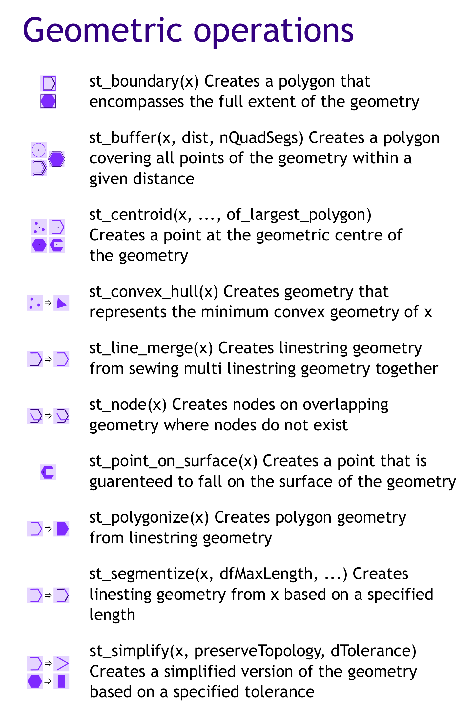
```

<br>

#### Relations topologiques entre deux couches vectorielles {-}

Nous allons maintenant nous servir de l'objet spatial `top10_villes_buffer` contenant les zones tampon afin de dénombrer le nombre de parcs nationaux se retrouvant à l'intérieur de ces zones. On appelle cette famille d'opérations spatiales des interceptions.

Pour réaliser cette étape, nous devons, dans un premier temps, charger la couche d'informations spatiales contenant les différentes aires récréatives du Québec. Cette information se trouve à l'intérieur d'une géodatabase téléchargeable depuis le site de [données ouvertes Québec](https://www.donneesquebec.ca/recherche/fr/dataset/couche-des-territoires-recreatifs-du-quebec-a-l-echelle-de-1-100-000). Comme vu dans le module {#vec}, les géodatabase permettent de contenir plusieurs couches vectorielles. Nous devons donc lire la géodatabase et explorer les différentes couches afin de déterminer laquelle est pertinente pour continuer notre analyse.

```{r, eval = FALSE}
chemin_parcs_nationaux <- paste(chemin, "/TRQ_100k.gdb", sep = "")
st_layers(chemin_parcs_nationaux)
```

```{r list-layers}
st_layers("Module7/data/parcs.gdb") 
```

Nous pouvons remarquer que les intitulés des différentes couches ne sont pas bien définis. Il faut donc prendre le temps de regarder la documentation accessible sur le site de [données ouvertes Québec](https://www.donneesquebec.ca/recherche/fr/dataset/couche-des-territoires-recreatifs-du-quebec-a-l-echelle-de-1-100-000/resource/229322ef-eca2-4ae9-a511-ba599bc2745e). En s'intéressant à la structure de données et à la nomenclature utilisée et décrite, nous pouvons déterminer que la couche `terpnq_s` correspond aux territoires des parc nationaux du Québec. Nous pouvons donc faire la lecture de la géodatabase en précisant cette couche à l'aide de la fonction `st_read()`, puis la visualiser avec la fonction `mapview()` .

```{r load-parcs, eval = FALSE}
chemin_provinces <- paste(chemin, "/parcs.gdb", sep = "")
provinces <- st_read(chemin_provinces)
mapview(parcs_nationaux, zcol = "TRQ_NM_TER")
```

```{r load-parcs2, echo = FALSE}
parcs_nationaux <- st_read("Module7/data/parcs.gdb", layer = "terpnq_s") 
mapview(parcs_nationaux, zcol = "TRQ_NM_TER", legend = FALSE)
```


L'attribut "TRQ_NM_TER" correspond au nom de chaque parc national.

Par curiosité, nous pouvons nous demander quelle fraction de la superficie du Québec est occupée par des parcs nationaux.


Pour réaliser un tel calcul, il faut obtenir la superficie de chacun des polygones correspondant aux parcs nationaux grâce à la fonction `st_area()`. Encore une fois, nous devons d'abord nous assurer que le système de coordonnées de référence de l'objet spatial `parcs_nationaux` utilise des unités métriques, et reprojeter cette couche vers un autre CRS qui satisfait cette condition dans la négative.

```{r}
# Validation de l'unité du CRS
st_crs(parcs_nationaux)
# Puisque le CRS est en degré, nous le transformons en NAD83 (EPSG: 32198) tel que vu précédemment.
parcs_nationaux <- st_transform(parcs_nationaux, crs = 32198)
# Calcul de la superficie de chaque parcs nationaux.
st_area(parcs_nationaux)
# Calcul du pourcentage de couverture des parcs nationaux sur le territoire québécois
sum(st_area(parcs_nationaux)) / st_area(subset(provinces, NAME_1 == 'Québec')) * 100
```

La superficie des parcs nationaux du Québec représente donc `r round(sum(st_area(parcs_nationaux)) / st_area(subset(provinces, NAME_1 == 'Québec')) * 100, 2) `% de sa superficie totale.

Notez qu'il est possible à tout moment de changer l'unité de mesure en utilisant la fonction `set_units()` de la librairie `units`. 

```{r set-unit-parcs}
set_units(st_area(parcs_nationaux), km^2)
```


Retournons à présent à notre question originale, nous avons toutes les couches d'informations spatiales nécessaires pour répondre à la question: _Pour chacune des 10 plus grandes municipalités du Québec, combien de parcs nationaux se retrouvent dans un rayon de 70&nbsp;km?_. La fonction `st_intersects()` permet déterminer les parcs se trouvant partiellement ou non à l'intérieur de chacune des zones tampon. Avant de réaliser cette opération spatiale, nous devons nous assurer que les deux objets spatiaux (`top10_villes_buffer` et `parcs_nationaux`) utilisent le même système de coordonnées de référence.

```{r interceptions-buffer-parcs}
st_crs(top10_villes_buffer) == st_crs(parcs_nationaux)
```

Puisque la réponse est positive, nous pouvons utiliser la fonction `st_intersects()`:

```{r}
st_intersects(x = top10_villes_buffer, y = parcs_nationaux, sparse = FALSE) 
```

La fonction `st_intersects` avec l'argument `sparse = FALSE` retourne une matrice avec en ligne les zones tampons des 10 plus grandes villes (argument `x` ci-dessus) et en colonne, les 27 parcs nationaux du Québec (argument `y` ci-dessus). Pour chacune des combinaisons, la valeur boléenne renvoyée (`TRUE` ou `FALSE`) spécifie si les deux polygones se chevauchent (partiellement ou non). En utilisant l'argument `sparse = TRUE` (valeur par défault), il est possible d'obtenir un affichage plus minimaliste et lisible de la sortie de la fonction.

```{r interceptions-buffer-parcs2}
st_intersects(top10_villes_buffer, parcs_nationaux)
```

La fonction retourne cependant un objet de type `list` avec le numéro des polygones
spatiaux (ici ceux des parcs nationaux) satisfaisant la condition d'intersection. 

Pour bien comprendre l'opération spatiale réalisée, prenons l'exemple de la ville de Sherbrooke:

```{r interceptions-buffer-parcs3}
which(top10_villes_buffer$toponyme == 'Sherbrooke')
```

La fonction `which` retourne le numéro de ligne dans la table d'attributs de l'objet `top10_villes_buffer` satisfaisant la condition `toponyme == 'Sherbrooke'`. Nous consignons ensuite cet identifiant dans l'objet `id_buffer_sherbrooke`.

```{r interceptions-buffer-parcs4}
id_buffer_sherbrooke <- which(top10_villes_buffer$toponyme == 'Sherbrooke')
```

À présent, nous voulons déterminer les identifiants des parcs nationaux qui sont dans la zone tampon autour de la municipalité de Sherbrooke. Ceux-ci correspondent aux numéros des colonnes pour lesquels l'opération `st_intersects(top10_villes_buffer, parcs_nationaux,sparse = FALSE)` a retourné la valeur `TRUE` lorsque le numéro de la ligne correspond à l'identifiant de la ville de Sherbrooke. Nous pouvons déterminer facilement ces identifiants à partir du format `list` de la fonction `st_intersects()`

```{r interceptions-buffer-parcs5}
ids_parcs_sherbrooke <- st_intersects(top10_villes_buffer, parcs_nationaux)[[id_buffer_sherbrooke]]
```


Nous pouvons maintenant se servir des identifiants que nous venons de déterminer pour visualiser le polygone de la zone tampon autour de la municipalité de Sherbrooke (`id_buffer_sherbrooke`) ainsi que les polygones des parcs nationaux se trouvant dans cette zone tampon (`ids_parcs_sherbrooke`). 

```{r viz-interceptions-buffer-parcs}
mapview(parcs_nationaux[ids_parcs_sherbrooke, ], legend = FALSE) + 
mapview(top10_villes_buffer[id_buffer_sherbrooke, ], legend = FALSE, lwd = 2, color = "red")
```

Dans le cadre de se module, nous avons seulement utilisé la fonction `st_intersects`. Or, il existe une multitude d'autres opérateurs permettant de tester les relations topologiques entre deux couches de données spatiales. La figure \@ref(fig:plot-geoConf) résume ces opérations de vérifications géométriques. 

```{r plot-geoConf, fig.align='center', echo=FALSE, fig.cap="Illustration des opérations réalisables à partir du package `sf`. Extrait de l'aide mémoire de `sf` produit par Rstudio: https://github.com/rstudio/cheatsheets/raw/master/sf.pdf", out.width = '50%'}
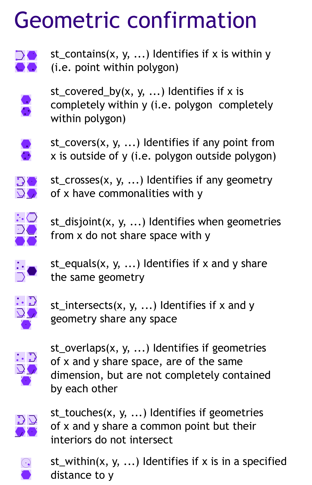
```

Chacun de ces opérateurs utilisent la même approche que `st_intersects`. Ils retournent une liste (`sparse = TRUE`, l'argument par défault) avec les identifiants des polygones satisfaisant la conditions du test ou alors une matrice (`sparse = FALSE`) contenant des valeurs boléennes (`TRUE`/`FALSE`): le résultat du test pour chacune des combinaisons de polygones.

L'une des propriétés intéressante des valeurs boléennes (`TRUE` ou `FALSE`), renvoyées par la fonction `st_intersects`, est que la valeur `TRUE` peut être interprétée par R comme une valeur de 1 et `FALSE` comme une valeur de 0. Il est donc possible de réaliser des opérations mathématiques sur des valeurs boléennes. 

Par exemple, nous pouvons effectuer une sommation sur les lignes (zones tampons de chaque grandes municipalité) afin de déterminer combien de parcs nationaux se trouvent à l'intérieur des zones tampons (c-à-d combien d'éléments ont la valeur `TRUE`).

```{r top-villes-parcs}
rowSums(st_intersects(x = top10_villes_buffer, y = parcs_nationaux, sparse = FALSE))

# Si l'on travaille avec l'argument sparse = FALSE:
lengths(st_intersects(x = top10_villes_buffer, y = parcs_nationaux))
```
La fonction `lengths()` permet d'obtenir la même information mais elle s'utilise sur le format `list`. `lengths()`  retourne la taille (longueur) des vecteurs (c-à-d le nombre de parcs) pour chacun des niveaux de la liste (chaque niveau étant une zone tampon).

Consignons à présent ces valeurs dans une nouvelle colonne de la table d'attributs de l'objet `top10_villes`.

```{r top-villes-parcs2}
top10_villes$nbr_parcs <- rowSums(st_intersects(x = top10_villes_buffer, y = parcs_nationaux, sparse = FALSE))
```

Nous pouvons ordonner la table d'attributs de l'objet `top10_villes` en se basant sur la nouvelle colonne `nbr_parcs`. 

```{r top-villes-parcs3}
top10_villes <- top10_villes[order(top10_villes$nbr_parcs, decreasing = TRUE), ]
```

Finalement, il suffit d'afficher la table d'attributs de l'objet `top10_villes` afin d'obtenir la réponse tant attendu à notre question:

> Parmi les dix plus grandes villes du Québec, quelle est celle qui dispose du plus grand nombre de parcs nationaux (dans un rayon de 70&nbsp;km)? 

```{r top-villes-parcs4}
top10_villes
```

Nous constatons que Sherbrooke et Saint-Jean-sur-Richelieu disposent toutes deux du plus grand nombre (4) de parcs nationaux dans un rayon de 70&nbsp;km. 

<!---
NOTE: ICI on pourrait introduire la notion de cropping pour tenter de départager mais je pense qu'il y a déjà pas de stock alors 
-->

Dans le module 8, nous allons caractériser le profil d'élévation des 4 parcs de la région de Sherbrooke afin de trouver les meilleurs panoramas de la région.


## Exercice {#ex_map_vec}

- Pour chaque ville, qu'elle est le plus proche parc? (st_nearest_feature) *
- En utilisant les données des sentiers hivernaux de la SEPAQ (XXXX), parmi les 4 parcs de la région de Sherbrooke, lequel dispose de la plus longue distance de sentier de raquette? (Exercice plus intégrateur mais XXX)
- Départager les deux villes gagnantes en calculant le pourcentage de couverture des parcs nationaux dans la zone tampon de 70&nbsp;km. L'un des parcs de la région de Sherbrooke chevauche partiellement la zone tampon. Pour répondre à cette question, il faudra découper (`st_crop()`) ce polygone afin d'obtenir seulement la portion se retrouvant dans la zone tampon (XXX) 

<!--chapter:end:Module7/index.Rmd-->

# Manipulation de données matricielles {#manip_mat}


L'objectif principal de ce module est

À la fin de ce module vous saurez:

-
-
-

Vous utiliserez les librairies suivantes:

-
-

Vous apprendrez à utiliser les fonctions suivantes:

- `getValues()`
- `nrow()`, `ncol()` et `ncell()`
- `as.data.frame()`


Dans la section Leçon, vous utiliserez des données XYXYX

Dans la section Exercice, vous utiliserez XXXXX

```{r load-libraries8, echo = FALSE, results='hide', warning = FALSE, message = FALSE}
library(raster)
library(sf)
```

## Leçon

Dans le cadre de cette leçon, nous allons repartir des 4 parcs nationaux présent dans le secteur de la ville de Sherbrooke. Nous allons utiliser le modèle d'élévation numérique aussi appelé *Digital Elevation Model* (DEM). Cette couche d'information spatiale (donnée matricielle) est produite par le gouvernement du Canada ([accessible sur ce portail](https://maps.canada.ca/czs/index-en.html)) est une matrice contenant l'élévation. Nous allons, dans un premier temps, extraire et manipuler les valeurs d'élévation des parcs de la région de Sherbrooke. Nous allons isoler le parc disposant du plus haut point culminant. Enfin, nous dresserons le profil d'élévation du sentier de randonnées de la SÉPAQ (LINESTRINGS, [source](https://www.donneesquebec.ca/recherche/fr/dataset/sentiers-estivaux)) se rendant au plus proche de se point culminant. 

Afin de faciliter l'importation de ces données, l'ensemble de ces couches d'informations spatiales peuvent être téléchargez en cliquant sur un seul lien: [données sur l'élévation et les parcs de la région de Sherbrooke](https://github.com/elisefilotas/Donnees_spatiales/blob/master/Elevation_Parcs_Sherbrooke.zip). Sauvegardez le dossier compressé (`zip`) dans votre répertoire de travail `Donnees` pour ce module, et dézippez-le. Le dossier `Elevation_Parcs_Sherbrooke` comprend deux sous-dossiers et un fichier:

- buffer_sherbrooke
- parcs_sherbrooke
- DEM.tif


### Opérations de base {-}

Afin de se familiariser avec la manipulation de données vectorielles, nous allons explorer le région de Sherbrooke en se posant les questions suivantes: 

> Parmi les 4 parcs nationaux de la région de Sherbrooke, lequel dispose du plus haut sommet?

En deuxième partie, on s'interrogera sur:

> Quelle est le profil topographique du sentier se rendant au plus proche de ce sommet?

Pour répondre à ces questions, il faut réaliser un ensemble d'opérations spatiales. 
Pour la première question:

- TODO: Étayer le pseudo code ici, chaque étapes pour chacune des trois questions

Dans ce chapitre, nous allons passer à travers chacune de ces étapes.

### Parmi les 4 parcs nationaux de la région de Sherbrooke, lequel dispose du plus haut sommet? { - }

#### Importation des données {-}

Afin de répondre à cette question, nous désirons dans un premier temps charger dans l'environnement R, les différentes couches d'informations spatiales.

On charge les librairies requises pour importer les données spatiales vectorielles (`sf`), et les données spatiales matricielles (`raster`).

```{r}
library(sf)
library(raster)
```

On charge également la librairie `mapview` permettant de visualiser les données spatiales.

```{r}
library(mapview)
```

Maintenant, on peut importer le *shapefile* des 4 parcs de la régions de Sherbrooke que nous avons isolé à l'intérieur du module 7. 

```{r, eval = FALSE}
chemin <-"D:/votrechemin/SCI1031/Module8/Donnees/"
chemin_parcs <- paste(chemin, "/parcs_sherbrooke/parcs_sherbrooke.shp", sep = "")
parcs <- st_read(chemin_parcs)
```

```{r, echo = FALSE}
parcs <- st_read("Module8/data/parcs_sherbrooke/parcs_sherbrooke.shp")
```

Et enfin, on importe la couche d'élévation pour la région d'intérêt.

```{r, eval = FALSE}
chemin_dem <- paste(chemin, "/DEM.tif", sep = "")
dem <- raster(chemin_dem)
```

```{r, echo = FALSE}
dem <- raster("Module8/data/DEM.tif")
```

On visualise par la suite les deux objets spatiaux afin de valider l'importation.

```{r}
mapview(dem) + mapview(parcs, zcol = "TRQ_NM_", legend = FALSE)
```


#### Accéder aux valeurs d'un `raster` (données matricielles) {-}

Avant d'aller plus loin, nous allons prendre un moment pour nous familiariser avec la manipulation de raster. Les objet de type `raster` dispose d'une structure d'objet particulière (communément appelé classe S4). Les rasters spatiaux peuvent être vu comme une image composée d'une multitude de pixels. La seule différence réside dans le fait que cette image inclut un contexte géospatial, c'est à dire, elle est référencée dans l'espace. Pour accéder à des valeurs spécifiques, on utilise des numéros ou index référant à un ou plusieurs pixels.

```{r}
# Accéder à la première valeur
dem[1]
# Accéder au valeurs des pixels 1 à 100
dem[1:100]
# Pour des valeurs spécifiques
dem[c(14, 30, 33:44)]
```

Il est souvent dangereux d'extraire des valeurs à des positions spécifiques en utilisant les index de pixels. En effet, on perd une information précieuse: la localisation dans l'espace du pixel (coordonnées X et Y). C'est pourquoi, il est souvent privilégié de convertir le raster en `data.frame`. La fonction `as.data.frame(..., xy = TRUE)`, appliqué sur un objet de class `raster`, présente l'avantage de retourner les coordonnées associées à la valeur. Par défault, la coordonnée renvoyée par la fonction `as.data.frame` correspond au coin inférieur gauche de chaque pixel. Il est possible de renvoyer le centroid du pixel en utilisant l'argument  `as.data.frame(..., xy = TRUE, centroids = TRUE)`.

```{r include-figs-raster-centroids, fig.align = 'center', echo = FALSE, fig.cap = "(A) Coordonées renvoyées par défault par la fonction `as.data.frame`; (B) Coordonnées des centroides des pixels renvoyées lorque l'argument `centroids = TRUE` est utilisé dans la fonction `as.data.frame`", out.width = '50%'}
knitr::include_graphics('Module8/images/coordsPixel.png')
```

```{r}
df_dem <- as.data.frame(dem, xy = TRUE)
head(df_dem)

# On renomme la colonne DEM
names(df_dem)[3] <- "elevation"
```

On peut maintenant accéder à des valeurs spécifiques tout en aillant un regard sur les coordonées associées aux pixels.

```{r}
# Accéder à la première valeur
df_dem[1,]
# Accéder au valeurs des pixels 1 à 20
df_dem[1:20,]
# Pour des valeurs spécifiques
df_dem[c(14, 30, 33:44),]
```

#### Décrire un `raster` (données matricielles) par ses valeurs ou sa composition {-}

En utilisant `getValues()` ou encore `dem[]`, on peut extraire l'ensemble des valeurs du raster. Cette approche permet de calculer la moyenne, la médiane etc. 

```{r}
max(getValues(dem))
```

Certains pixels peuvent disposer d'une valeur non-définie (`NA`). Lorsqu'on applique des opérateurs mathématiques sur les valeurs des pixels (`mean()`, `sum()`, `median()` etc.), il est important de spécifier l'argument `na.rm = TRUE` afin d'ignorer ces valeurs non-définies sinon la valeur renvoyée par l'opérateur sera `NA` telle que constaté ci-dessus lors de l'appel de la fonction `max(getValues(dem))`.

```{r}
max(getValues(dem), na.rm = TRUE)
```

La fonction `summary()` peut s'avérer utile pour en savoir davantage sur la distribution des valeurs à l'intérieur du raster.

```{r}
summary(getValues(dem))
```

Si l'on s'intéresse maintenant à la structure du raster, c'est à dire à en savoir davantage sur la dimension du raster, on peut se référer aux fonctions suivantes:

```{r}
# Nombre de lignes
nrow(dem)
# Nombre de colonne
ncol(dem)
# Nombre total de pixels
ncell(dem)
```

Enfin, on peut également obtenir la résolution spatial d'un raster en utilisant la fonction `res()`.

```{r}
res(dem)
```

L'unité de la résolution (taille du pixel en X et en Y) affiché ici est en degré, telle que correspondant à la projection du raster. Ce type d'unité est plus difficilement interprétable. On peut reprojeté le raster dans le système *Conique conforme de Lambert du Québec* (NAD83, EPSG: 32198) afin d'obtenir la résolution en système métrique et non en degré. Cette projection est identique à l'objet spatial `parcs`.

```{r}
st_crs(parcs) 
dem_lcc <- projectRaster(dem, crs = crs(parcs))
res(dem_lcc)
```

La largeur (x) d'un pixel est de `r res(dem_lcc)[1]`&nbsp;m de largeur et `r res(dem_lcc)[2]`&nbsp;m de hauteur.


#### Modifier les valeurs contenus dans le raster {-}

Après avoir explorer la distribution des valeurs avec `summary(getValues(dem))`, on a pu s'apercevoir que certains pixels contenaient des valeurs négatives. Ces valeurs ne sont pas abberantes et signifient que ces pixels se retrouvent en dessous du niveau de la mer. 

TODO

`-9999` peut être une valeur 

- reclassify les valeurs (faible, modéré, élevé)
- remplacer des valeurs (exemple avec les valeurs inférieurs à 0)


#### Changer la résolution d'un raster {-}

Parfois, il peut être utile d'ajuster la résolution d'un raster afin de conduire des analyses sur des tailles de pixels de références. Par exemple, nous voudrions que chaque pixel du modèle d'élévation numérique (DEM) est une taille prédéfinis de 500 par 500 mètres. La première étape consiste à créer un raster de référence disposant de cette résolution.

```{r}
dem100 <- raster(extent(dem_lcc), res = 100, crs = crs(dem_lcc))
```
On utilise `extent()` pour créer un nouveau raster de référence (`dem100`) dont l'étendu spatiale est identique à celle du raster d'élévation `dem_lcc`. On définit la résolution à 100 mètres à l'aide de l'argument `res`. Enfin, on définit la projection comme identique au raster d'élévation avec la fonction (`crs()`). 

```{r}
head(getValues(dem100)) 
```

Par défault, les pixels du nouveau raster possédent tous une valeur `NA`. La dernière étape consiste à échantillonner le raster d'élévation afin de remplir le raster de référence avec les valeurs du raster d'élévation. La fonction `resample()` permet d'aller échantillonner les valeurs selon deux méthodes.

```{r, echo=FALSE,out.width="49%", out.height="20%",fig.cap="caption",fig.show='hold',fig.align='center', fig.cap = "Méthodes de rééchantillonnage d'un raster de référence vide à partir d'un autre raster contenant des valeurs. Figures adaptés de [Arcgis Pro](https://pro.arcgis.com/fr/pro-app/help/analysis/spatial-analyst/performing-analysis/cell-size-and-resampling-in-analysis.htm)"}
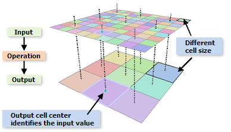
``` 

- Méthode A: L'affectation par le voisin le plus proche est la technique de rééchantillonnage la plus adaptée aux données discrètes (catégoriques) car elle ne modifie pas la valeur des pixels en entrée. L'affectation par le voisin le plus proche détermine l'emplacement du centre du pixel la plus proche (bleu) sur le raster en entrée et attribue la valeur de ce pixel au pixel du raster en sortie. Cette méthode présente l'avantage qu'elle ne modifie en rien les valeurs.

- Méthode B: L'interpolation bilinéaire utilise les centroides des quatres pixels (en bleu) les plus proches pour déterminer la valeur sur du pixel en sortie (rouge). La nouvelle valeur pour le pixel (rouge) correspond à la moyenne pondérée de ces quatre valeurs (bleu), ajustée pour tenir compte de la distance les séparant du centre de la cellule en sortie. Cette méthode d'interpolation crée une surface à l'aspect plus lisse qu'avec l'affectation par le voisin le plus proche.

Afin d'obtenir des valeurs de pixels contenus dans `dem_lcc`, nous allons utiliser la méthode A.

```{r}
dem100 <- resample(dem_lcc, dem100, method = "ngb")
dem100
```

On a présent un nouveau raster d'élévation dont la résolution d'un pixel est de 100 mètres par 100 mètres.
On peut également facilement changer la résolution de ce raster à l'aide des fonctions `disaggregate()` et `aggregate()`. Par exemple, il est possible de diminuer la résolution du raster par 10 (1 pixel = 1000 mètres par 1000 mètres) à l'aide de la fonction suivante:

```{r}
dem1000 <- aggregate(dem100, fact = 10, fun = max, na.rm = TRUE)
```

L'argument `fact` permet de spécifier le facteur d'aggégation et l'argument `fun` précise quelle fonction sera utilisé pour réaliser l'aggrégation des 100 pixels ensemble. Si l'on veut augmenter la résolution d'un raster on utilisera la fonction `disaggregate()`. 


### Parmi les 4 parcs nationaux de la région de Sherbrooke, lequel dispose du plus haut sommet?

Nous avons à présent couvert les opérations sur un raster permettant de vérifier sa composition et la distribution de ses valeurs. On peut maintenant passer à notre question qui vise à déterminer parmis les 4 parcs nationaux à 70kms de Sherbrooke lequel dispose du plus haut sommet. 

La première étape consiste à isoler les pixels se retrouvant dans les 4 parcs nationaux. Pour cela, on utilise la fonction `mask()`. 

```{r}
dem_parcs <- mask(dem_lcc, parcs)
mapview(dem_parcs)
```

La fonction `mask()` attribue une valeur `NA` aux pixels se retrouvant à l'extérieur des 4 parcs (polygones contenus dans l'objet `parcs`). On a ainsi isoler les valeurs d'élévation se retrouvant à l'intérieur des parcs.
On peut maintenant retourner la valeur d'élévation la plus élevé en utilisant la fonction `max()`. On désire conserver cette valeur maximale afin d'isoler les pixels du raster `dem_parcs` disposant de cette valeur.

```{r}
max(getValues(dem_parcs), na.rm = TRUE)
vmax <- max(getValues(dem_parcs), na.rm = TRUE)
```

L'étape suivante consiste à isoler le pixel disposant de cette valeur et d'obtenir sa coordonnée. Pour cela, on transforme le raster en `data.frame` avec la fonction `as.data.frame()` tel que vue précédemment. 

```{r}
df_dem_parcs <- as.data.frame(dem_parcs, xy = TRUE, centroid = TRUE, na.rm = TRUE)
head(df_dem_parcs)
```

On retire les valeurs masquées (`NA`) en utilisant l'argument `na.rm=FALSE` puisque ces dernières ne nous intéressent pas. On s'assure également d'obtenir la coordonnées au centre du pixel avec `centroid = TRUE`. On peut à présent d'isoler la ligne du `data.frame` (1 ligne = 1 pixel) contenant la valeur maximale d'élévation (contenu dans `vmax`). Pour cela, on utilise la fonction `subset()`.

```{r}
df_max_elev <- subset(df_dem_parcs, DEM == vmax) 
df_max_elev
```

Une fois isolé, les coordonnées du pixel (x et y) peuvent être utilisé pour un créer un objet spatial (POINT) contenant le centroide de ce pixel grâce à la fonction `st_as_sf()`. On n'oublie pas de spécifier que le système de projection est identique à celui du raster d'élévation (`dem_parcs`) pour les 4 parcs autours de la ville de Sherbrooke. Nous nous servirons par la suite de ce point pour vérifier dans lequel des 4 parc nationaux il se retrouve. 

```{r}
sf_point_max_elev <- st_as_sf(df_max_elev, coords = c("x", "y"), crs = 32198)
sf_point_max_elev
```

Une autre facon d'obtenir le point d'élévation maximal est d'utiliser la fonction `rasterToPoints()` de la manière suivante:

```{r}
sp_max_elev <- rasterToPoints(dem_parcs, fun = function(x) x == vmax, spatial = TRUE)
st_as_sf(sp_max_elev)
```

L'objet renvoyé par la fonction `rasterToPoints(... , spatial = TRUE)` permet de renvoyer un objet spatial contenant également le point d'élévation maximale. Cependant, la classe d'objet retourné ne provient pas de la librairie `sf` mais de la librairie `sp`. Cette librairie spatiale est plus ancienne et ne sera pas abordé dans ce cours, puisque elle est amené à être remplacé par la librairie `sf`. Si jamais vous devez l'utiliser ailleurs que dans ce cours, sachez qu'il est possible de convertir un objet de classe `sf` à tout moment vers la classe `sp` grâce à la fonction `as(... , "Spatial")`. En voici un exemple. Cette conversion est possible pour l'ensemble des couches spatiales vectorielles mais ne s'applique par aux rasters.


```{r}
as(sf_point_max_elev, "Spatial")
```

En supperposant les couches d'informations spatiales avec mapview, on peut observer dans quel parc se retrouve à présent ce point d'élévation maximal. 

```{r, fig.cap = "En cliquant sur le polygon du parc contenant le point rouge (point d'élévation maximal), il est possible de constater que le point se retrouve dans le Parc national du Mont-mégantic"}
mapview(dem_parcs) + mapview(parcs, alpha = 0.01) + mapview(sf_point_max_elev,  col.regions = "red")
```

Ce point se retrouve dans le **Parc national du Mont-Mégantic**. On réalise à présent une opération sur la topologie permettant d'isoler le polygon du parc dans lequel se retrouve ce point. 


```{r}
parcs[which(st_intersects(parcs, sf_point_max_elev, sparse = FALSE) == TRUE), ]
```

st_crs(parcs) 
st_crs(sf_point_max_elev)


On crop le raster avec les parcs du module 7 (Sherbrooke). Crop et Mask sont des notions plus utile lorsque l'on veut faire de la visualisation. Crop = Zoom in sur la BBOX, Mask = Zoom in + mask les pixels tombant à l'extérieur du parcs.
- `crop()` et `mask()`

On extrait les valeurs ce retrouvant dans le parc.
- extract values

Trouver le pixel avec la plus forte valeur d'élévation et représenter le ou les points sur la carte

- `vmax = maxValue(r)`: trouver la valeur max
- `rasterToPoints(r, function(x) all.equal(x, vmax), spatial = FALSE)`: Créer le point 
- Pas le choix ici: parler un tout petit de `sp` pour expliquer pourquoi spatial = FALSE
- Jouer avec spatial = TRUE (fonction `rasterToPoints()`) et conversion vers sf
- st_point si (spatial = FALSE)
- Dans quelle parcs tombent ce point: st_within avec sf

Première question répondu: On a trouver notre plus haut sommet à l'intérieur des 4 parcs.

### Quelle est le profil topographique du sentier se rendant au plus proche de ce sommet?

- Isoler le sentier le plus proche du sommet (st_nearest)
- Puis, extraire les pixels du rasters se retrouvant sous la ligne du sentier (extract)
- mapview des pixels passant sous la ligne du sentier
- On montre habituellement les figures (distance parcourue vs élévation) présenté par la SEPAQ, on veut améliorer le rendu visuelle.
- Utiliser la resolution du raster pour déterminer la distance inter-pixels - Ici ca va prendre de l'illustration pour être sûr que la notion est saisie
- Faire la figure de distance cumulée versus élévation 
- On vient de répondre à notre question

### Quelle est le mois disposant du plus faible niveau de pluviométrie pour le parc national possédant ce sommet?

- Dans ce chapitre, on veut jouer avec les `rasterStack`. Préparation d'un `rasterStack` avec la précipitation totale par mois pour le même bonding box que le raster de DEM. Trouver le mois le moins pluvieux pour préparer notre saison de randonnée.
- On extract les valeurs de précipitation (par mois) du rasterStack pour le parc que l'on a ciblé
- On montre comment on peut réaliser une moyenne entre deux mois rasterStack[[1]] + rasterStack[[2]] / 2 ou alors mean rasterStack[[1:2]]. 
- Crop un raster rasterStack
- which.min pour déterminer le raster du stack disposant de la plus petite valeur
- Compléter avec d'autre chose, ca me parait léger... à voir quand au dessus ce sera écrit..


## Exercice

<!--chapter:end:Module8/index.Rmd-->

# Données spatiotemporelles {#spatiotemp}


L'objectif principal de ce module est

À la fin de ce module vous saurez:

- 
- 
-

Vous utiliserez les librairies suivantes:

-
-

Vous apprendrez à utiliser les fonctions suivantes:

-
-

Dans la section Leçon, vous utiliserez des données XYXYX

Dans la section Exercice, vous utiliserez XXXXX

```{r load-libraries9, echo = FALSE, results='hide', warning = FALSE, message = FALSE}
#library(raster)
# library(rgdal)
# library(ggplot2)
# library(dplyr)
# library(sf)
# library(svglite) ## J'ai pas besoin de ça pour créer les figures, mais pour les inclure dans le markdown, oui.
# library(ggpubr)
```


## Leçon

### Propriétés des données spatio-temporelles

Les données spatio-temporelles représente une collection d'objets spatiaux ordonnées dans le temps: la même information spatiales pour différents dans le temps. 


- Trajets en vélo (vitesse, distance) - POINT + LINES
    - GeoJSON
    - https://donnees.montreal.ca/ville-de-montreal/pistes-cyclables
- Étendue spatial du réseau de pistes cyclabes à travers le temps.
- Expansion des aires protégées au Québec
    -  https://www.donneesquebec.ca/recherche/fr/dataset/aires-protegees-au-quebec


### Visualisation spatiotemporelle

-	Figure à panneaux multiples
-	Figure espace-temps
    - Hovmoller plot
-	Figure animée


### Introduction à la librairie R stars

-	Classes de données spatiotemporelles
-	Création d’objet ST
-	Manipulation de bases de données spatiotemporelles


## Exercice


<!--chapter:end:Module9/index.Rmd-->

