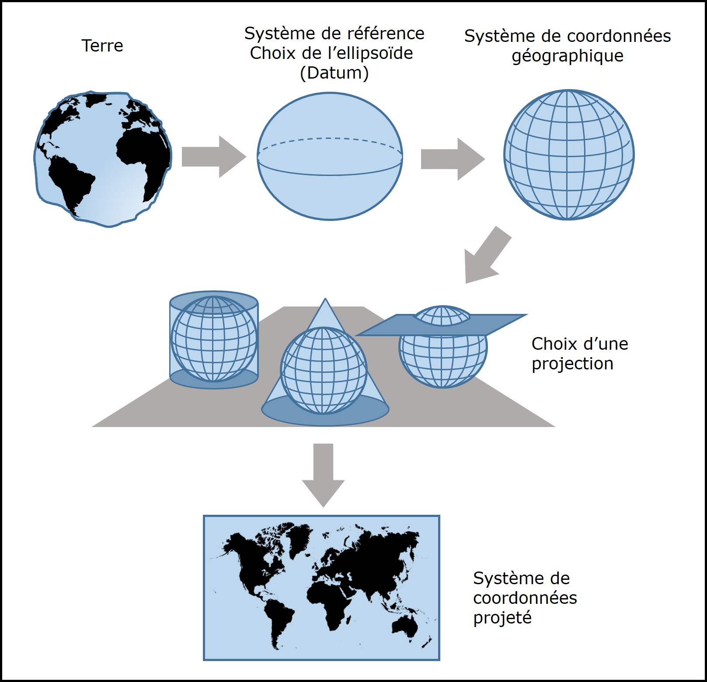

```{r setup, include=FALSE}
knitr::opts_chunk$set(echo = TRUE)
```

# Le datum

**Qu'est-ce qu'un datum ?**

> *C'est un système de référence qui détermine la position d’un ellipsoïde sur la Terre : c’est-à-dire son origine par rapport au centre du globe, ainsi que son orientation.*

**Qu'est-ce qu'un datum géocentrique ?**

> *C'est un système de référence associé à un ellipsoïde global dont l'origine correspond au centre de masse de la Terre[^note1].*

[^note1]: Les principaux datums géocentriques sont le GRS80 et le WGS84.

# Les systèmes de coordonnées

Le système de coordonnées géographique représente la Terre comme une sphère. Les points à la surface de la Terre peuvent être sont définis par des coordonnées sphériques ($\phi$,$\lambda$) associée à la longitude et à la latitude respectivement. 

Le système de coordonnées projeté réfère à une transformation mathématique permettant de représenter sous forme de carte plane la réalité tridimensionnelle de la Terre.

# Les projections

## Les classes de transformation

Il existe trois classes principales pour créer un système de coordonnées projetées.

1. Cylindrique : la surface de la Terre est projetée sur un plan enroulé comme un cylindre.
2. Conique : la surface de la Terre est projetée sur un cône.
3. Azimutale : la surface de la Terre est projetée sur un cône.

Le site web de [Tobias Jung](https://map-projections.net/) illustre un très grand nombre de projections. 

## Les distortions

Les projections produisent toutes une certaine forme de distorsion.  Il y a trois propriétés importantes qui sont ou non conservées : la forme, la superficie et la distance.

| Type de projection | Propriété | Exemples |
|:------- | :------- |:------- |
| Conforme | Conserve localement les angles, et donc la forme des régions de petite superficie | Canonique conforme de de Lambert, Lagrange, Mercartor|
| Équivalente | Conserve localement l'aire des régions | Azimutal équivalente de Lambert, Bonne, Equal Earth, Eumorphique interrompue de Boggs, Mollweide | 
| Équidistante | Conserve les distances sur certaines lignes du globe (généralement les méridiens)| Cylindrique équidistante |
: Distorsions des projections

# Un résumé du module 3

La figure 3.24 résume bien les étapes du processus utilisé pour définir un système de coordonnées géographique et un système de coordonnées projeté.

<!--   
Vous pouvez afficher une image comme ceci.

Ou de la façon utilisée ci-dessous
-->

```{r 324, echo = FALSE, fig.cap = "La figure résumé 3.24.", out.width = '50%', fig.align = 'center' }

```


# Exemple : les villes du Québec

Commençons par lire le fichier `villes_qc.csv` sans que cela ne paraisse!

```{r coord, echo=FALSE}
villes <- read.csv("Module3_donnees/villes_qc.csv")
```

Nous pouvons calculer que le fichier compte `r dim(villes)[1]` villes.

Affichons maintenant les quinzes premières lignes du tableau:
```{r tableau}
# Utilisons la bibliothèque knitr
library(knitr)

# Puis la fonction kable()
kable(villes[1:15,], caption = "Les villes du Québec (15 premières entrées)")
```
Créons un histogramme de la distibution de la population des villes du Québec.

```{r hist, fig.cap = "Distribution de la taille des villes du Québec.", fig.height = 5, fig.width = 5, fig.align = 'center'}
hist(log10(villes$mpopul), breaks = 10,
     main = "",
     xlab = "Nombre d'habitants (log10)",
     ylab = "Nombre de villes",
     col = "cadetblue",
     xlim = c(0, 7),
     ylim = c(0, 400),
     )
```

