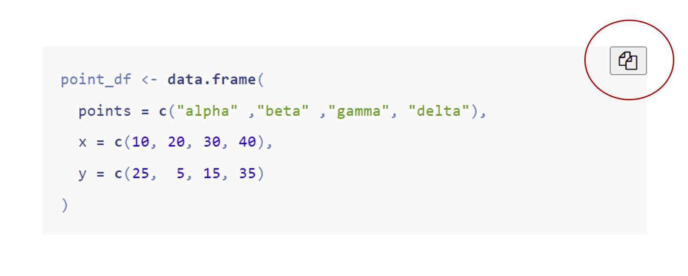

\mainmatter


# (PART) SCI 1031 {-}
# À propos du cours {-}
### Présentation {-}

Comme son nom l’indique, le cours SCI1031 porte sur la visualisation et l’analyse de données spatiales avec le langage de programmation et logiciel libre R.


#### Pourquoi suivre ce cours ? {-}

L’intérêt du cours SCI 1031 est lié plusieurs aspects. Tout d’abord, nos sociétés sont confrontées à une incroyable augmentation des données spatiales. C’est-à-dire des données qui possèdent une composante spatiale, comme des coordonnées géographiques. 

Pensons, par exemple, aux données de télédétection récoltées par des satellites et des véhicules aériens télépilotés (drones). Ou encore, aux données échantillonnées par des technologies de notre vie quotidienne qui sont munis d’un système de géo-positionnement par satellite (GPS!) intégré comme les téléphones intelligents, les caméras, et les tablettes.  

Cet accroissement des données spatiales est interrelié avec une explosion d’applications qui dépendent des données spatiales et qui en génèrent dans des domaines aussi variés que le marketing, l’évaluation des risques par les compagnies d’assurances, la logistique des réseaux de transports, et les études d’impact environnementaux. 

Ainsi, cette effervescence des données spatiales et de leurs applications entrainement nécessairement une hausse de la demande pour des compétences spécialisées dans la manipulation, la visualisation et l’analyse de données spatiales. 

L’objectif général du cours SCI 1031 est donc de permettre aux étudiantes et aux étudiants de développer ces compétences essentielles pour traiter les données spatiales, tant dans leurs études que sur le marché de l’emploi.


#### Pourquoi R ? {-}

R^[R est soutenu par le *R Core Team* et la *R Foundation for Statistical Computing*: [www.r-project.org](www.r-project.org)] est un logiciel libre et un langage de programmation qui offre un environnement riche permettant de réaliser une multitude de tâches incluant des calculs statistiques, des graphiques scientifiques, de la manipulation de bases de données, et de la modélisation. 

R est devenu un outil incontournable en sciences des données. La communauté R est constituée non seulement d’utilisatrices et d’utilisateurs, mais aussi de créatrices et de créateurs. Ceux-ci améliorent constamment les capacités de R par le développement de nouvelles fonctionnalités et de bibliothèques spécialisées qui deviennent accessibles à toute la communauté.

Dans les dernières années, plusieurs expertes et experts de l’analyse et de la visualisation de données spatiales se sont affairés à bâtir des bibliothèques simples et efficaces destinées aux traitements des données spatiales.  Ces bibliothèques sont mise-à-jour continuellement alors que d’autres bibliothèques voient le jour pour répondre à des nouveaux besoins.

Un avantage indéniable à utiliser R, en comparaison aux autres outils de visualisation de données spatiales, est sa grande flexibilité.  L’abondance des bibliothèques permet d’utiliser R pour accomplir des opérations diverses. Il est ainsi possible de produire des cartes géographiques de grande qualité avec R et de faire des analyses statistiques spatiales très poussées. Tout cela sans changer de logiciel et en conservant la même syntaxe générale. 


#### Objectifs {-}

Voici ce que vous serez en mesure de faire à la fin du cours SCI 1031:

-	Identifier les concepts fondamentaux propres à la représentation spatiale.
-	Décrire les types de données spatiales et leurs caractéristiques.
-	Appliquer l’usage d’opérateurs spatiaux de base à la réalisation d’analyses spatiales simples.
-	Créer une carte thématique respectant les règles cartographiques.
-	Appliquer les fonctions de base des principales librairies R destinées à la manipulation, la visualisation et l’analyse de données spatiales. 
-	Représenter des données spatiotemporelles.


#### Contenu sommaire {-}

Le cours est divisé en 9 modules:

**Module 1 : Introduction **
<br>
Ce module donne un aperçu de l'évolution historique dans la représentation des données spatiales, des premières cartes jusqu'à l'avènement des systèmes d'information géographiques. Il fait une revue des outils existants pour visualiser et analyser les données spatiales. Il présente aussi les concepts essentiels à l'étude des données spatiales. 


**Module 2 : Modèles de données spatiales**
<br>
Ce module s’intéresse à la façon dont nous représentons les phénomènes spatiaux se déroulant à la surface de la Terre par des données spatiales. Il présente les propriétés des deux types de modèle de données spatiales: les données vectorielles et les données matricielles.


**Module 3 : Systèmes de coordonnées de référence**
<br>
Ce module porte sur les systèmes de coordonnées de référence. Il explique les concepts mathématiques et cartographiques pour représenter la position des données sur la surface de la Terre. 


**Module 4 : Données vectorielles**
<br>
Ce module se veut une introduction à la bibliothèque R `sf`. Il présente les fonctions de base pour lire, interpréter et visualiser des données vectorielles.


**Module 5 : Données matricielles**
<br>
Ce module se veut une introduction à la bibliothèque R `raster`. Il présente les fonctions de base pour lire, interpréter et visualiser des données matricielles.


**Module 6 : Cartographie**
<br>
Ce module explique les principes essentiels de la cartographie, des informations indispensables comme la légende, jusqu'au choix des couleurs. Il présente les fonctions de la bibliothèque R `tmap` pour créer des projets cartographiques. 


**Module 7 : Manipulation de données vectorielles**
<br>
Ce module présente les fonctions R pour manipuler les attributs de données vectorielles et faire des opérations spatiales sur ces données comme faire des jointures spatiales ou trouver l'intersection entre des données.


**Module 8 : Manipulation de données matricielles**
<br>
Ce module présente les fonctions R pour filtrer les valeurs des données matricielles et faire des opérations spatiales sur ces données tel que découper un *raster*.

**Module 9 : Données spatiotemporelles**
<br>
Ce module explique comment manipuler des données spatiales qui possèdent une dimension temporelle. Il présente certaines fonctions des bibliothèques R `lubridate` et `animation`.
<br>

#### Fonctionnement du cours {-}

##### Organisation des modules {-}

Le cours s'échelonne sur 15 semaines. La [feuille de route](#route) constitue un guide pour vous aider à répartir vos apprentissages tout au long de votre cheminement. 

Les modules sont tous divisés en deux parties: une partie *Leçon* et une partie *Exercices*. 

**Pour les modules 1, 2, et 3** 

- La partie *Leçon* comprend des apprentissages théoriques. Vous apprendrez les concepts de base propres aux données géospatiales. Ces apprentissages sont essentiels avant de se lancer dans l'apprentissage des fonctions R spécifiques à la manipulation, l'analyse et la visualisation de données spatiales.
- La partie *Exercices* comprend une révision des bases de R (module 1) et une introduction à RMarkdown (module 2 et 3). Vous serez également amenés à mettre en pratique ces apprentissages en répondant à quelques questions.


**Pour les modules 4, 5, 6, 7, 8, et 9** 

- La partie *Leçon* comprend des apprentissages théoriques et aussi pratiques: vous serez guidé dans l'utilisation de fonctions R et dans la résolution de problèmes. 
- La partie *Exercices* comprend des questions pour mettre en pratique vos apprentissages. Bien que les réponses aux questions soient disponibles, il est important de tenter d'y répondre par vous-mêmes. Les questions des travaux notés et de l'examen sont très semblables à celles des parties *Exercices*.

<br>

##### Apprentissage de R {-}

Il est important d'organiser sur votre ordinateur un environnement de travail optimal pour faciliter vos apprentissages. Il est fortement recommandé de créer un répertoire, par exemple `SCI1031`, dédié exclusivement à ce cours. Dans ce répertoire, créé également un répertoire pour chacun des neuf modules du cours (p. ex. `Module1`, `Module2`, ..., `Module9`). 

À chaque module du cours, vous serez amené à utiliser des données sur lesquelles vous pratiquerez des opérations R. Ces données seront fournies dans un dossier zippé à télécharger (`Module1_donnees.zip`, `Module2_donnees.zip`, ...,  `Module9_donnees.zip`). Sauvegarder le dossier de données dans le répertoire correspondant à son module sur votre ordinateur. 

Il est également recommandé de vous créer un fichier R (ou Rmd) pour chaque module (p.ex. `Mod1.R`, `Mod2.R`, ..., `Mod9.R`) dans lequel vous pourrez copier-coller les opérations R enseignées. Vous pourrez ainsi vous exercer à utiliser ces opérations et vous assurer de comprendre leur fonctionnement. Il facile de copier les blocs de codes R à partir de la page web en utilisant le bouton dédié à cette fin dans le coin supérieur droit de chaque bloc.


```{r copypaste, fig.align='center', echo=FALSE, fig.link='Images/Pres_copypaste.png', fig.cap="Le bouton supérieur droit vous permet de copier facilement un bloc de codes R.", out.width = '80%'}

```
<br>


#### Travaux notés {-}

Le cours comprend trois (3) travaux notés (chacun 20%) et un examen final (40%).

La date de remise des travaux notés, telle que suggérée dans la [feuille de route](#route) est flexible: vous ne serez pas pénalisé si vous remettez votre travail après cette date. Toutefois, il est préférable d'espacer la remise des travaux pour pouvoir bénéficier d'une rétroaction de la part de la personne qui corrige. 

Noter que vous devez faire l'examen au plus tard au cours de la dernière semaine. Il s'agit d'un examen à faire chez soi. L'examen dure 3 heures mais vous avez 3 jours (72 heures) pour remettre vos réponses à partir du moment où vous l'entamez. 

Les consignes, les données à utiliser, et les gabarits de réponses pour les travaux notés et l'examen sont disponibles sur la [page web du cours](https://m2.teluq.ca/course/view.php?id=2164) sur le site de la TÉLUQ.
Seuls les étudiants inscrits à la TÉLUQ ont accès aux évaluations. 

<br>

#### Rétroaction {-}

Le mode de communication le plus efficace pour rejoindre la personne qui vous encadre est le courriel. Si cela s'avère nécessaire une rencontre zoom ou un appel téléphonique pourront être planifiés.

Le sujet de votre courriel doit contenir le sigle du cours. De plus, vous devez clairement vous identifier dans votre courriel: nom, prénom, numéro d'étudiant. La personne qui vous encadre, encadre beaucoup d'étudiantes et d'étudiants, et cela dans plusieurs cours!

Si votre courriel comporte une question sur une ou des opérations R qui vous causent problème, vous devez absolument inclure toutes les commandes R depuis l'importation des données jusqu'au problème rencontré. Il est recommandé d'envoyer un fichier R avec vos commandes pour faciliter l'intervention de la personne qui vous encadre.

Sauf exception (en cas de maladie, de vacances ou de déplacements dans le cadre de travaux de recherche) vous recevrez une réponse à votre courriel dans les 48h. 
Les travaux corrigés seront remis au plus tard deux semaines suivant leur dépôt mais généralement dans un délai d'une semaine. 
<br>


### Feuille de route {.unnumbered #route}


```{r route, echo = FALSE, warning = FALSE, out.width = '100%'}
library(kableExtra)


data <- read.table("FeuilleRoute.csv", sep = ",", encoding="UTF-8", header = FALSE )
colnames(data) <- NULL
opts <- options(knitr.kable.NA = "", knitr.table.format = "simple")
kbl(data,"html", align = c("l",rep("c",15))) %>% 
  kable_classic(full_width = TRUE)%>%
  #kable_styling(bootstrap_options = c("condensed", "responsive")) %>%
  #kable_styling(font_size = 13)%>%
   add_header_above(c("", " 1"=1, " 2"=1," 3"=1, " 4"=1, " 5"=1, " 6"=1, 
                      " 7"=1, " 8"=1," 9"=1, "10"=1, "11"=1,"12"=1, "13"=1, "14"=1,"15"=1)) %>% 
  add_header_above(c("Modules" = 1, "Semaines" = 15)) %>%
  column_spec(1:16, background = "white", border_right = "1px solid black") %>%
   column_spec(1, border_left = "1px solid black") %>%
  #column_spec(2:16, width = c(rep("0.2cm",15)))  %>%
  column_spec(2:16, width_max = "0.3cm", width_min = "0.3cm")  %>%
  column_spec(1, width = "5cm")  %>%
  column_spec(2, background = c("lightgrey", "lightgrey", rep("white",8), "lightpink", rep("white",11)) ) %>%
  column_spec(3, background = c("white", "white", "lightgrey", "lightgrey", rep("white",6), "lightpink", rep("white",11)) ) %>%
  column_spec(4, background = c(rep("white",4), "lightgrey", "lightgrey", rep("white",4), "lightpink", rep("white",11)) ) %>%
  column_spec(5, background = c(rep("white",6), "lightgrey", "lightgrey", rep("white",2), "lightpink", rep("white",11)) ) %>%
  column_spec(6, background = c(rep("white",8), "lightgrey", "lightgrey", "lightpink", rep("white",11)) ) %>%
  column_spec(c(7,8,9), background = c(rep("white",11), "lightgrey", "lightgrey", "lightpink", rep("white",8)) ) %>%
  column_spec(c(10, 11), background = c(rep("white",14), "lightgrey", "lightgrey", "white", "white","lightpink", rep("white",3)) ) %>%
  column_spec(c(12,13), background = c(rep("white",16), "lightgrey", "lightgrey", "lightpink", rep("white",3)) ) %>%
  column_spec(c(14,15), background = c(rep("white",19), "lightgrey", "lightgrey",  rep("white",1)) ) %>%
  column_spec(c(16), background = c(rep("white",21), "lightpink") ) %>%
  row_spec(c(11,14, 19, 22), bold = T, color = "red",  font_size = 13) %>%
  row_spec(c(1,3,5,7,9,12, 15,17, 20), bold = T, font_size = 12)%>%
  row_spec(c(2,4,6,8,10,13, 16,18, 21), font_size = 10)%>%
  row_spec(c(2,4,6,8,10,11,13, 14,16,18,19, 21), extra_css = "border-bottom: 1px solid black")
  

```


<br>

### Crédits {-}

#### Équipe {-}

**Direction pédagogique, conception et rédaction:** Élise Filotas

**Soutien à la conception:** Kevin Cazelles et Steve Vissault

<br>

**Direction multi-média:** Mathieu Corriveau et Élodie Bussières

**Conception graphique: ** Marie-Sol Lapointe

**Intégration: ** Elise Filotas, Kevin Cazelles et Simon Gaudreau

<br>

#### Reproduction du contenu {-}

Vous êtes autorisé à copier, distribuer et communiquer le matériel contenu sur ce site selon la licence Creative Commons Attribution-NonCommercial 4.0 International ([CC BY-NC 4.0](https://creativecommons.org/licenses/by-nc/4.0/)).

<a rel="license" href="http://creativecommons.org/licenses/by-nc/4.0/"></a><br />

<br>
<br>
<br>
<br>
<br>

### Contact {.unnumbered #contact}

<br>

<div class="boite photo elise gauche"> 
###### Élise Filotas {-} 

Je suis professeure au Département Science et technologie de la TELUQ en écologie quantitative et je suis responsable du cours SCI 1031. 
<br>
Vous pouvez me rejoindre à l'adresse suivante: elise.filotas@teluq.ca

Consultez mon [site web](http://elisefilotas.ca/fr/maison/) pour en savoir plus sur ma recherche.

<br>
<br>
<br>
<br>

</div>


<br>
<br>
<br>
<br>
<br>


