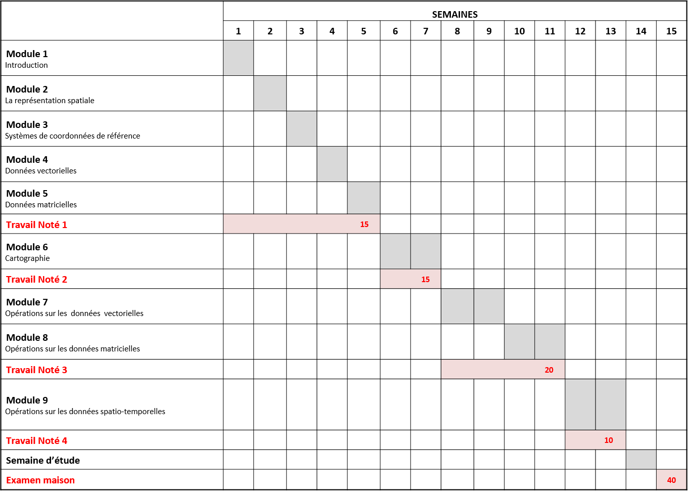

# Feuille de route {-}

```{r FeuilleRoute, fig.align='left', echo=FALSE,out.width = '100%'}

```

```{r}

route <- read.csv("E:/ELF/Dropbox/TELUQ/ENSEIGNEMENT/Cours/SCI1031/Developpement/FeuilleRoute.csv")
route
```

```{r}
library(kableExtra)
route %>%
kbl() %>%
kable_paper("hover", full_width = F)
```

